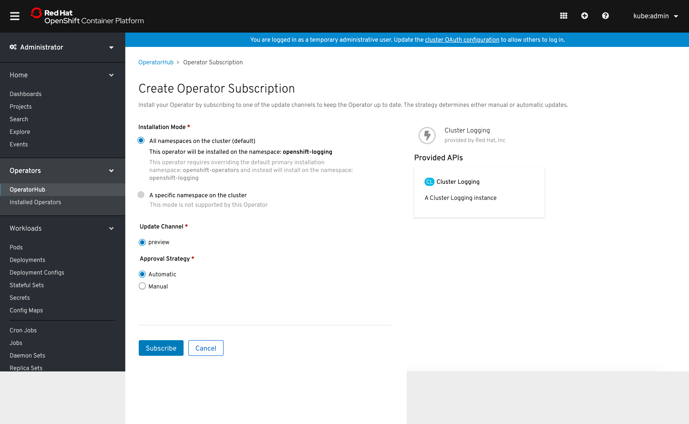
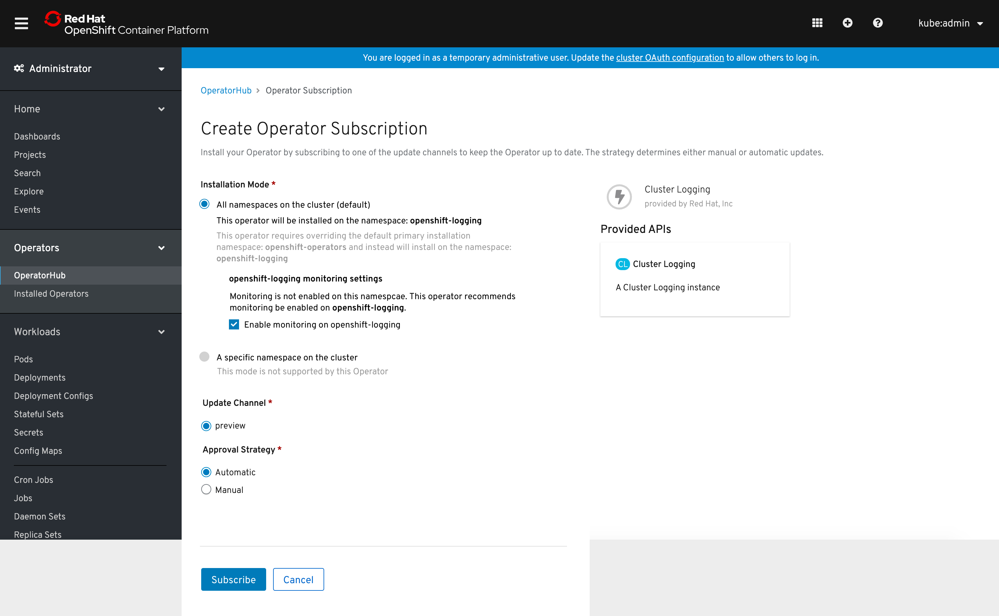
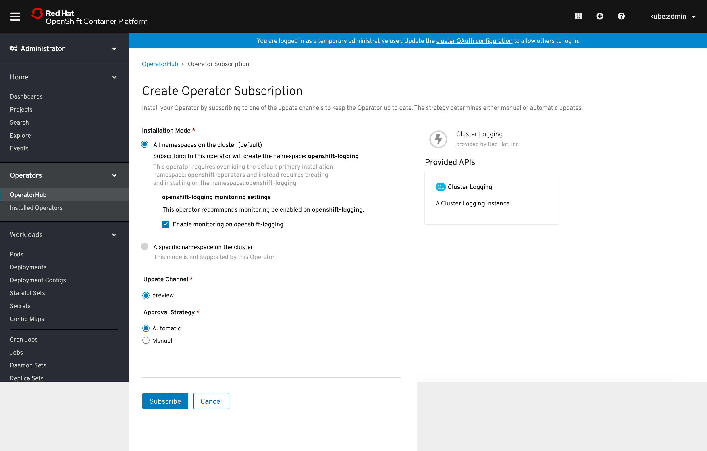

# Operator-defined Namespace

Operator bundles can define what namespace they should be installed to, so the user should be prevented from changing the target namespace.

## When namespace exists

- When an operator requires installation on a specific namespace, options to change selection for installation mode and namespace are disabled.

- If monitoring is not enabled on the namespace, and it is something the operator recommends, then the option for enabling monitoring is exposed. It would be ideal if only Red Hat operators have the ability to enable monitoring through this workflow.

## When namespace does not exist

- When a namespace doesn’t yet exist, but the operator requires being installed on a specific namespace, the creation of the namespace is facilitated through this workflow – the users are informed that creating this subscription will create the namespace. The options for enabling monitoring are shown if the operator recommends it. It would be ideal if only Red Hat operators have the ability to create namespaces and enable monitoring through this workflow.