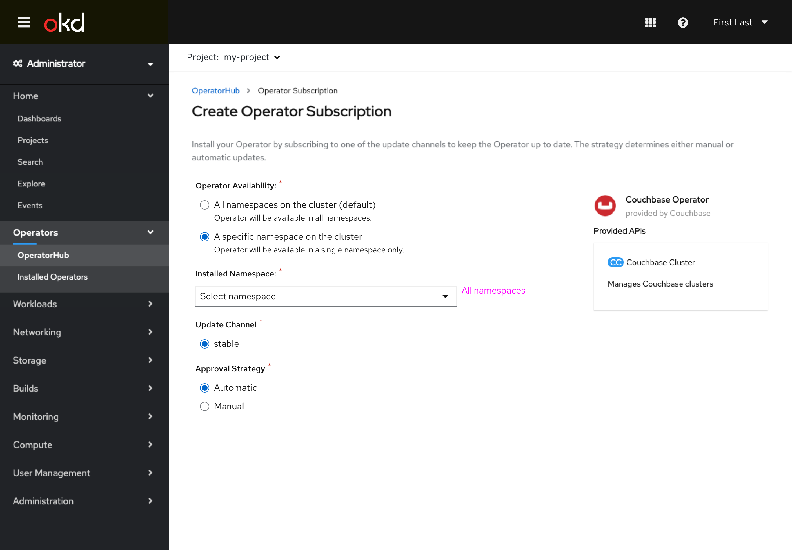
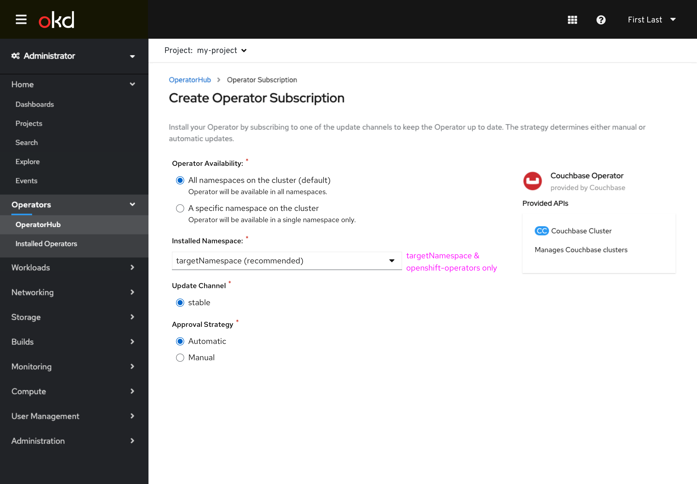
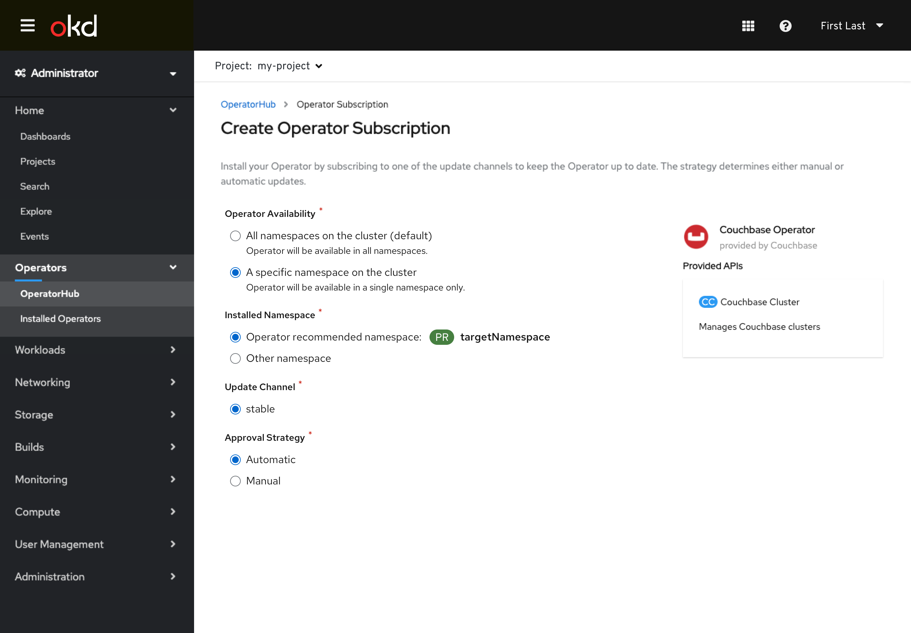
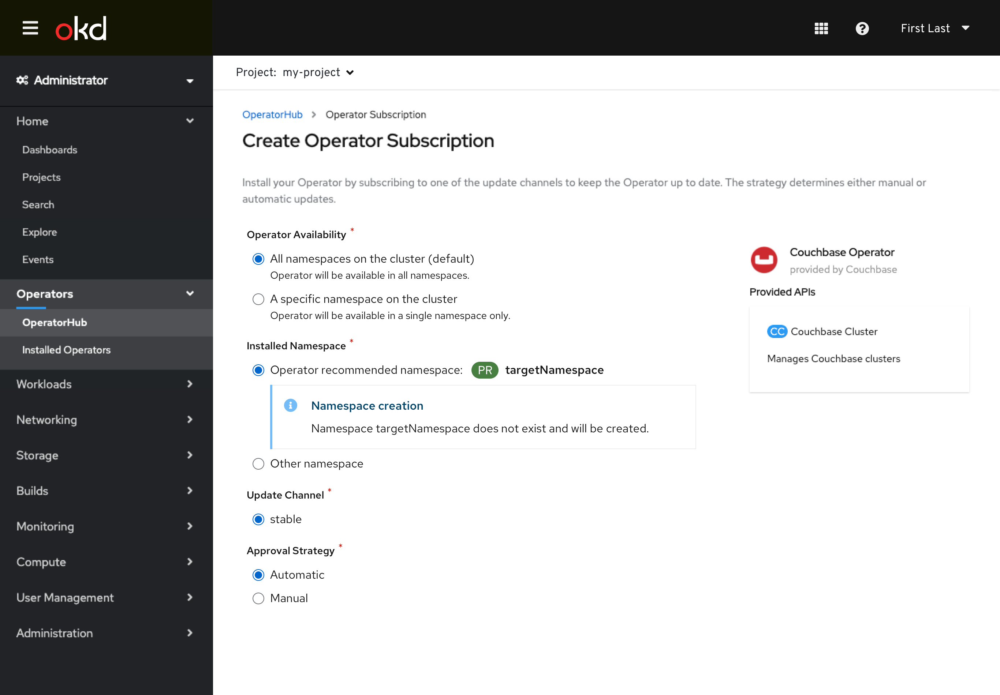
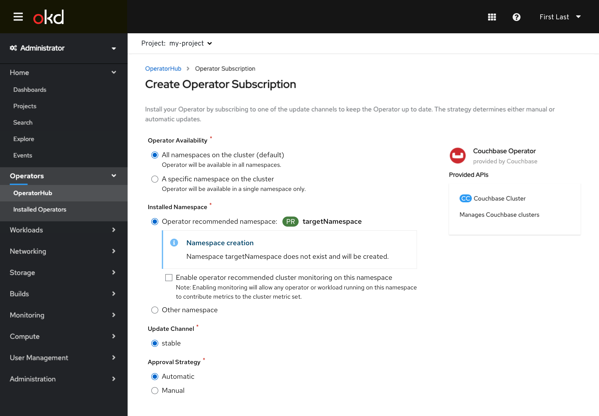
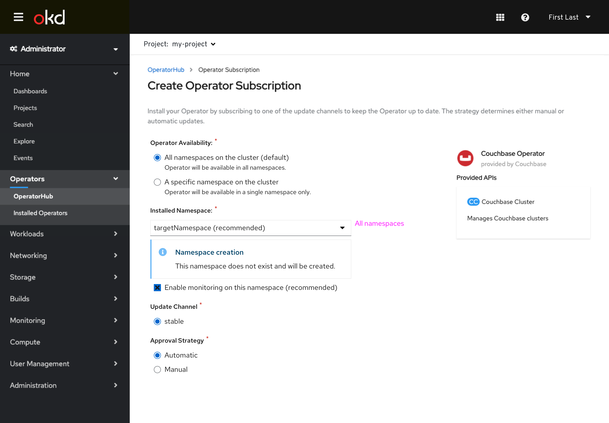
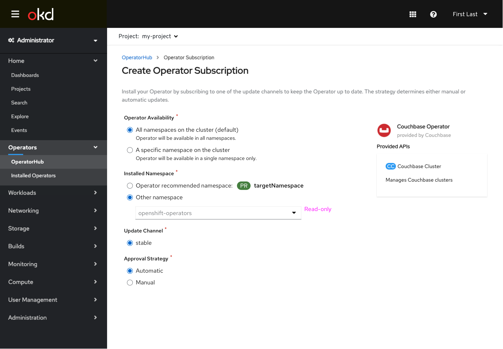
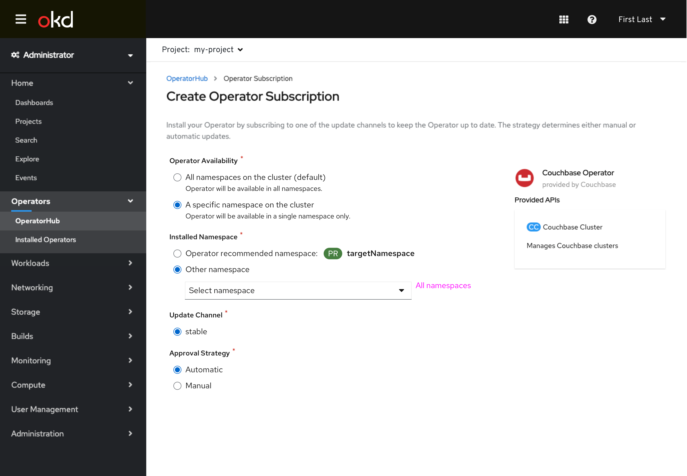

# Operator-defined Installation Namespace

Operator bundles can define what namespace they should be installed to, so that namespace is recommended to the user. The user can still change the installation namespace if desired.

The installed namespace is always conveyed to the user for understanding of the underlying behavior.

## No operator-defined namespace (existing behavior)

- Namespace selection is read-only and fixed to openshift-operators.

- All namespaces are available for installation.

## Operator-defined namespace - already exists

- Namespace selection defaults to operator-defined namespace with option to change to openshift-operators.

- Namespace selection defaults to operator-defined namespace with option to change to any other namespace.

## Operator-defined namespace - does not exist

- Namespace selection defaults to operator-defined namespace with option to change to openshift-operators.
- When the not yet created operator-defined namespace is selected, the user is alerted that the namespace will be created.

- Namespace selection defaults to operator-defined namespace with option to change to any other namespace
- When the not yet created operator-defined namespace is selected, the user is alerted that the namespace will be created.

## Operator-defined namespace - does not exist, monitoring recommended

- Namespace selection defaults to operator-defined namespace with option to change to openshift-operators.
- When the not yet created operator-defined namespace is selected, the user is alerted that the namespace will be created.
- Checkbox toggle is presented to enable monitoring on newly created namespace (deselected by default.) User is given additional information about monitioring via help text.

- Namespace selection defaults to operator-defined namespace with option to change to any other namespace
- When the not yet created operator-defined namespace is selected, the user is alerted that the namespace will be created.
- Checkbox toggle is presented to enable monitoring on newly created namespace (deselected by default.) User is given additional information about monitioring via help text.

## Operator-defined namespace - selecting other namespace

- User can choose to not user operator-definend namespace
- Global option only otherwise allows openshift-operators namespace selection

- User can choose to not user operator-definend namespace
- User can choose from all namespaces