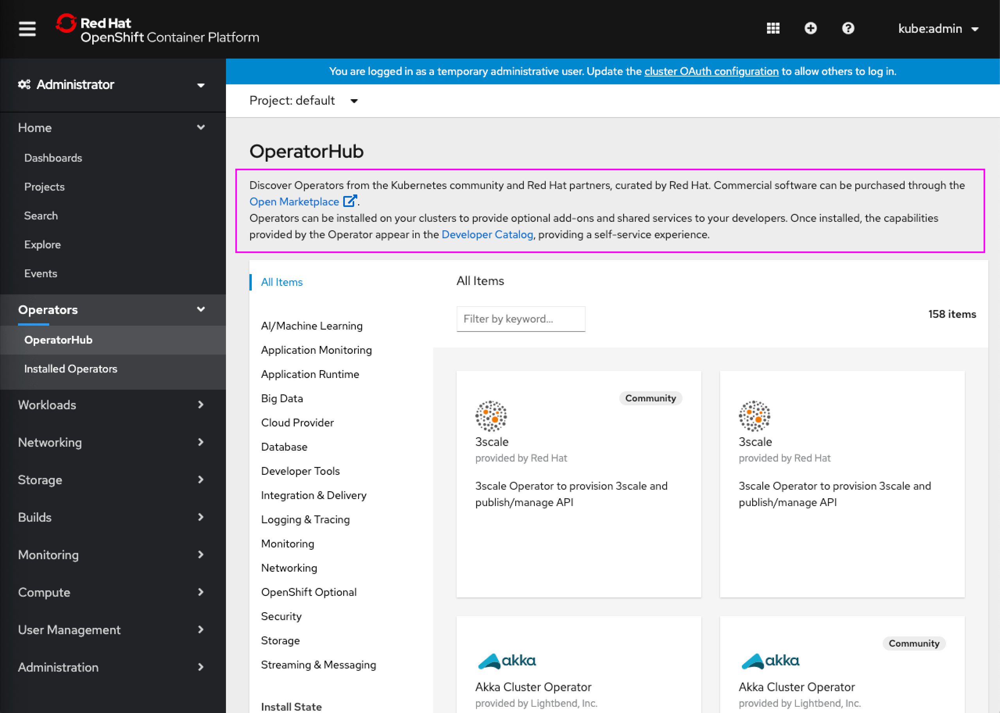
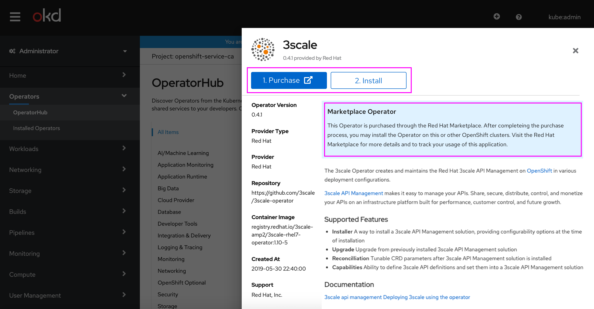

# Open Marketplace Support

Users can now install operators from the Open Marketplace from within OpenShift Web Console via OperatorHub. Users will be linked to the Open Marketplace to purchase operators and then are able to complete installation in OperatorHub.

## Link to Open Marketplace

- A link to the Open Marketplace is provided for users to browse and purchase operators from the Open Marketplace directly
- Detailed text in OperatorHub is updated to now include a link to Open Marketplace

## Purchasing and Installing a Marketplace Operator

- Operators from the Open Marketplace will have a “Marketplace” badge in OperatorHub, and when opened, will have a hint similar to the Community operator hint that describes this operator is from the Open Marketplace and can be purchased
- A **Purchase** button will now also be present for Marketplace operators that links to Open Marketplace for purchaing of that operator. At this time the UI is not able to determine when the operator has already been purchased so both the **Purchase** and **Install** buttons will always appear for Marketplace operators
- The buttons will be numbered to convey the expected flow of first purchasing and then installing the operator