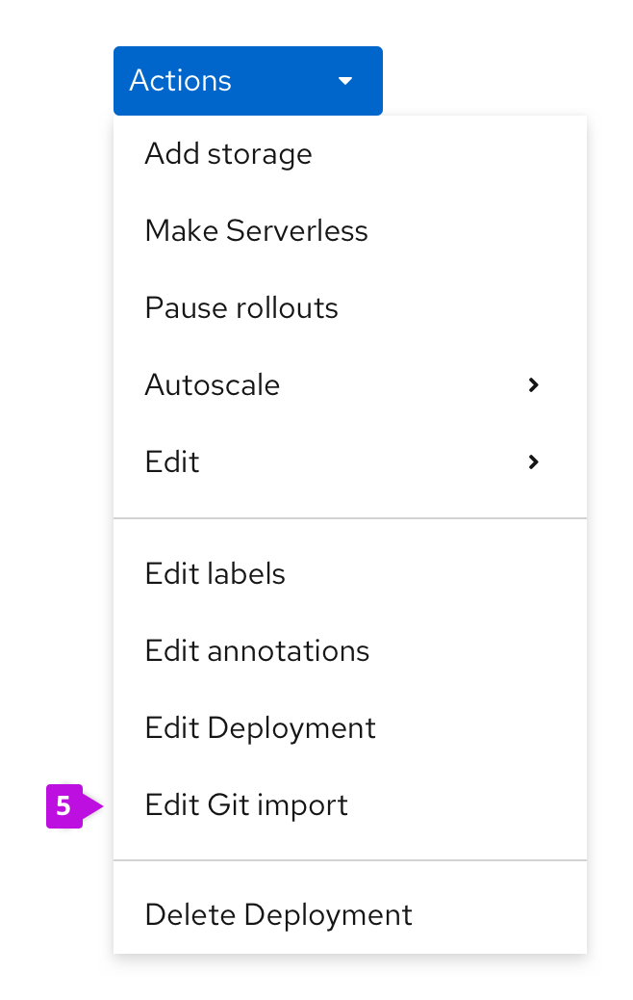

# Action menus

## Kebab and resource Actions menus

- A resource's Actions menu is accessible from a number of places, such as:
  1. List view kebab
  2. Details page actions dropdown
  3. Topology side panel
  4. Topology right-click action on a resource
- By default, submenus will open to the right of the main menu. In cases where there is no space to the right, they can open to the left.

**List view kebab**

**Details page actions dropdown**

**Topology side panel**

**Topology right click action on a resource**

- Actions dropdowns are styled as primary blue dropdowns.
- Exceptions are acceptable in cases where a different action(s) has been identified as the view's primary action. In these cases, the primary action(s) is usually pulled out of the dropdown and is styled as a primary button or dropdown to the left of the Actions dropdown, which will thus have secondary styling (e.g., Secrets details pages).

## Organization of Actions menu items

**Basic action menus**

The majority of resource action menus will be a basic action menu. These menus have "universal" actions and the `Delete {resource_type}` action separated by a horizontal divider.

**Complex action menus**

Some resource action menus will have more actions than those included in the basic action menu. The following documentation uses a Deployment as an example, but the logic to each section should be applied to any other complex action menu.

Action menus are separated into multiple sections. The ordering of sections and actions in the menu should adhere to the following pattern:
1. **Resource specific actions**
  * This section includes both standalone actions and flyout actions with submenus (see below for submenu guidance). Standalone actions are listed first, ordered alphabetically by default. Next, flyouts are listed, also alphabetically by default.
  * Exceptions are acceptable in the cases where an action may be dynamic (e.g., `Pause rollouts` becomes `Resume rollouts`, but the action should not move from its original position).
2. **"Universal" actions**
  * These actions are available for every resource in the console. These are listed in the following order:
    1. `Edit labels`
    2. `Edit annotations`
    3. `Edit {resource_type}`
3. **Delete resource action**
  * The last section of each Actions menu has the `Delete {resource_type}` action.
4. **Submenus**
  * In this example, the resource has two or more actions that are Edit actions, and are thus put into an Edit submenu.
  * Resources may have multiple submenus.
  * The default logic for ordering these actions is alphabetical.
  * If multiple actions relate directly to one topic, they can go in their own submenu. For example, dynamic actions relating to HorizontalPodAutoscalers will be listed in an "Autoscale" submenu.
    * If the resource doesn't yet have a HorizontalPodAutoscaler, the only action in the submenu will be `Add HorizontalPodAutoscaler`. If one exists already, the Add action will be replaced by `Edit HorizontalPodAutoscaler` and `Delete HorizontalPodAutoscaler`. (In the future, VerticalPodAutoscalers may be added to this submenu, with the same dynamic actions used for HPAs – Add, Edit, and Delete.)

5. **Additional Edit action**
  * In cases where a resource was created via an import flow, they may have an additional Edit action.
  * The Edit action is listed below the default `Edit {resource_type}` action.
  * The Edit action name will reflect the import flow used to create the resource. The following are the possible Edit labels for this action:
    * `Edit JAR import`
    * `Edit Git import`
    * `Edit Container import`

Naming of actions:
- Actions for resources do not need to include the resource’s name they affect, unless many resource types can be affected in the actions menu (e.g. taking action on HorizontalPodAutoscalers from Deployment action menu).
- Create, Edit, Delete are the exceptions in that they always include the full name of the resource they affect.
- Action labels should follow the [capitalization convention](http://openshift.github.io/openshift-origin-design/conventions/documentation/capitalization.html).

---

## Bulk Actions Menu

- This is a convention that hasn’t yet been implemented in the console. [Learn more here](http://openshift.github.io/openshift-origin-design/designs/administrator/future-openshift/bulk-actions/)
- List views of resources may support multi-select and a bulk “Actions” menu.

Actions in the menu should follow the following pattern:
- Unique bulk actions to that resource should appear above default bulk resource actions
- Add Labels (when present)
- Add Annotations (when present)
- Delete [Resource Name(s)]

---
