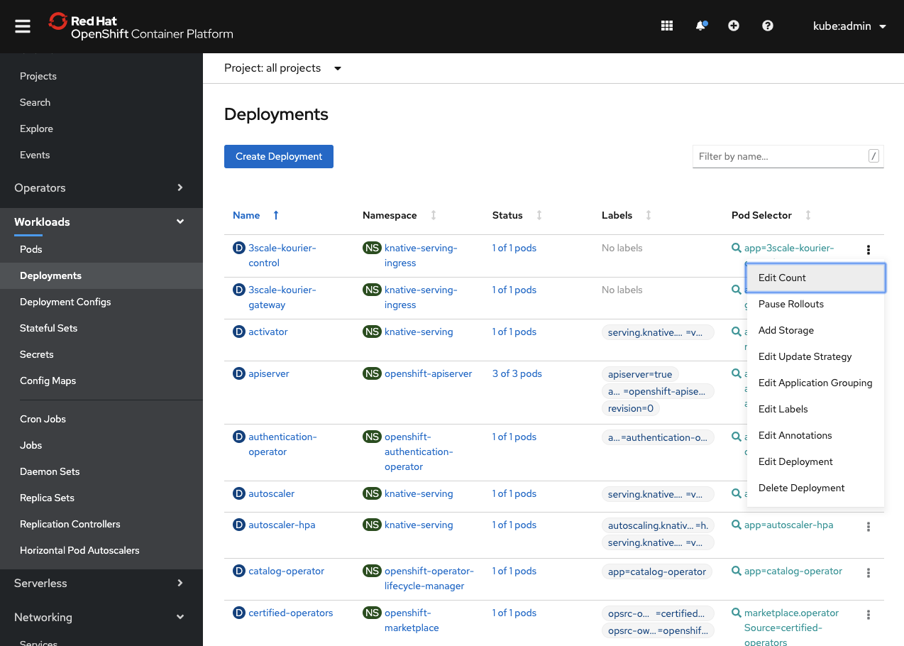
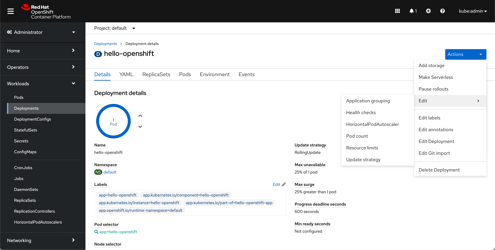
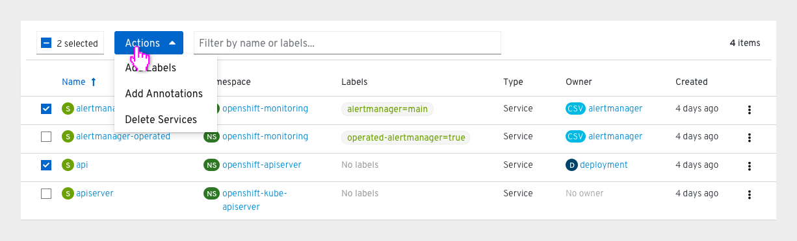

# Action menus

## Kebab and resource ‘Actions’ menus

- List views of resources have a “kebab” menu that matches the resources’ “Actions” menu in their details view.

Ordering of actions in the menu should follow the following pattern:
- Unique actions to that resource should appear above default resource actions
- Edit Labels (when present)
- Edit Annotations (when present)
- Edit [Resource Name]
- Delete [Resource Name]

Naming of actions:
- Actions for resources do not need to include the resource’s name they affect, unless many resource types can be affected in the actions menu.
- Create, Edit, Delete are the exceptions in that they always include the full name of the resource they affect.

---

## Bulk Actions Menu

- This is a convention that hasn’t yet been implemented in the console. [Learn more here](http://openshift.github.io/openshift-origin-design/designs/administrator/future-openshift/bulk-actions/)
- List views of resources may support multi-select and a bulk “Actions” menu.

Actions in the menu should follow the following pattern:
- Unique bulk actions to that resource should appear above default bulk resource actions
- Add Labels (when present)
- Add Annotations (when present)
- Delete [Resource Name(s)]

---