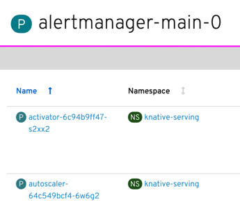
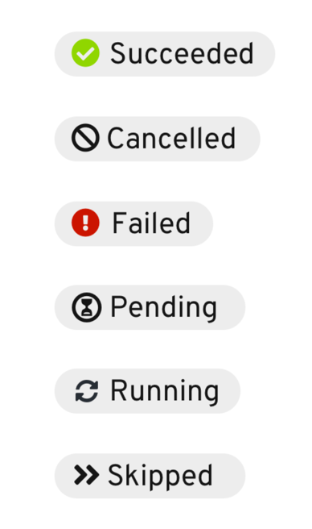

# Badges

## Resource badges

+ Colored badges are added to the left of all Kubernetes resources (including Custom Resources) in the console
+ Badges help users quickly identify resource type with a 1-3 letter abbreviation
+ There are custom resource definitions that exceed 3 letter abbreviations but we try to avoid this for general pre-defined resources 
+ Resource names are typically shown as links (There are some exceptions to this rule if there is no detail page to display but majority of the time there is a link).
+ Full descriptive resource type name is shown on delayed hover of badge

---

## Status badges

A status badge is a PatternFly badge that includes both a status icon and status label which can be used on a details view title.  Having a status badge in the details view title allows the user to see the status of the resource in context, regardless of which tab is selected.

*Examples of status badges shown in OpenShift:*

---

## Tech preview badge

A tech preview badge indicates when a feature is new and may still be in-progress on the development side.

*Example of tech preview badge on feature*

