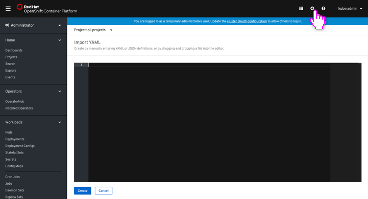
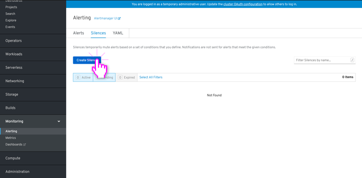

# Creating

+ Resources that can be created through the console have a primary button called: **Create [resource-name]**
+ If a form exists, the form is shown by default
+ All forms should include an **Edit YAML** secondary action in the top right corner for users to optionally switch to YAML creation
+ If multiple creation types exists, the primary create button changes to **Create** and includes a dropdown to present the options
+ When creating a resource from the summary table view page, the create resource form/yaml is presented in-page
+ If creating a resource from another context, such as the topology view, these forms can be surfaced in a modal
+ Resources should have samples available on creation. When first viewing the form, the sample panel should be closed by default. When first viewing the YAML creation, the sample panel should be open by default. 

---

## Creating from YAML

**Import YAML:**

*Clicking the "+" menu in the masthead will open up a YAML editor in order to create resources.*

---

**Create from button (YAML):**

*Some resource types can only be created with YAML. The first time viewing the YAML creation, the samples panel should be open by default.*

---

## Creating from a form

*Some resource types can be created with a form (as the dault) with an option to edit the YAML. After the resource is created, the user is automatically navigated to the created resource.*

