# Creating

+ Resources that can be created through the console have a primary button called: **Create [resource-name]**
+ Create buttons should appear in the top right corner
+ If the resource supports freely switching between form and YAML views, the editor switching radio controls should be shown
+ If the resources supports form editing (but not freely switching between form and YAML,) the form should include an **Edit YAML** secondary action in the top right corner for users to optionally switch to YAML creation
+ If a form exists, the form is shown by default
+ If multiple creation types exists, the primary create button changes to **Create** and includes a dropdown to present the options
+ When creating a resource from the summary table view page, the create resource form/yaml is presented in-page
+ If creating a resource from another context, such as the topology view, these forms can be surfaced in a modal
+ Resources should have samples available on creation. When first viewing the form, the sample panel should be closed by default. When first viewing the YAML creation, the sample panel should be open by default.
+ Upon creating a resource, the user should generally be taken into that newly created resource's details. An exception can be if the resource list is not surfaced at a top level and the user should be oriented to its location (Operands do this as their list is in the operator,) so the user is taken to the resource list.

---

## Create button types

### Single Create Buttons

*Single resource create buttons appear in the upper right of the page.*
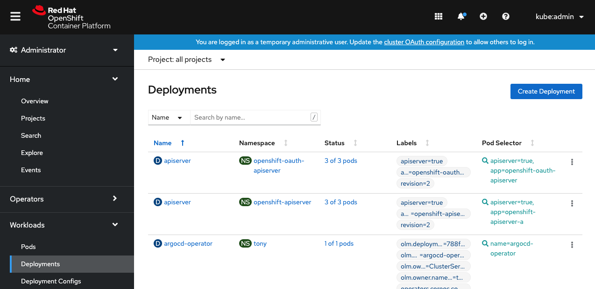

---

### Dropdown Create Buttons

*If multiple resources or multiple methods (or both) can be created from a button, a dropdown is used.*

**Multiple methods to create one object**
- Name of resource is included on button.
- Name of resource is not included in methods to create it.
- Methods are recommended to start with “With” or “From”.
- “From YAML” should appear last, when applicable.

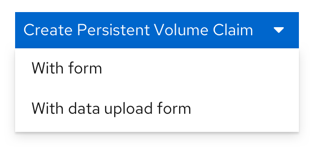

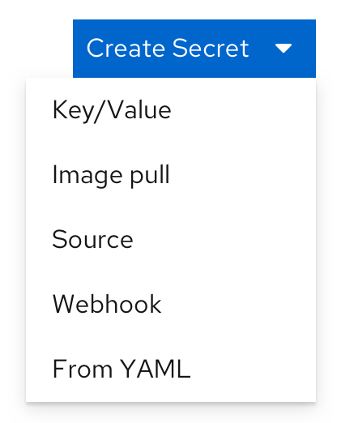

**Multiple objects created from one button**
- Button just reads “Create”.
- Names of resources are listed as options.

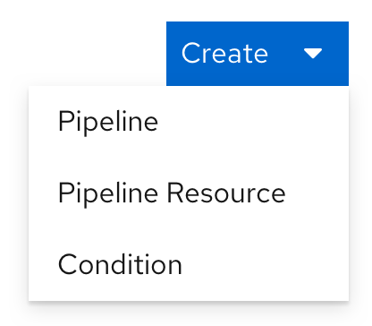

**Multiple methods to create multiple objects**
- Button just reads “Create”.
- Groups are used to separate resource types, with the methods in each group.
- A Separator component can appear between resource types.

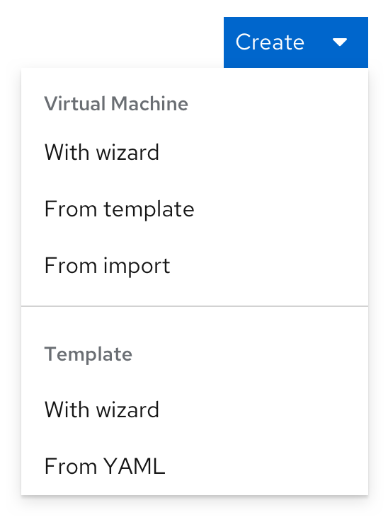

---

### Create buttons in selection fields

*Fields that allow the user to optionally create a resource where they would otherwise be selecting one have a create action as the first option in the dropdown, seperated by a divider.*
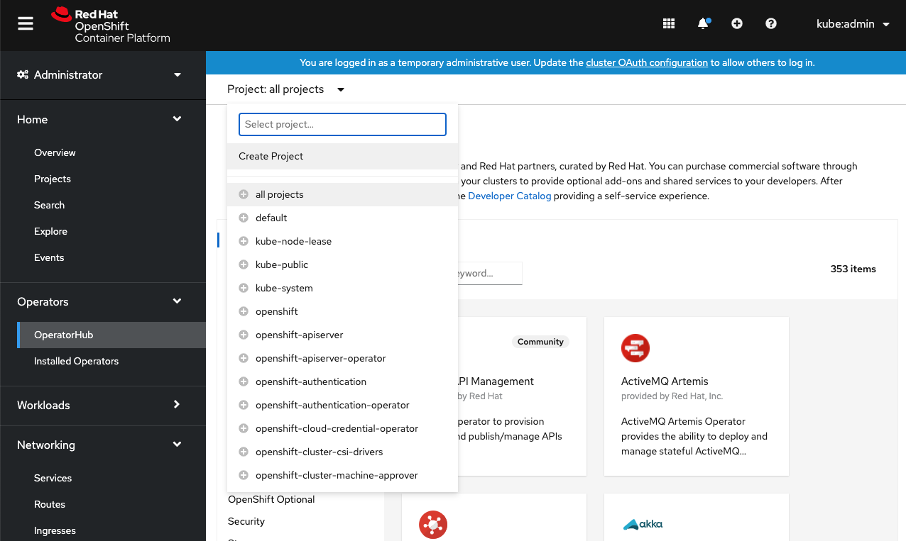

---

## Creation with form/YAML

### Creation via YAML only:

*Some resource types can only be created with YAML. The first time viewing the YAML creation, the samples panel should be open by default.*
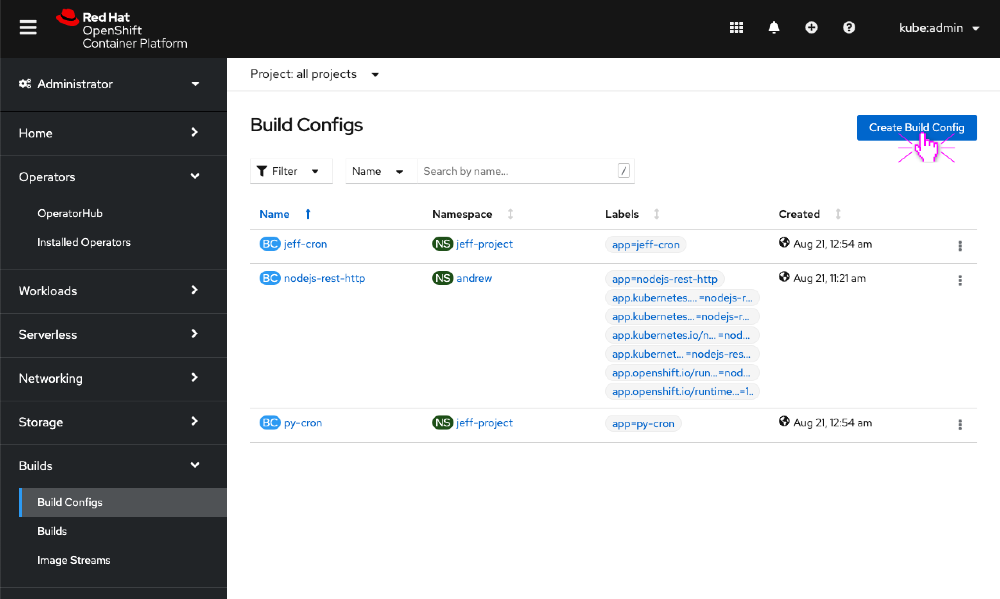
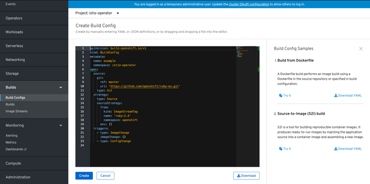

---

### Creation via form only:

*Some resource types can only be created with a form.*
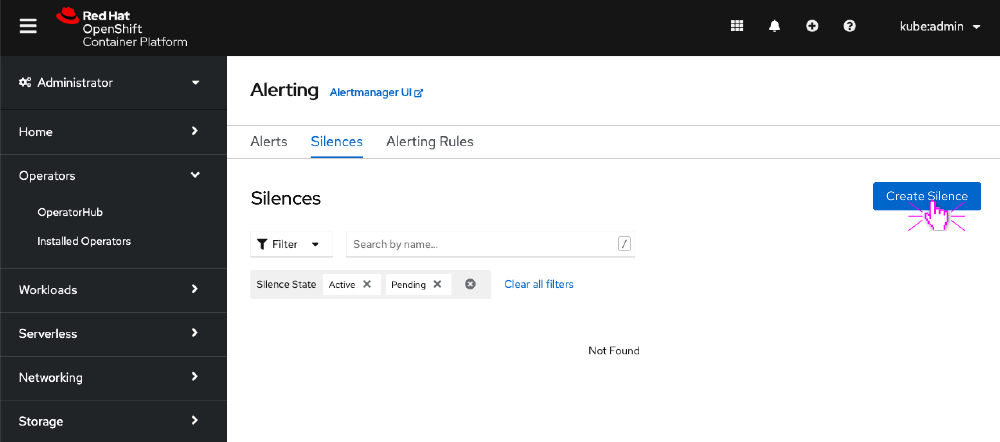
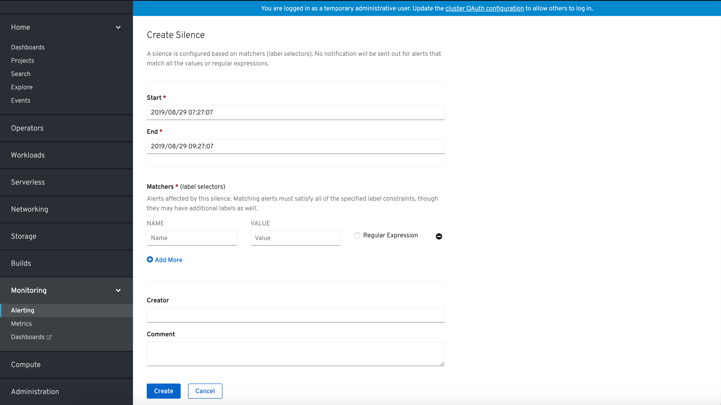
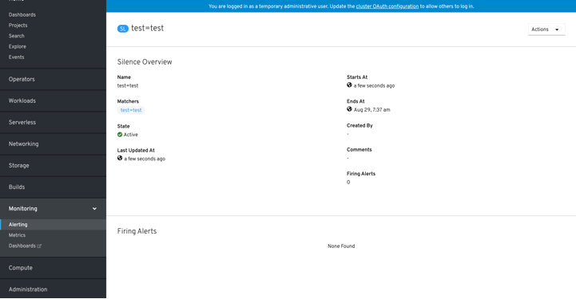

---

### Creation via form with option for YAML:

*Some resource types can be created with a form (as the default) with an option to switch to create with YAML. Once switched to the YAML editor changes from the form editor are lost and it is not possible to switch back to the form view. Ideally this switch is confirmed with the user.*
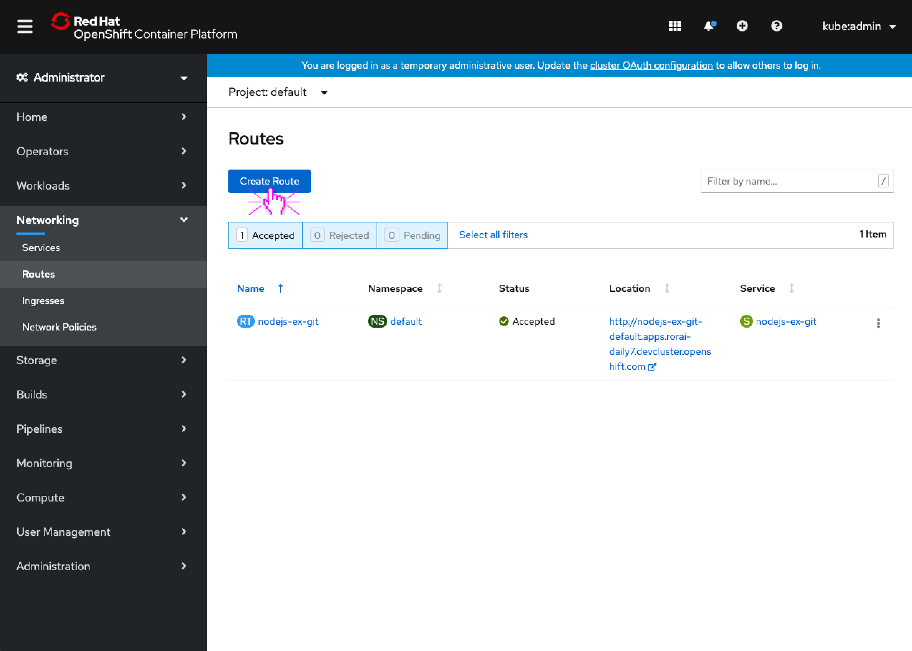

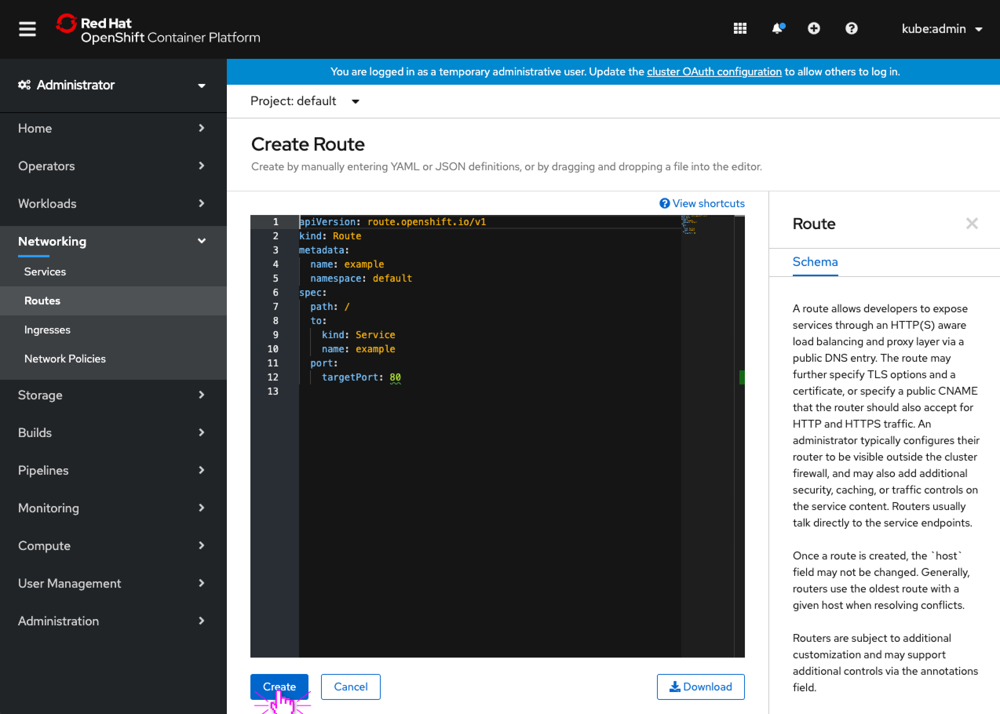
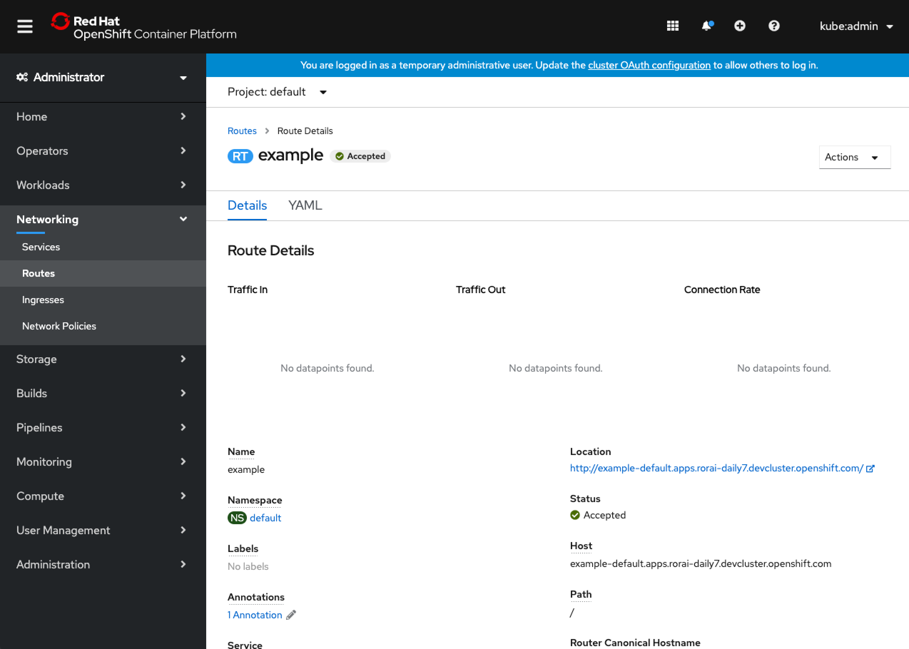

---

### Creation via free switching between form & YAML:

*Some resource types can be created with both a form and YAML editor. The user is able to freely switch between the two editors and changes are preserved across them.*
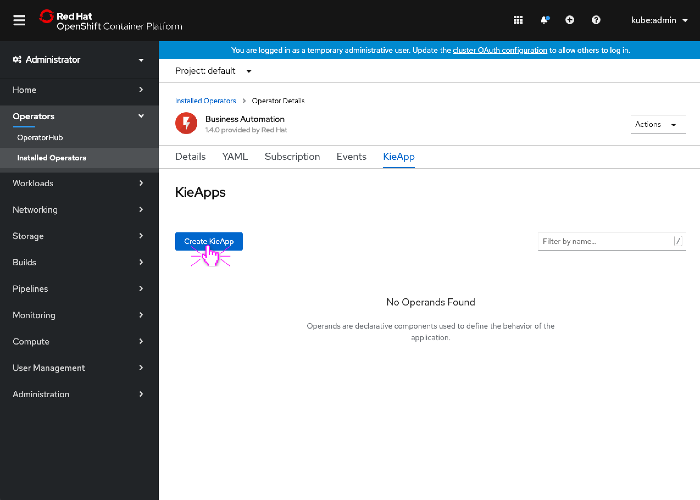
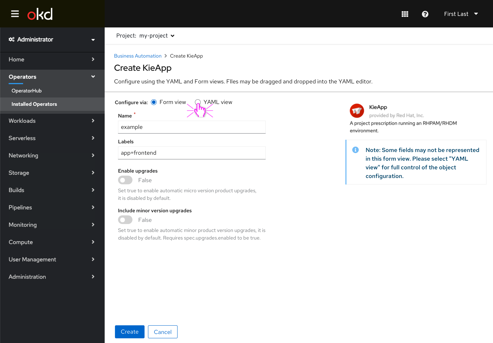
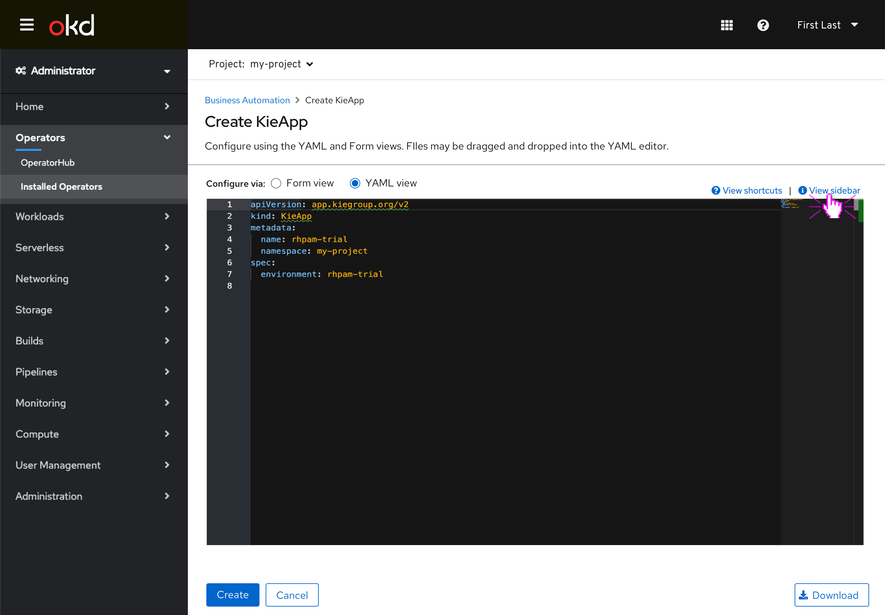
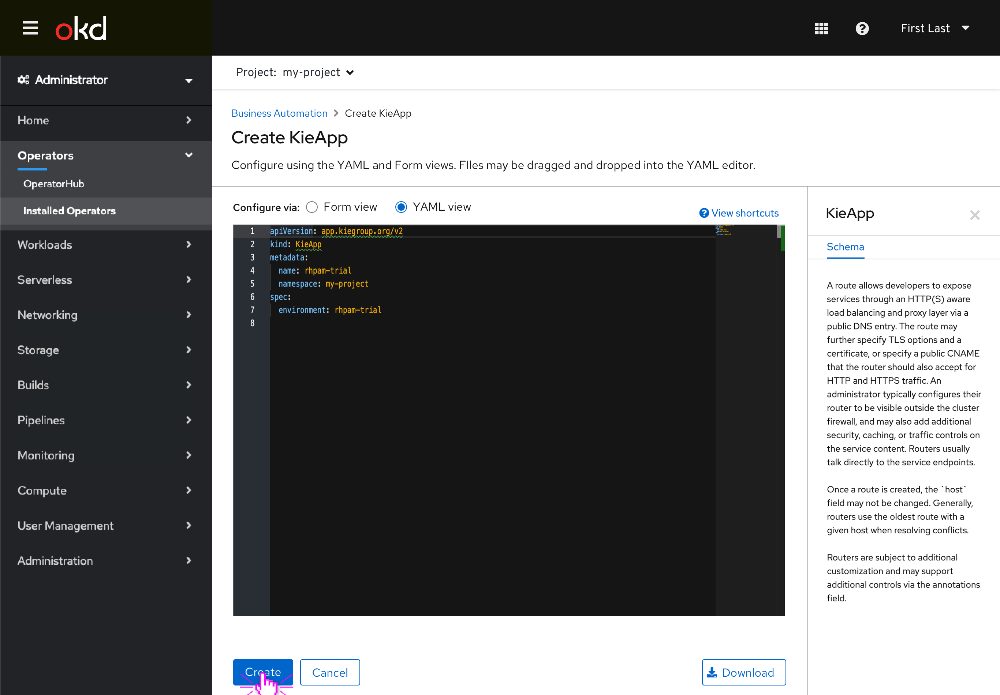

---

## Importing from YAML

**Import YAML:**

*Clicking the "+" menu in the masthead will open up a YAML editor in order to create resources.*

---
