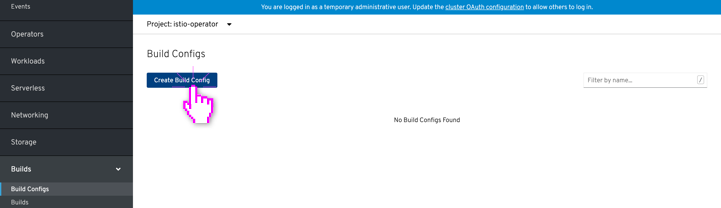

# Creating

+ Resources that can be created through the console have a primary button called: **Create [resource-name]**
+ If the resource supports freely switching between form and YAML views, the editor switching radio controls should be shown
+ If the resources supports form editing (but not freely switching between form and YAML,) the form should include an **Edit YAML** secondary action in the top right corner for users to optionally switch to YAML creation
+ If a form exists, the form is shown by default
+ If multiple creation types exists, the primary create button changes to **Create** and includes a dropdown to present the options
+ When creating a resource from the summary table view page, the create resource form/yaml is presented in-page
+ If creating a resource from another context, such as the topology view, these forms can be surfaced in a modal
+ Resources should have samples available on creation. When first viewing the form, the sample panel should be closed by default. When first viewing the YAML creation, the sample panel should be open by default.

---

## Creating from Create button

**Create from button (YAML only):**

*Some resource types can only be created with YAML. The first time viewing the YAML creation, the samples panel should be open by default.*

---

**Create from button (Form only):**

*Some resource types can only be created with a form. After the resource is created, the user is automatically navigated to the created resource.*

---

**Create from button (Form with option for YAML):**

*Some resource types can be created with a form (as the default) with an option to switch to create with YAML. Once switched to the YAML editor changes from the from editor are lost and it is not possible to switch back to the form view. Ideally this switch is confirmed with the user. After the resource is created, the user is automatically navigated to the created resource.*

---

**Create from button (Free switching between Form & YAML):**

*Some resource types can be created with both a form and YAML editor, with the user able to freely switch between the two editors and changes are preserved across them. After the resource is created, the user is automatically navigated to the created resource.*

---

## Importing from YAML

**Import YAML:**

*Clicking the "+" menu in the masthead will open up a YAML editor in order to create resources.*

---