# Dashboards

The cluster-wide (overview) dashboards serve as an overview of the system – either as a general overview or with a specific lens on a service (storage, for example). The resource level dashboards serve as an overview of the resource and show similar content as the cluster overview dashboard, but filtered to relevant information for the particular resource. The information shown, and even the dashboards being displayed, will depend on the Operators installed and the setup of the particular cluster.

---

## Dashboard examples

**Overview dashboards:**

*Cluster overview:*

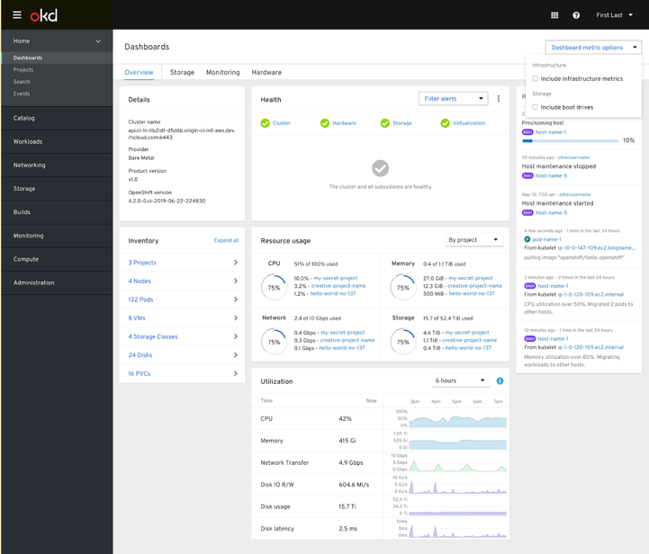

*Cluster persistent storage:*

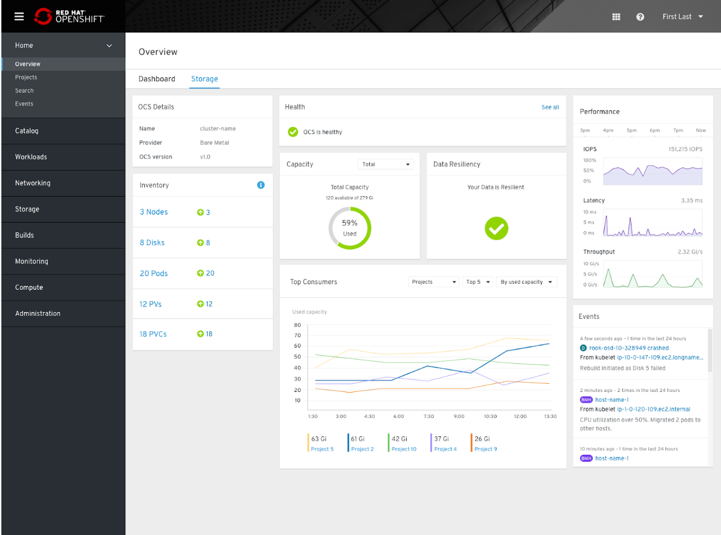

*Cluster object service:*

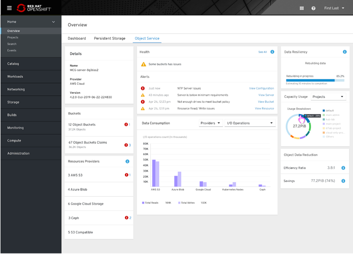

**Resource dashboards:**

*Node overview:*

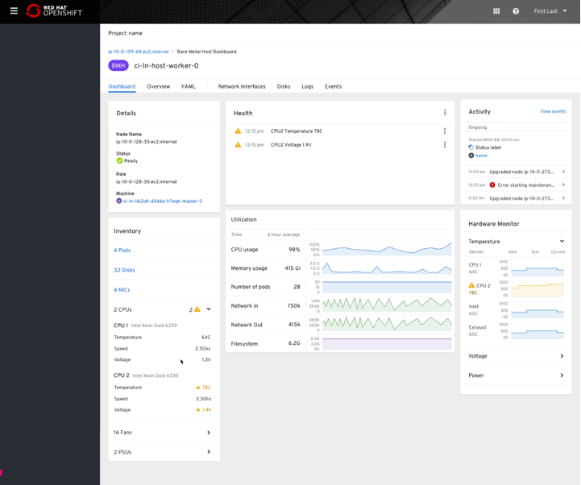

*Project overview:*

*Virtual machine overview:*

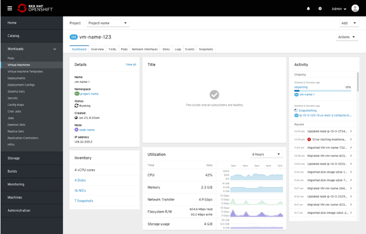

---

## Dashboard card examples

*Details:*

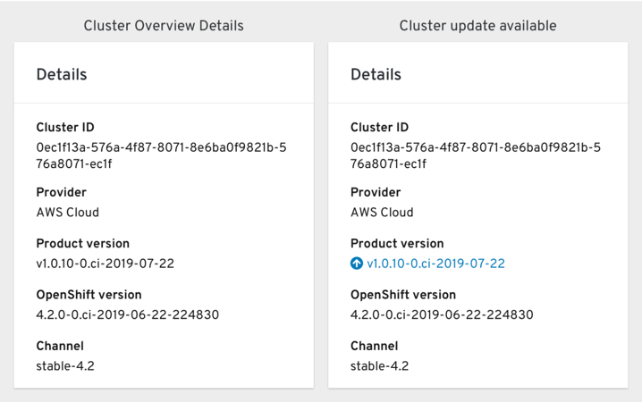

*Activity:*

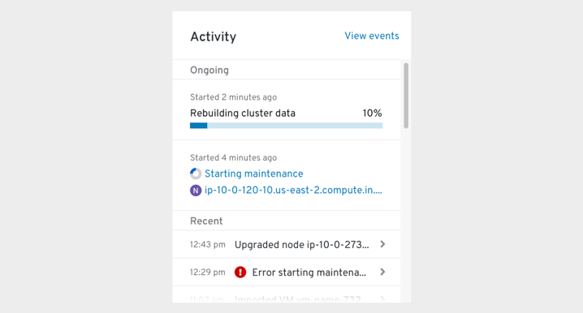
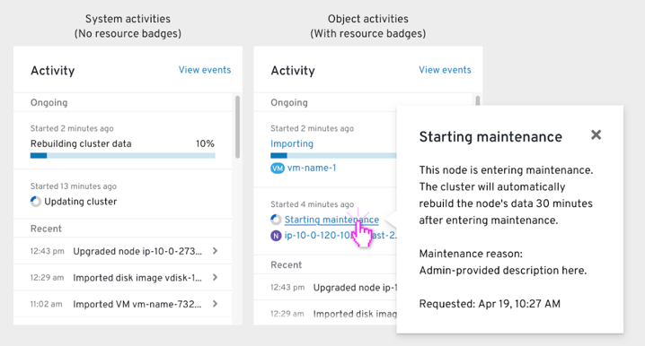
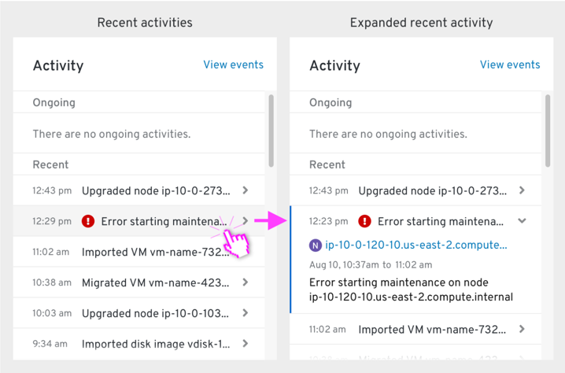

*Health:*

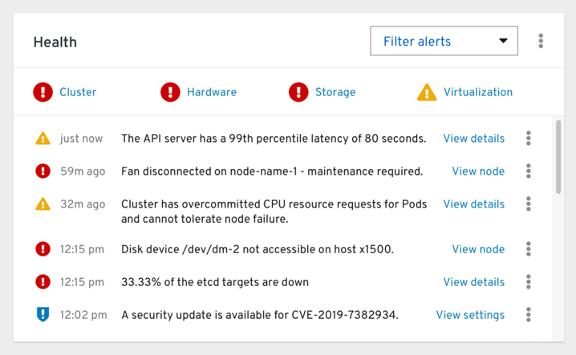

*Inventory:*

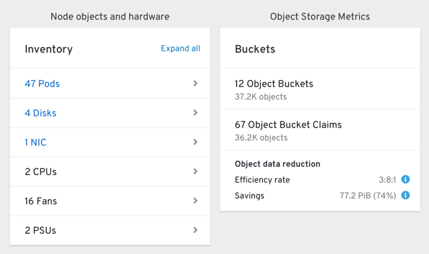

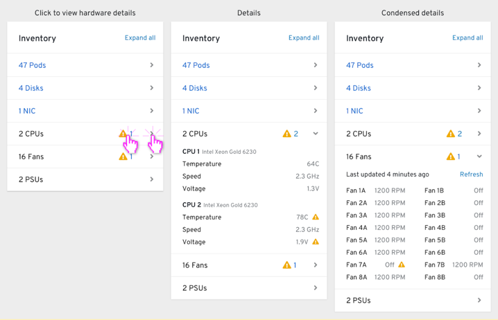

*Resource usage:*

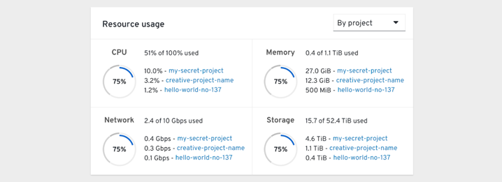

*Breakdown:*

*Generic chart:*

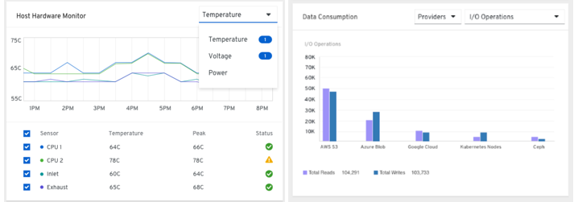

