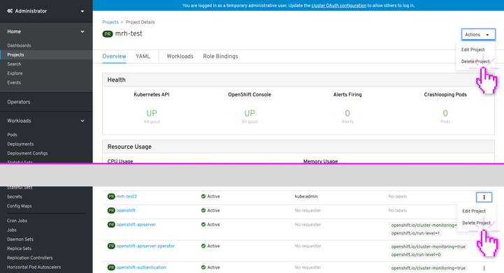
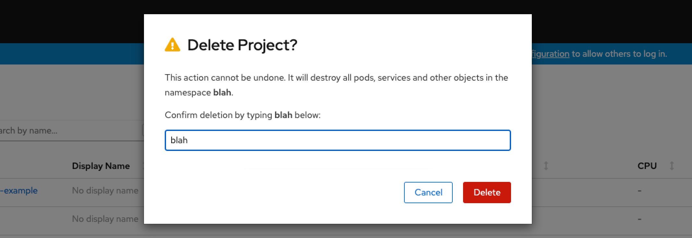
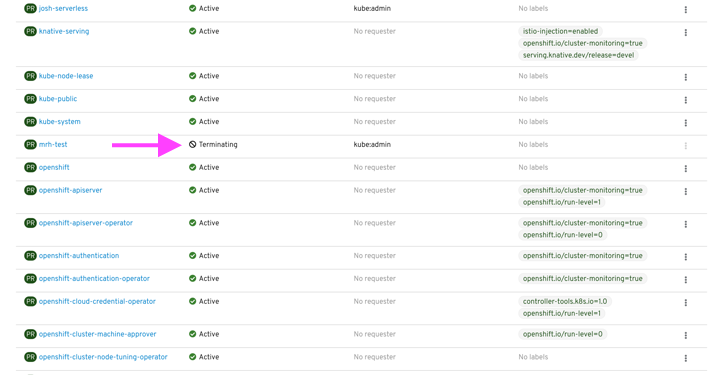
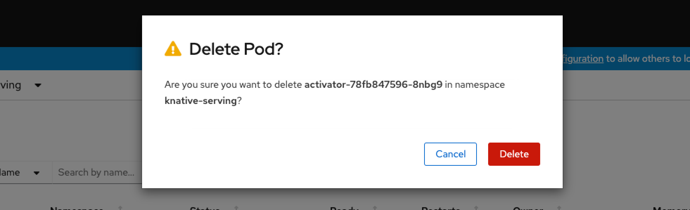

# Deleting

**Example (Project):**

When deleting a resource, a user must confirm by typing the resource name. After a user confirms deletion, the resource is marked for deletion with an indicator of "terminating."

---

**Example (Pod):**

Some resources do not require a confirmation by typing, but still must be confirmed via a confirmation modal.

