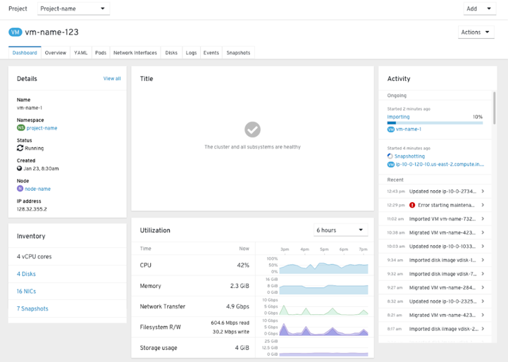
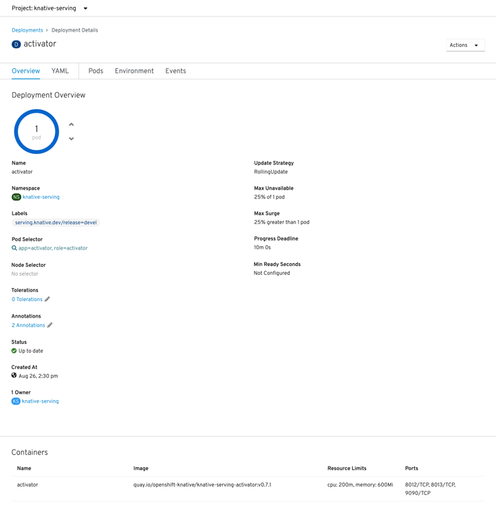
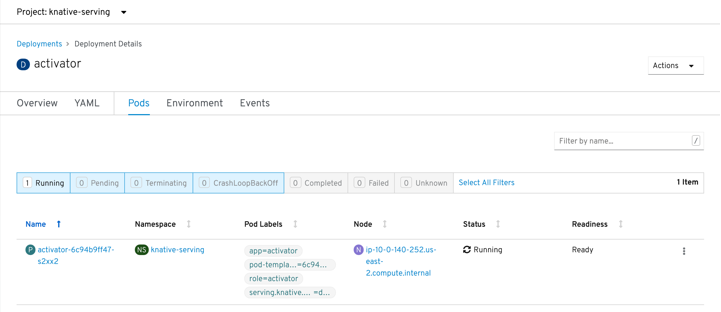
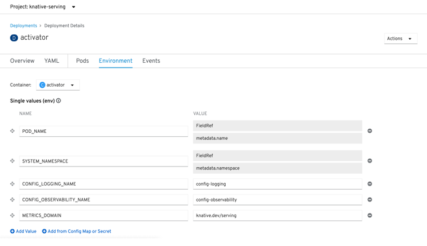
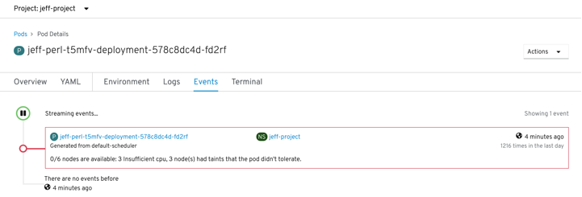
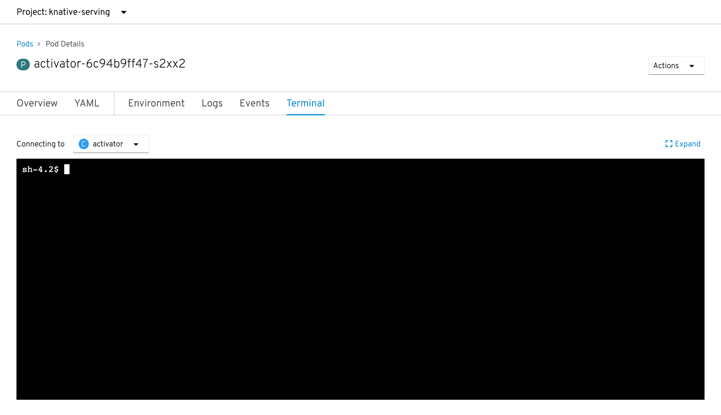
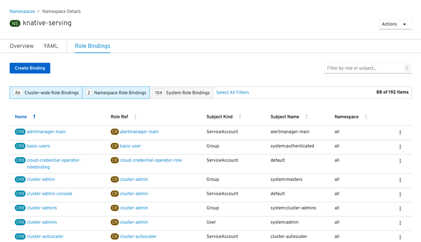
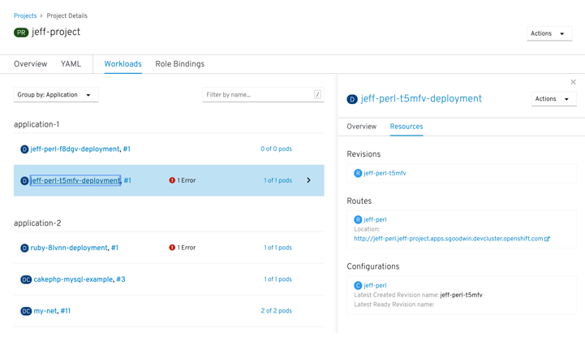

# Resource details

## Details pages & tabs

A resource is an object in the system: Kubernetes objects (Containers, Pods, Deployments, etc), custom objects in OpenShift (Projects), or custom resources created by an installed Operator (Alerting rule). As a general rule, creating a custom object that is an abstraction or expansion of a Kubernetes concept can be confusing and is advised against (for example Projects as an abstraction of Namespaces).

Tabs are generally used to segment content: details and meta information about the resource, configurations, related settings, related objects, and child objects. 

*Resource dashboard:*

*Resource overview:*

*Resource YAML:*

*Resource pods:*

*Resource environment:*

*Resource events:*

*Resource terminal:*

*Resource role bindings:*

*Resource workloads:*

---

## Details panel

A details panel provides a summary view of the resource and related information.

*Details overview:*

*Details resources:*

