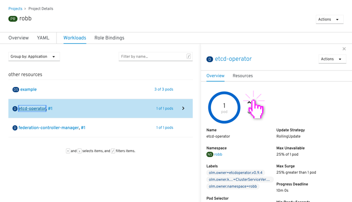
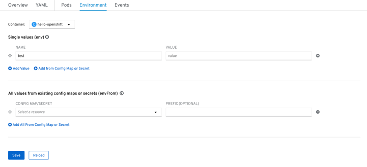
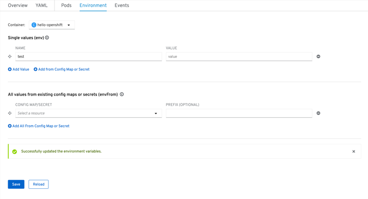
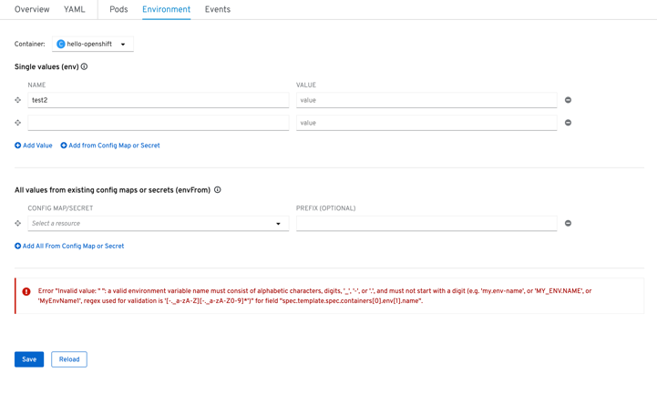
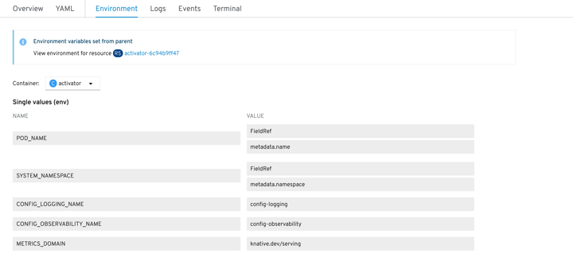
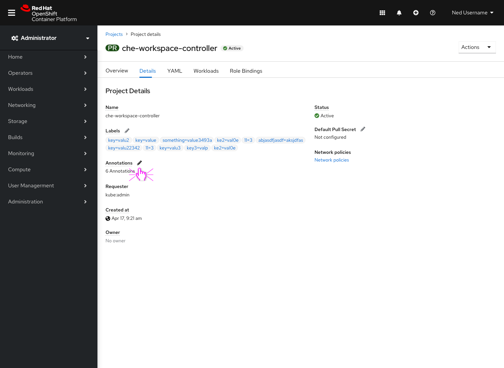
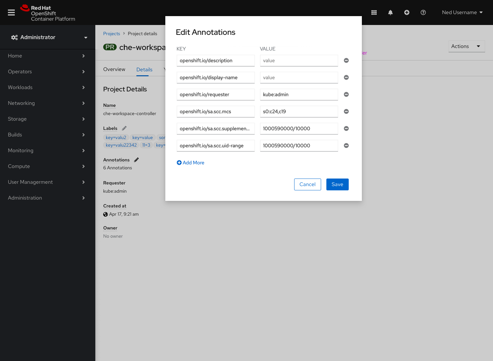

# Editing

## Edit inline

Users can edit some details directly inline, like the pod count.

---

## Edit inline forms

Users can edit forms inline directly, like on the "Environments" tab.

*Default view shows editable fields:*

*When users edit and save, a success appears inline:*

*When users edit and save while having an error, an error message appears inline:*

*When users go to a view where they could typically edit, but the inputs are being controlled through another resource, a message appears inline explaining this and pointing to the source:*

---

## Edit links

Some details / field inputs link to modals for editing information.

*Field inputs that can be edited are links and show an "edit" icon (pencil):*

*An edit modal appear and allow users to edit within the modal:*

