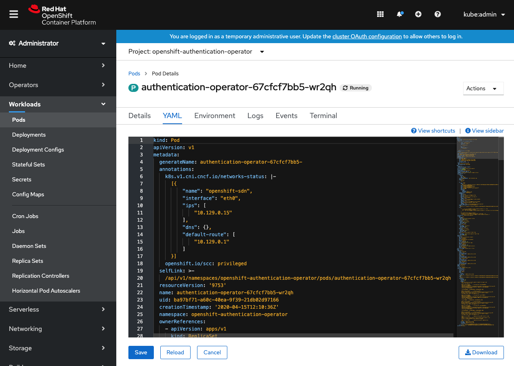
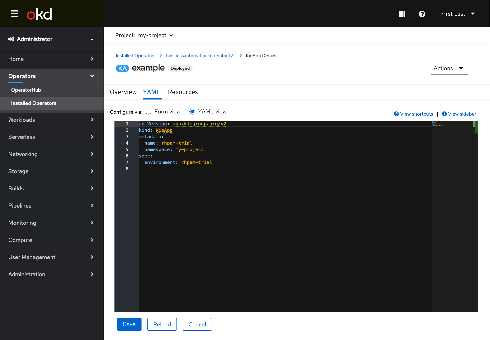

# Editing

## Edit inline

Users can edit some details directly inline, like the pod count.

---

## Edit inline forms

Users can edit forms inline directly, like on the "Environments" tab.

*Default view shows editable fields:*

*When users edit and save, a success appears inline:*

*When users edit and save while having an error, an error message appears inline:*

*When users go to a view where they could typically edit, but the inputs are being controlled through another resource, a message appears inline explaining this and pointing to the source:*

---

## Edit links

Some details / field inputs link to modals for editing information.

*Field inputs that can be edited are links and show an "edit" icon (pencil):*

*An edit modal appear and allow users to edit within the modal:*

---

## Edit in YAML tab

Most resources have backing YAML that can be edited directly in their YAML tab.

**Editing with YAML only:**

*Some resource types can only be edited via YAML in their YAML tab:*

---

**Editing with free switching between Form & YAML:**

*Some resource types can be edited in their YAML tab with both a form and YAML editor:*

The user is able to freely switch between the two editors and changes are preserved across them. The YAML view is generally the default to allow for quick reference of the more complete YAML for read only tasks like status checking.

---