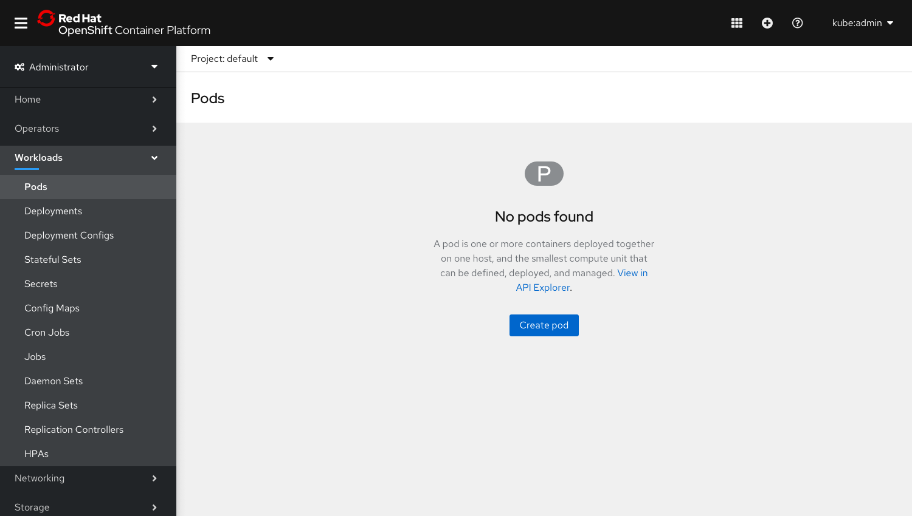
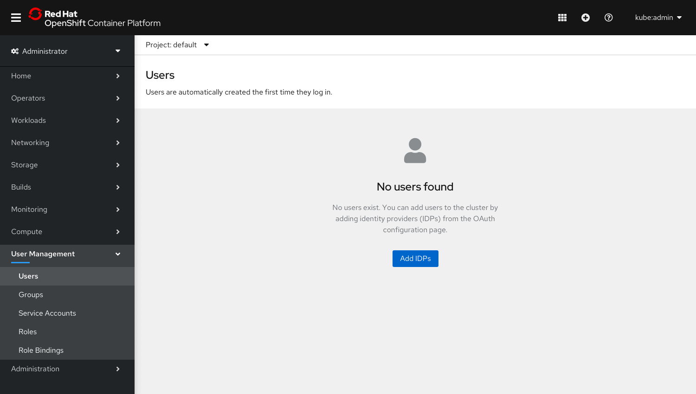
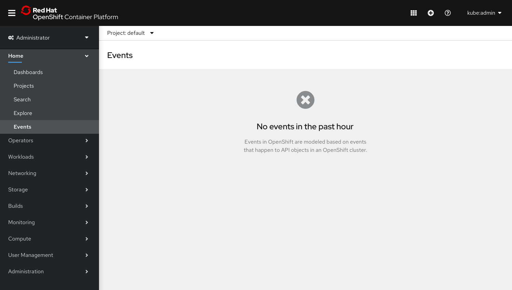
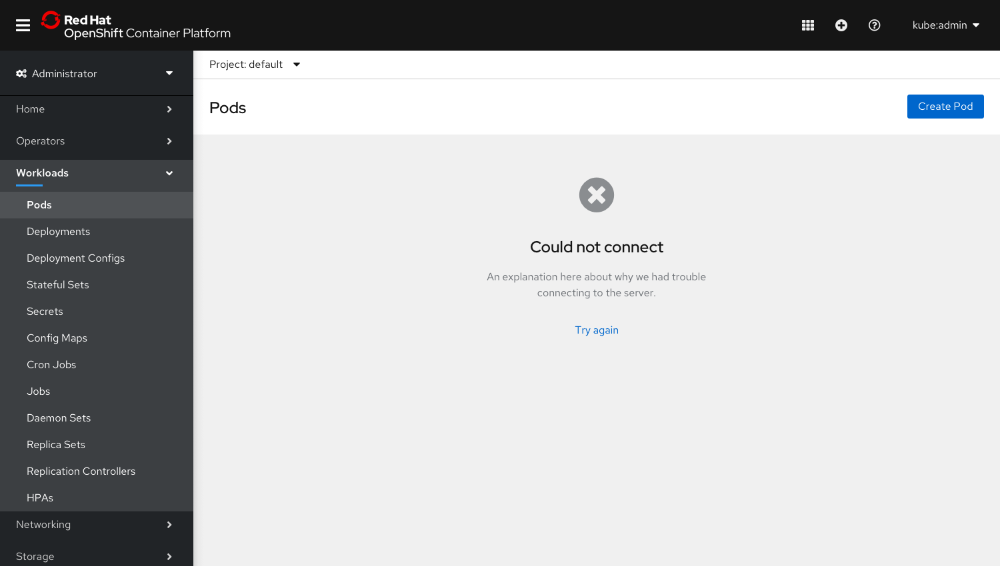
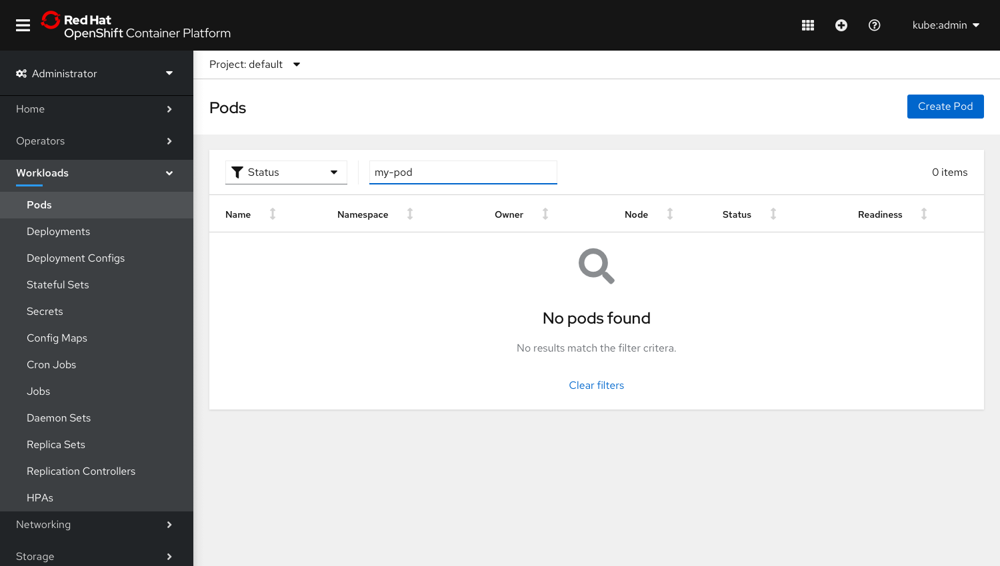
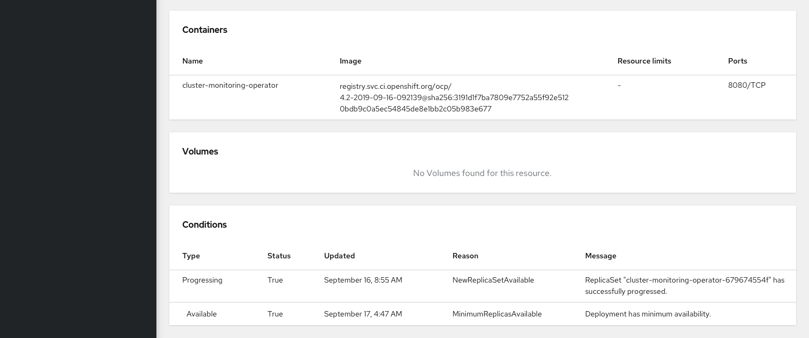
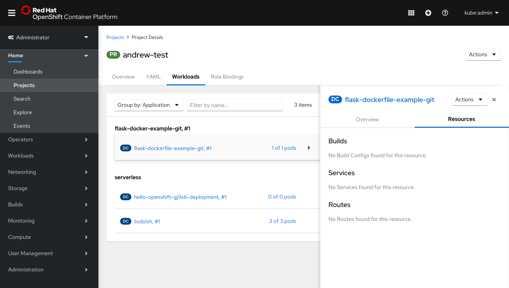

# Empty states

## Default empty states

### When there are no workloads

+ Use this empty state across workloads when there are no items to show. Include the resource’s schema description and link to the API Explorer to learn more. The primary action should allow the user to Create [Resource].
+ In cases where users should not be creating objects in specific namespaces, remove the primary Create button and include informational text in the body explaining why.
+ Where applicable, use the resource’s badge in grey for the empty state icon.

+ For this case, the primary Create button should be “Add IDPs” and redirect users to the OAuth page. A user icon should be used for this empty state.

+ Since users cannot create or add events, this empty state does not have a primary action.

### Could not connect

### When nothing matches a filter

---

## Small empty states

