# Navigation interactions

## Loading

When a screen is loading, the application displays a wireframe of the loading content (same shape and layout of the content that will eventually replace the screen) with an animation of transitioning shades of gray.

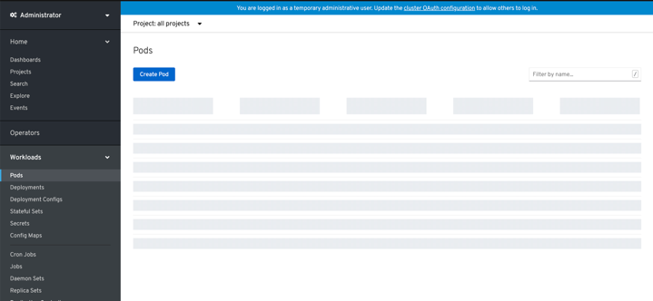

*Example of a dashboard card loading and content that is unavailable:*

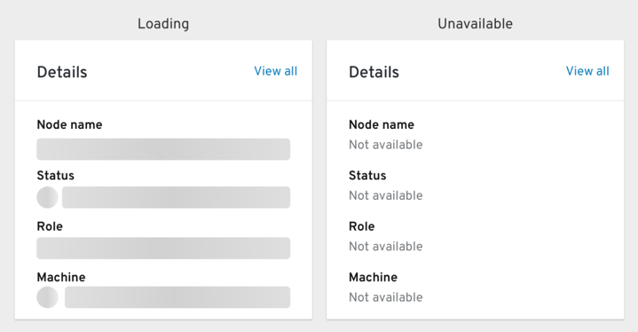

---

## Breadcrumbs

Breadcrumbs do not appear on the initial page whether it is a dashboard or a list page.

When navigating to a details view for a resource, the breadcrumb displays the list page for that resource as a clickable link, then the resource type (for example: Pods (link) > Pod Details).

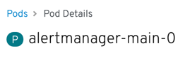

When a resource has a parent/child relationship, like a Pod to a Container, clicking to the container will show the Pod as the parent. The breadcrumb shows the actual name of the Pod itself (for example: Pods (link) > ruby-ex-git-1-xzvb6 (link) > Container details).

In other instances, like when navigating to a pod from a deployment, the breadcrumb changes to reflect the parent of the resource as the resource list (pod list) rather than the originating resource (a deployment).

*Deployment:*

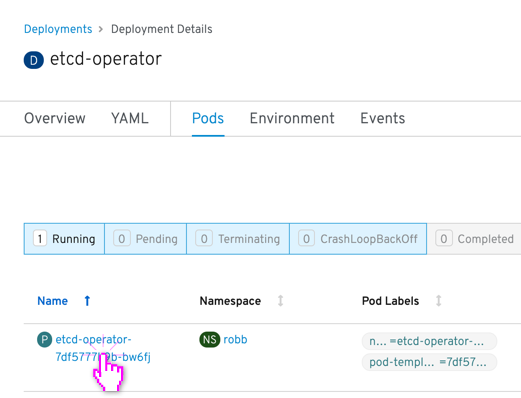

*Pod (navigating from deployment):*

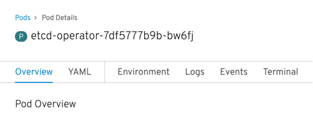

---

## Project selector

The project selector is available on pages of resources that are contained within projects. When on a list view, if you select “all projects” you will see all resources (for example “all projects” on the Pods list page will show all pods in all projects).

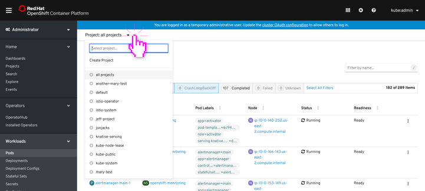

When you select an individual resource (like a pod), the project will automatically select the project that owns the pod.

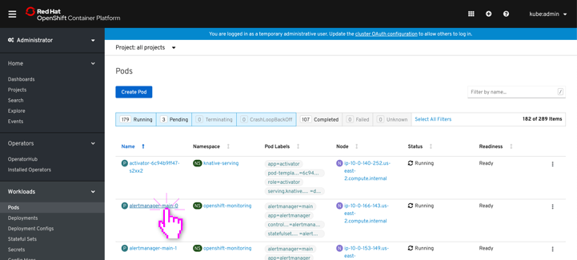

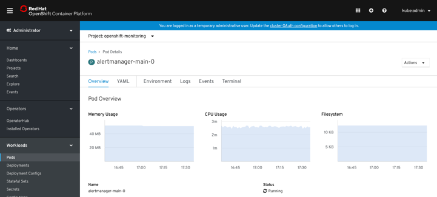

When you navigate from that details page with a selected project, it now changes all contexts (where project selection is applicable) to that selected project. This includes navigating back (example: using the breadcrumbs) to the parent page (pods list) where the project selection will persist. Project selection persists across sessions as well (local storage on user side).

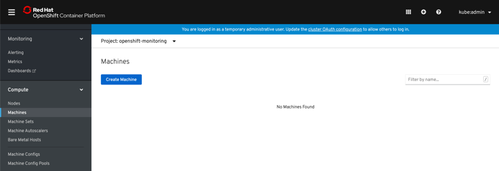

---

## Searching from labels

When you click on a "label" object from a list or details page, you are navigated to the search page with the results filtered.

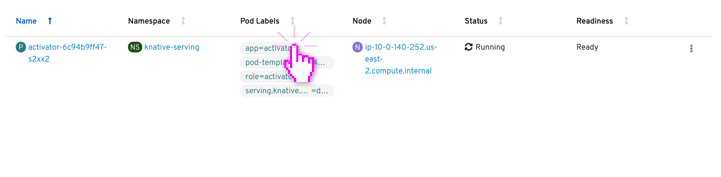

The resulting search shows the label name in the search field and the results are displayed.

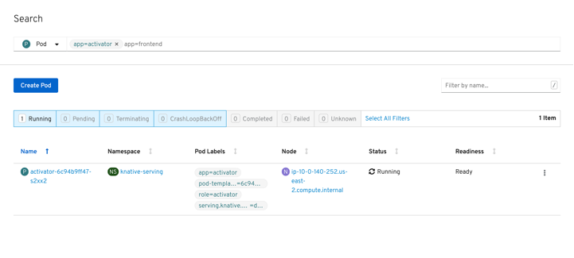

---

## External linking

When a page can open another application (link to an external source), the external source name along with an external linking icon is displayed next to the page title. When you click the link the source opens in a new tab.

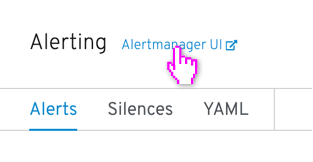

