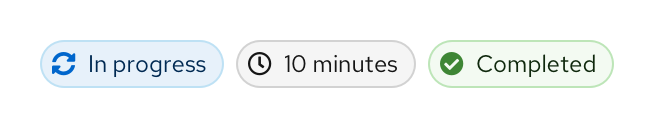
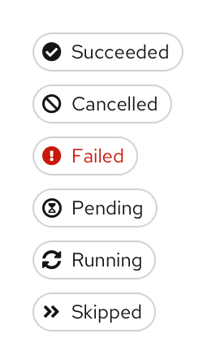
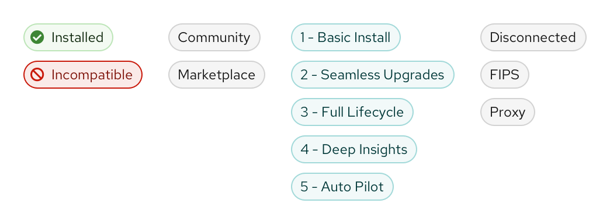
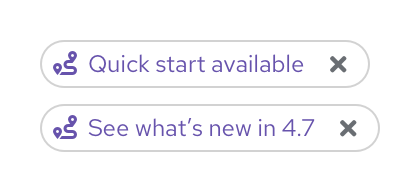
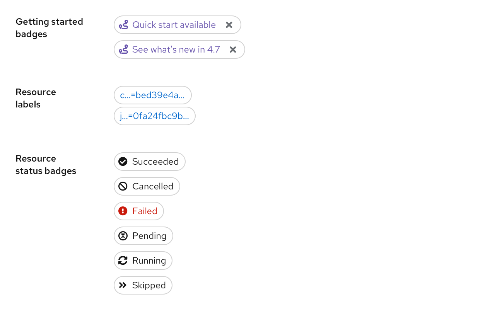
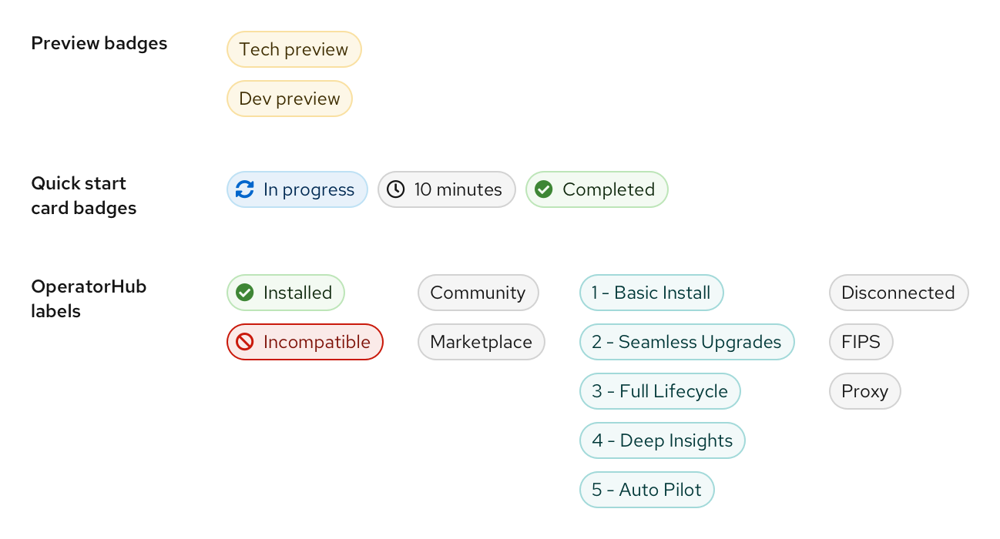
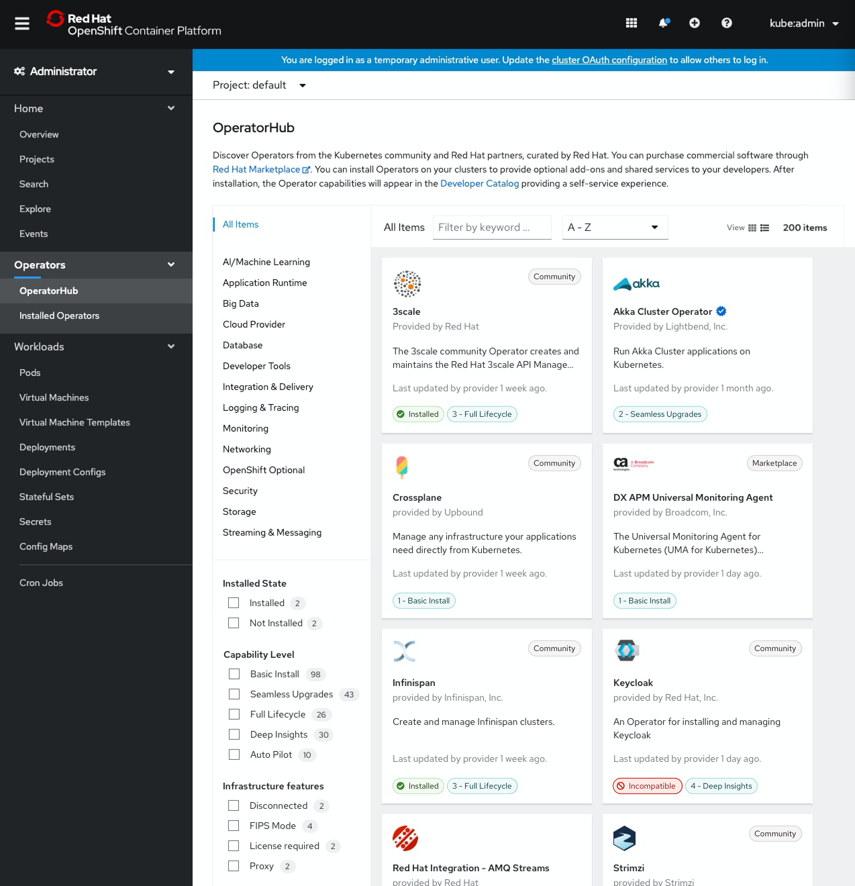
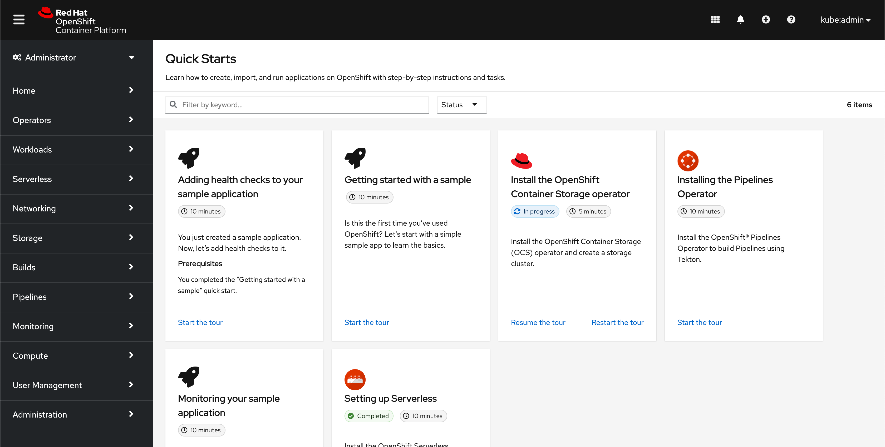

# Labels

This convention covers label guidelines for the OpenShift console UI. These should be followed in tandem with PatternFly's [label guidelines](https://www.patternfly.org/v4/components/label/design-guidelines). While PatternFly provides general recommendations on the use of color for labels and styling for clickable and non-clickable labels, the OpenShift console should follow the more specific guidelines below.

**IMPORTANT NOTE:** PatternFly is in the process of updating the label visuals to have light and heavy styling instead of unfilled and filled styling, respectively. The visual changes do not affect these guidelines, so while the new designs are not yet available on PatternFly, these guidelines will show examples with the updated styling. See the following issue for updates: https://github.com/patternfly/patternfly-design/issues/967.

### Color guidelines

#### Using color to indicate status
Red and green labels should be reserved for status labels only. Additional colors should be used sparingly through the console on an "as-needed" basis to avoid overusing color and overwhelming the UI with visual noise. Status labels throughout the console include quick start card labels, resource status badges, and OperatorHub labels.

**Quick start card labels**

For the "In progress" label, blue is used since it is similar to a progress bar which is blue by default. The time estimate doesn't require any special call out and is therefore a grey label. Use green for "Completed" labels.

**Resource status badges**

For resource status badges, default to grey. Often in the console statuses such as "Succeeded" or "Ready" indicate a neutral or normal state, so refrain from using green in such cases. Use red to call out error states.

**OperatorHub labels**

The only OperatorHub labels that use red or green labels are the "Installed" and "Incompatible" labels.

#### Other uses of color
As mentioned above, additional colors for labels should be used sparingly in the console. However, colored labels can be used in cases where we may want to draw extra attention to a UI element. For example, preview badges or getting started badges. When considering a colored label, try to choose the color(s) with intention to best align with existing color use.

**Preview badges**

**Getting started badges**

### Interactivity guidelines
Clickable and non-clickable labels should be differentiated by the label style. Use PatternFly's **light styling** for clickable labels, and **heavy styling** for non-clickable labels.

**Clickable labels**

NOTE: Resource status badges (appearing after page titles on details pages) have been included in the clickable category as we begin to add popovers to more and more statuses.

**Non-clickable labels**

### Examples of new labels in context

**OperatorHub**

**Quick start catalog**

