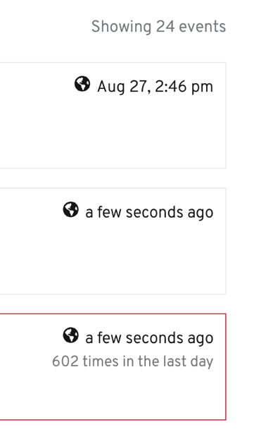

# Metrics

## Unit Labels

+ Designs should default to using MiB, GiB, and TiB unit labels
+ Designs should not include Mi, Gi, or Ti except when showing YAML (where that abbreviated unit label is used frequently)
+ In the context of some Storage and Virtualization objects (like when importing from external sources) using MB, GB, or TB to avoid unit conversions is acceptable

---

## Timestamp

+ Show relative time for events within the last 10 minutes. Otherwise, show the full date.
+ Hover displays the raw UTC date string.

