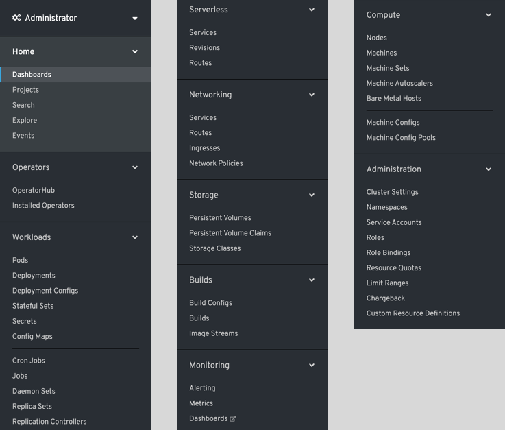
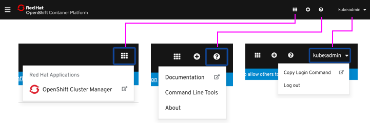

# Primary navigation

## Perspectives

OpenShift has different perspectives for "administrator" and "developer." These perspectives change the navigation list accordingly to show only relevant pages.

---

## Navigation list

Certain operators, when installed, have the ability to create new navigation items.

*Administrator perspective navigation list:*

*Developer perspective navigation list:*

---

## Masthead

*Full:*

*Condensed:*

