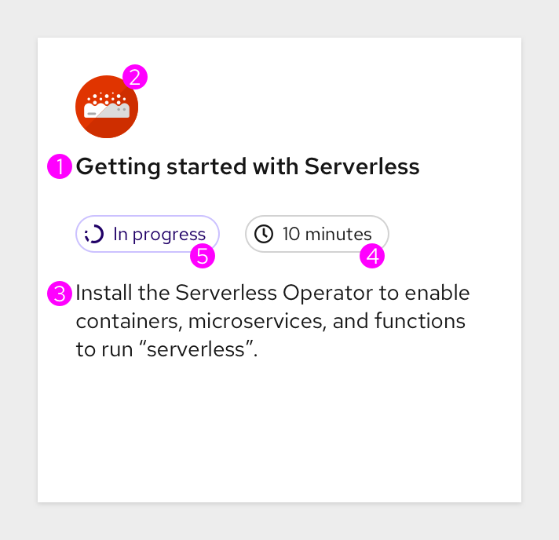
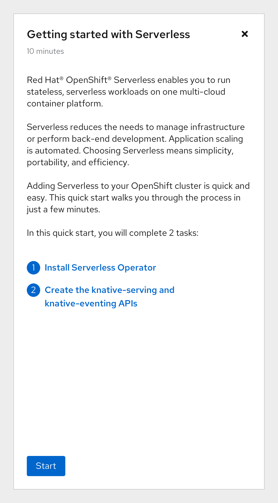
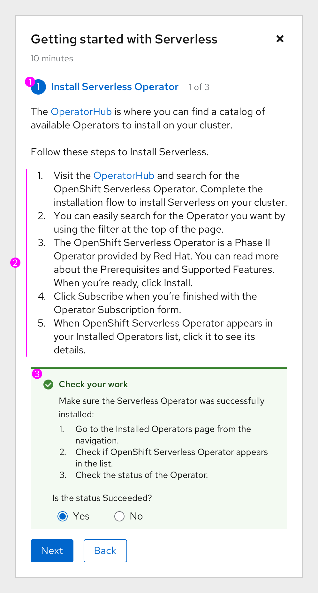

# Quick start guidelines

## Goal
A number of teams are interested in contributing quick starts to the OpenShift console. In order to maintain a consistent user experience across all quick starts, we need to create guidelines for teams to follow. This document has four parts: how quick starts work, what you need to contribute a quick start, how to write a quick start, and what the contribution process looks like.

## Part I: How do quick starts work?
A quick start is like a guided tutorial that walks users through a set of tasks to achieve a particular goal. Quick starts in the OpenShift console will live in the Help Menu and are surfaced through a side panel on the right side of the console. The following describes the interactions of a quick start.

### Behavior / interaction

#### Task headers
Task headers can be clicked to navigate through the quick start. Task headers should represent the status of that task through its color and icon.

#### Next and Back buttons
Each screen (with the exceptions of the first and last screens) should have both **Next** and **Back** buttons.

The Next button will take users to the next state. That is, if a user is on a task’s initial state, clicking Next will reveal the Check your work feature (review state). Clicking Next again will take users to the next task’s initial state. The Back button will always take users back to the previous panel in the review state.

#### Check your work
Check your work is intended to help the user validate that they have correctly followed the steps in a task. They typically ask users a question that validates the task completion.

If a user clicks **Yes**, the feature will turn green. If a user clicks **No**, the feature will turn red and an error message will be shown.

In future, we want to explore how we can show more specific troubleshooting help if users choose **No**.

Whichever state the Check your work feature is in (neutral – blue, yes – green, or no – red) will be reflected in the task header’s color and icon when users click Next.

#### Final screen buttons
The last screen should have a primary **Close** button, a secondary **Back** button, and a link to **View all quick starts**. If applicable, also show a link to the next quick start in the “bundle”.

#### Hints (4.7+)
When the user is in the quick start and the quick start mentions a location in the vertical navigation or masthead, the navigation point will look like a link and the user can click on it to reveal the hint animation. The animation would go through one cycle and then stop. A solid blue rectangle would remain around the navigation point after the animation stops or until the user moves onto the next step in the quick start or quits the quick start.

If the user clicks on a sub navigation point hint in a quick start, the main navigation section should be highlighted.

## Part II: What kind of content do I need to contribute a quick start?
All items are required unless otherwise specified.

### Catalog tile
Each quick start will have a tile that users can click to open the quick start.

1. **Quick start name:** Each quick start should have a straightforward and succinct name.
2. **Icon / image:** Quick starts should have an icon or other image to surface on the quick starts catalog page. If no icon is provided, a default quick starts icon will be shown for the quick start.
3. **Description:** A one or two sentence description should be available to surface on the quick start tiles that appear on the quick starts catalog page.
4. **Time estimate:** Quick starts should have a time estimate that will be shown on the quick start tile and in the heading of the side panel. Quick starts should typically be no longer than 20-30 minutes.
5. **Badges:** Quick start tiles can have a number of badges. Each quick start should have the time estimate in a badge. If a quick start has been started or completed, show the relevant badge: In progress or Completed.
6. **Prerequisites (Optional):** When applicable, detail what prerequisites users / clusters have to meet before completing the quick start. The prerequisites should appear underneath the description.

### Overview / details
The first screen of any quick start should give an overview of the quick start. The overview can include information about the benefits of completing the quick start (e.g., why you should use Serverless) and / or a summary of the tasks to be completed.

### Task screens
Each quick start will walk a user through a set number of tasks.

1. **Numbered tasks:** Each quick start should consist of a set of high-level tasks. These should represent the overarching steps that users will need to complete in order to successfully finish the quick start. It is recommended that each quick start have at least two tasks, but no more than five or six. Next to the task header that is currently open / active, show the task number out of the total number of tasks. Example: 2 of 3.
2. **Substeps:** Substeps provide the specific, granular details of how users can complete each numbered task. UI elements should be formatted to match the guidelines below.
3. **Check your work:** After clicking Next on a task screen, users are presented with a Check your work feature. Each task should have a validation question to present for the Check your work feature. Users can choose to skip this step by clicking the Next button again.
4. **Context (optional):** When needed, tasks and substeps should provide context to the user. Be clear as to why the user is taking the actions, how it helps them, etc. Don’t be afraid to add content that isn’t strictly instructional!

### Additional components
The following are additional quick start components.
1. **Metadata:** Quick starts should have metadata to be used for sorting and filtering. This can include product names, keywords, users, etc.
2. **Version, timestamp:** If quick starts are only compatible with certain versions of OpenShift, this should be noted on the quick start tile, in the quick start description, and in the quick start instructions.
3. **RBAC specs:** Quick starts should be appropriately flagged to determine which perspectives they may be accessible from.
4. **Next quick start (Optional):** When applicable, upon completion of a quick start, surface a link to the next quick start in the “bundle”.

## (WIP) Part III: How do I write quick start content?
This section is a work in progress. Keep an eye out for a more detailed style guide!

### How to write a task
In order to write a task well, try to answer the following questions first:
1. What is the goal of the task? Why should the user do this?
2. What are the required steps to take in order to complete the task?
3. Are there any optional steps?
4. Can the user validate they’ve completed the task? How?

### Calling out UI elements
When writing out UI elements in the quick start instructions, follow these guidelines:

* **Buttons, dropdowns, tabs, fields, and other UI controls:** As it’s written in the UI + bolded.
* **Everything else, including page, window, and panel names:** As it’s written in the UI. If sentence case, use double quotes.
* **Code or user-entered text:** Monospaced font
* **CLI commands:** Monospaced font. “In running text, use a bold monospaced font for a command. If a parameter or option is a variable value, use an italic monospaced font; otherwise, use a bold monospaced font for the parameter and a monospaced font for the option.”

## (WIP) Part IV: How can I contribute a quick start?
This section is a work in progress. Keep an eye out for our contribution process!
