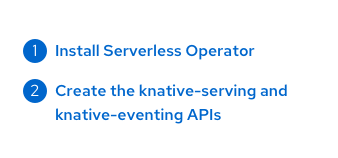
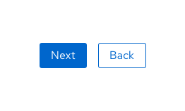
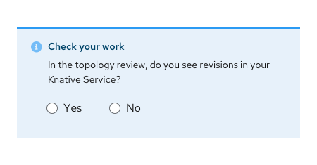
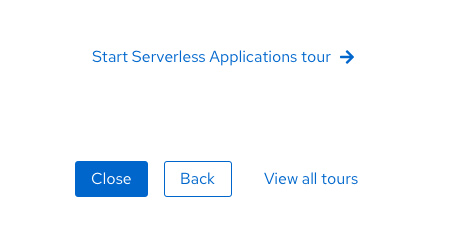
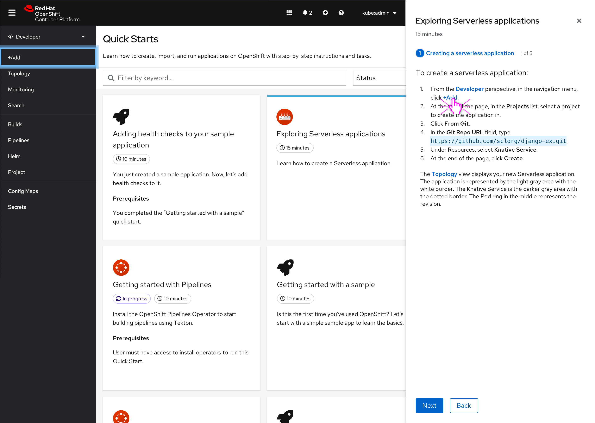

# Quick start guidelines

## Goal
A number of teams are interested in contributing quick starts to the OpenShift console. In order to maintain a consistent user experience across all quick starts, we need to create guidelines for teams to follow. This document has four parts: how quick starts work, what you need to contribute a quick start, how to write a quick start, and what the contribution process looks like.

## Part I: How do quick starts work?
A quick start is like a guided tutorial that walks users through a set of tasks to achieve a particular goal. Quick starts in the OpenShift console will live in the Help Menu and are surfaced through a side panel on the right side of the console. The following describes the interactions of a quick start.

### Behavior / interaction

#### Task headers
Task headers can be clicked to navigate through the quick start. Task headers should represent the status of that task through its color and icon.

#### Next and Back buttons
Each screen (with the exceptions of the first and last screens) should have both **Next** and **Back** buttons.

When the user first clicks the Next button, a Check your work section appears. The user is prompted to check their work before they can proceed to the next task. After the user has checked their work, they can click the Next button to proceed to the next task.

The Back button will always be present and take users back to the review state of the previous task. The only exception is the first task in the quick start. If the user clicks the Back button when they are on the first task, they will be taken back to the quick start introduction.

#### Check your work
Check your work is intended to help the user validate that they have correctly followed the steps in a task. They typically ask the user to validate that the task is complete.

If a user clicks **Yes**, the feature will turn green. If a user clicks **No**, the feature will turn red and an error message will be shown.

In the future, we want to explore how we can show more specific troubleshooting help if users choose **No**.

Whichever state the Check your work feature is in (neutral – blue, yes – green, or no – red) will be reflected in the task header’s color and icon when users click Next.

#### Final screen buttons
The last screen should have a primary **Close** button, a secondary **Back** button, and a link to **View all quick starts**. If applicable, also show a link to the next quick start in the “bundle”.

#### Hints (4.7+)
When the user is in the quick start and the quick start mentions a location in the vertical navigation or masthead, the navigation point will look like a link and the user can click on it to reveal the hint animation. The animation would go through one cycle and then stop. A solid blue rectangle would remain around the navigation point after the animation stops or until the user moves onto the next step in the quick start or quits the quick start.

If the user clicks on a sub navigation point hint in a quick start, the main navigation section should be highlighted.

## Part II: What kind of content do I need to contribute a quick start?
All items are required unless otherwise specified.

### Catalog tile
Each quick start will have a tile that users can click to open the quick start.

1. **Quick start name:** Each quick start should have a straightforward and succinct name.
2. **Icon / image:** Quick starts should have an icon or other image to surface on the quick starts catalog page. If no icon is provided, a default quick starts icon will be used.
3. **Description:** A one or two sentence description should be available to surface on the quick start tiles that appear on the quick starts catalog page.
4. **Time estimate:** Quick starts should have a time estimate that will be shown on the quick start tile and in the heading of the side panel. Quick starts should typically be no longer than 20-30 minutes.
5. **Badges:** Quick start tiles can have a number of badges. Each quick start should have the time estimate in a badge. If a quick start has been started or completed, show the relevant badge: In progress or Completed.
6. **Prerequisites (Optional):** When applicable, detail what prerequisites users / clusters have to meet before completing the quick start. The prerequisites should appear underneath the description.

### Overview / details
The first screen of any quick start should give an overview of the quick start. The overview can include information about the benefits of completing the quick start (e.g., why you should use Serverless) and / or a summary of the tasks to be completed.

### Task screens
Each quick start will walk a user through a set number of tasks.

1. **Numbered tasks:** Each quick start should consist of a set of high-level tasks. These should represent the overarching steps that users will need to complete in order to successfully finish the quick start. It is recommended that each quick start have at least two tasks, but no more than five or six. Next to the task header that is currently open / active, show the task number out of the total number of tasks. Example: 2 of 3.
2. **Substeps:** Substeps provide the specific, granular details of how users can complete each numbered task. UI elements should be formatted to match the guidelines below.
3. **Check your work:** After clicking Next on a task screen, users are presented with a Check your work feature. Each task should have a validation question to present for the Check your work feature. Users can choose to skip this step by clicking the Next button again.
4. **Context (optional):** When needed, tasks and substeps should provide context to the user. Be clear as to why the user is taking the actions, how it helps them, etc. Don’t be afraid to add content that isn’t strictly instructional!

### Additional components
The following are additional quick start components.
1. **Metadata:** Quick starts should have metadata that can be used for sorting and filtering. This can include product names, keywords, users, etc.
2. **Version, timestamp:** If quick starts are only compatible with certain versions of OpenShift, this should be noted on the quick start tile, in the quick start description, and in the quick start instructions.
3. **RBAC specs:** Quick starts should be appropriately flagged to determine which perspectives they may be accessible from.
4. **Next quick start (Optional):** When applicable, upon completion of a quick start, surface a link to the next quick start in the “bundle”.

## (WIP) Part III: How do I write quick start content?
This section is a work in progress. Keep an eye out for a more detailed style guide!

### How to write a task
In order to write a task well, try to answer the following questions first:
1. What is the goal of the task? Why should the user do this?
2. What are the required steps to take in order to complete the task?
3. Are there any optional steps?
4. Can the user validate they’ve completed the task? How?

### Calling out UI elements
When writing out UI elements in the quick start instructions, follow these guidelines:

* **Buttons, dropdowns, tabs, fields, and other UI controls:** As it’s written in the UI + bolded.
* **Everything else, including page, window, and panel names:** As it’s written in the UI. If sentence case, use double quotes.
* **Code or user-entered text:** Monospaced font
* **Hints:** If a hint to a navigation or masthead element is included, the text should be styled like a link.
* **CLI commands:** Monospaced font. “In running text, use a bold monospaced font for a command. If a parameter or option is a variable value, use an italic monospaced font; otherwise, use a bold monospaced font for the parameter and a monospaced font for the option.”

## (WIP) Part IV: How can I contribute a quick start?
This section is a work in progress. Keep an eye out for more detailed contribution processes to come!

### Internal contributions

#### Process goals:
* To provide user-centric, functional quick starts for OpenShift users across a wide range of product areas
* To create a successful collaboration across teams (UXD, CCS, PM, etc.) for every quick start
* To define which teams are involved at each step of the quick start effort so that the end result is organized, clean, and in final form for users
* To respect the bandwidth and input of each team

#### Phase 1: Planning
1. Determine which product area needs a quick start.
  * Identify stumbling blocks or complex areas where we can enable user success with as little friction as possible. This information will be gathered from:
    * UXD user research
    * Pain points shared from internal feedback sessions (Solution Architects, Technical Marketing, CEE/Customer Support, etc.)
    * Product Management input
    * OpenShift or Kubernetes documentation
    * Features we want to highlight or push more to entice users to try
    * Areas we want to offer more opinionated views or flows. For example, there are likely cases where there are multiple ways for users to accomplish a task, but we’re recommending a method or suggesting how to get up and running with XYZ.
  * **Team responsible:** Product Management; UXD Design; possibly UXD Research
  * **Time frame:** Before epic prioritization
  * **Definition of done:** Product Management, UXD Design, UXD Research, and any other groups in this step agree on the product area to prioritize for a quick start.
2. Plan user flows and interaction design.
  * UXD Designer, UXD Content Strategist, and CCS Content Strategist and/or Writer meet with Product Manager to determine the quick start’s goal and where we need to reduce friction or confusion in completing some tasks.
  * Collaborate on what the ideal user flow would look like. For example, what are the tasks and the sub tasks that users need to do in order to complete the quick start?
  * Work with Abi to figure out who we work with in CCS and tag in JIRA story.
    * Consider prioritization (track in JIRA); use template.
    * Maybe need a separate process for external teams; have UXD Content & CCS just do a quick run-through.
  * At this point, the UXD Designer is putting designs into Sketch and Marvel and getting feedback on interactions (not content yet). These will not be hi-fi designs.
  * **Team responsible:** UXD Design (including Dev Tools UXD); Product Management; UXD Content Strategy; CCS
  * **Time frame:** Conceptual design story (Sprint 1)
  * **Definition of done:**
    * UXD Designer creates interaction designs (not hi-fi) in Sketch and Marvel.
    * Product Manager reviews the interactions and provides feedback.
    * Stakeholder review (by Product Management and Dev Lead) is complete and all feedback is applied.

#### Phase 2: First draft
UXD Designer writes the first draft of the quick start, using the following as references:
* Interaction design plans (to align with user flow)
* Technical documentation (to avoid contradiction and duplication of effort)
* Red Hat brand standards/PatternFly UX writing style guide (to align with brand voice and UX writing best practices)
* CCS style resources (to align with docs best practices)
* Quick start writing template (to maintain consistency)
* **Team responsible:** UXD Design
* **Time frame:** After conceptual design story (Sprint 2)
* **Definition of done:**
  * All steps, descriptions, messaging, and other content is completely written.
  * Draft is ready for CCS review.

#### Phase 3: CCS review
CCS Technical Writer conducts a review of the draft.

During this step, have a checkpoint/feedback loop with CCS to give UX feedback on existing documentation. A smaller group can work together and identify what it will take to make existing documentation consumable for quick starts.

* **Team responsible:** CCS Technical Writing; UXD Design
* **Time frame:** Sprint 2
* **Definition of done:**
  * CCS Technical Writer reviewed all content and left edits/comments.
  * UXD Designer addressed all feedback.

#### Phase 4: UXD Content review
Abi conducts a content review of the draft.

* **Team responsible:** UXD Content Strategy; UXD Design
* **Time frame:** Sprint 3
* **Definition of done:**
  * Abi reviewed all content and left edits/comments.
  * UXD Designer addressed all feedback.
  * Stakeholder review (by Product Management and Dev Lead) is complete and all feedback is applied.

#### Phase 5: Implementation
UXD Developer implements the quick start design and written content in OpenShift.

* **Team responsible:** UXD Design; UXD Development
* **Time frame:** Initial Development Sprint (Sprint 4)
* **Definition of done:**
  * Implementation addresses the main goals of the design and quick start draft.
  * PR is reviewed and approved to be merged.

#### Phase 6: QE
QE does a review. UXD reviews and files bugs as needed.

* **Team responsible:** UXD Design; UXD Development
* **Time frame:** Before feature freeze
* **Definition of done:**
  * High-severity bugs are resolved.
  * Low-severity bugs are triaged for following release.

#### Post-release: User testing (if prioritized)
If we have the time and resources for user testing, UXD Research will conduct testing.

#### Ongoing: Maintenance and localization
Quick starts are localized as part of [UXD's localization efforts for OpenShift](https://docs.google.com/document/d/1LnussSddUj9NVkQ2nQ61w42Hj9wAkzWEn1_qmyUXbo8/edit).

NOTE: There needs to be a flag and QE process to review and sign off on quick starts for each release to make sure they still work.

### External contributions
* External teams may contribute quick starts to the console through a CR in 4.7 and later versions of OpenShift
* The teams should contribute their quick start to the relevant quick start GitHub repo
* The GitHub should have the quick start template and the required tag to get UX feedback
  * A template is in progress and will be provided for teams to use to create their own content
