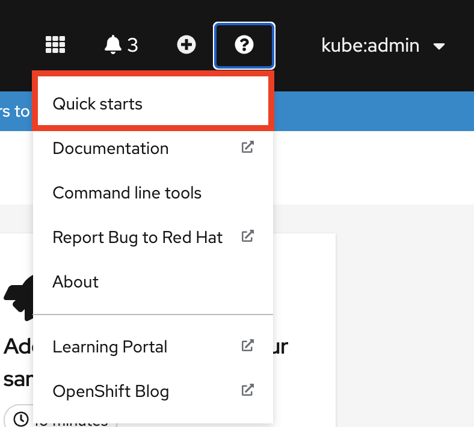
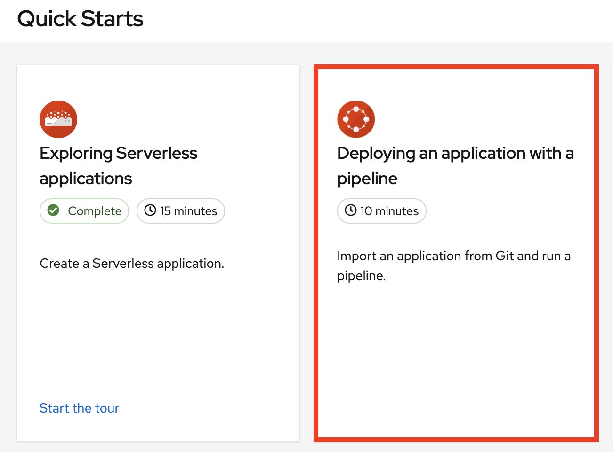
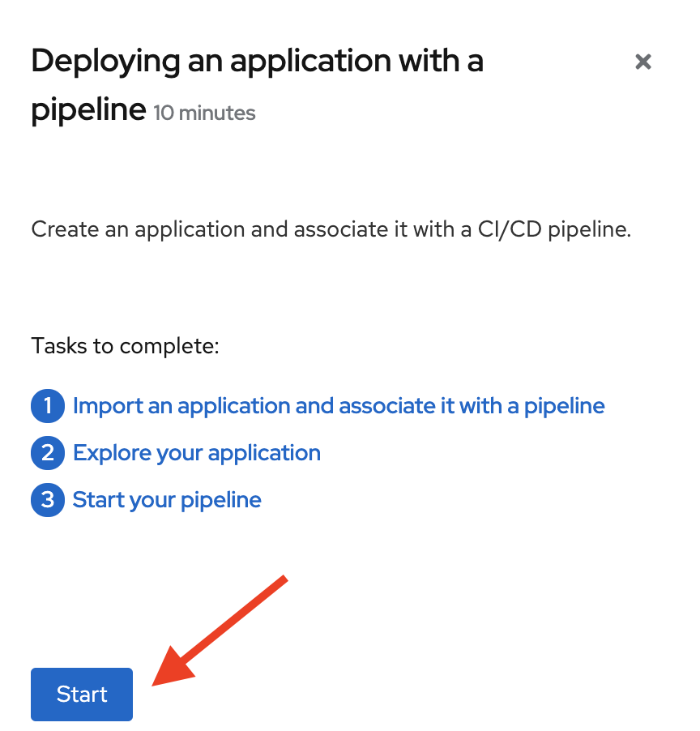
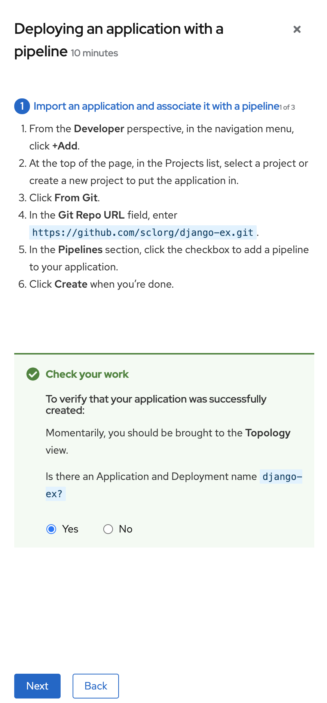
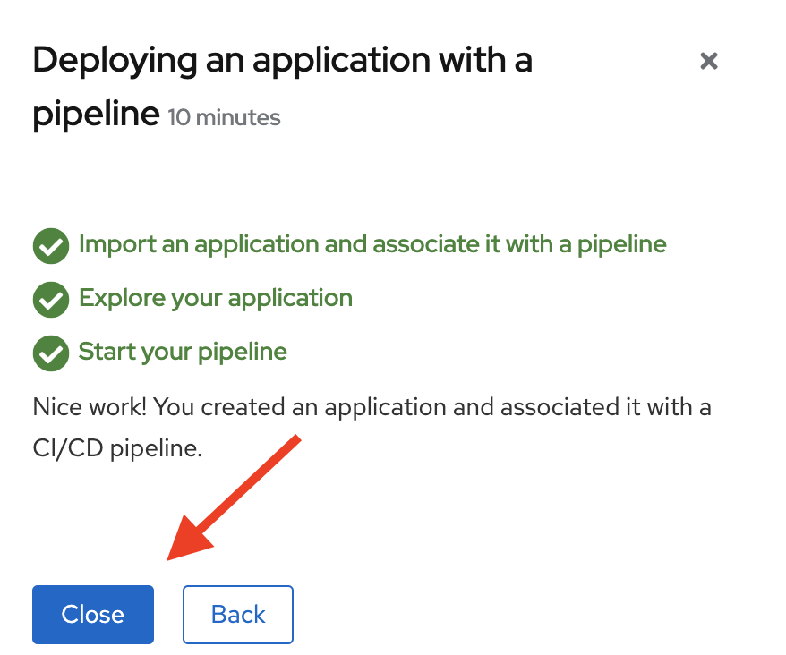

# Quick start guidelines

## Goal
A number of teams are interested in contributing quick starts to the OpenShift console. If you’re creating quick starts, follow these guidelines to maintain a consistent user experience across all quick starts.

**Table of contents**
* [Part I: What is a quick start?](#parti)
* [Part II: How does a quick start work?](#partii)
* [Part III: How do I write a quick start?](#partiii)
* [Part IV: How do I contribute a quick start?](#partiv)

##  Part I: What is a quick start?

A quick start is a guided tutorial with user tasks. In the OpenShift console, you can access quick starts under the **Help** menu. They’re especially useful for getting up and running with a product.

A quick start primarily consists of tasks and steps. Each task has multiple steps, and each quick start has multiple tasks. Example:
* Quick start
  * Task 1
    * Step 1
    * Step 2
    * Step 3
  * Task 2
    * Step 1
    * Step 2
    * Step 3
  * Task 3
    * Step 1
    * Step 2
    * Step 3

A quick start also includes these areas:  
(*For instructions on writing the content in these areas, see [How do I write a quick start?](#partiii)*)
* **Card**: Catalog title that provides the quick start’s basic information—title, description, time commitment, and completion status
* **Introduction**: Brief overview of the quick start’s goal and tasks
* **Task headings**: Hyperlinked titles for each task in the quick start
* **Check your work module**: Module for a user to confirm they completed a task successfully before advancing to the next task in the quick start
* **Hints**: Animation to help users identify specific areas of the product
* **Buttons**
  * **Next and back buttons**: Buttons for navigating the steps and modules within each task of a quick start
  * **Final screen buttons**: Buttons for closing the quick start, going back to previous tasks within the quick start, and viewing all quick starts

##  Part II: How does a quick start work?
This is the typical flow a user follows to complete a quick start:
1. In the Administrator or Developer perspective, click the **Help** icon and select **Quick starts**.

2. Click a quick start card.

3. In the panel that appears, click **Start**.

4. Complete the on-screen instructions.
5. Click **Next**.
6. In the **Check your work** module that appears, answer the question to confirm if you've successfully completed the task.
  * If you select **Yes**, click **Next** to continue to the next task.
  * If you select **No**, repeat the task instructions and check your work again.

7. Repeat steps 1-6 above to complete the remaining tasks in the quick start.
8. After completing the final task, click **Close** to close the quick start.

##  Part III: How do I write a quick start?
**Follow these existing style resources for quick start content:**
* For technical content stylistic requirements, refer to the [CCS product documentation guide](https://redhat-documentation.github.io/supplementary-style-guide/).
* For product naming, refer to the [Red Hat Official Product Naming List](https://docs.google.com/spreadsheets/u/2/d/1DLS_lS3VKidgZIvcLmLp9BoiqptkvqHWfe1D5FD2kfk/pubhtml?gid=1259317633&single=true).
* For voice and tone requirements, refer to [PatternFly’s brand voice and tone guidelines](https://www.patternfly.org/v4/ux-writing/brand-voice-and-tone).
    * For other UX content guidance, refer to all areas of [PatternFly’s UX writing style guide](https://www.patternfly.org/v4/ux-writing/about).
    * For any UX content guidance that’s not covered in PatternFly, refer to [IBM Carbon’s UX content guidelines](https://www.carbondesignsystem.com/guidelines/content/guidance).

The following guidelines provide some more information specific to quick starts, but be sure to refer to the style resources linked above when writing quick start content.

**Main content areas of a quick start:**
* Card copy
* Introduction
* Task steps
* Modals and in-app messaging
* Check your work module
* Completion confirmation

### Card copy
You can customize the title and description on a quick start card, but you cannot customize the status.
* Keep your description to 1 – 2 sentences.
* Start with a verb and communicate the user's goal. Example: *Create a Serverless application*.

### Introduction
After clicking a quick start card, a side panel slides in that introduces the quick start and lists the tasks within it.
* Make your introduction copy clear, concise, informative, and friendly.
* State the outcome of the quick start—a user should know what they’ll get out of a quick start before diving in.
* Give action to the user, not the quick start.
  * DO: *In this quick start, you'll deploy a sample application to OpenShift.*
  * DON’T: *This Quick Start shows you how to deploy a sample application to OpenShift.*
* The introduction should be a max of 4 – 5 sentences, depending on how complex the feature is. A long introduction may overwhelm the user.
* List the quick start tasks after the introduction copy, and start each task with a verb. Don’t specify the number of tasks because the copy would need to be updated every time a task is added/removed.
  * DO: *Tasks to complete: Create a serverless application; Connect an event source; Force a new revision*
  * DON’T: *You’ll complete these 5 tasks: Creating a serverless application; Connecting an event source; Forcing a new revision*

### Task steps
Once the user clicks *Start*, a series of steps appears that they must perform to complete the quick start.

Follow these general guidelines when writing task steps, in addition to the linked style guides at the beginning of this section:
* Use "Click" for buttons and labels. Use "Select" for checkboxes, radio buttons, and dropdown menus.
* Use "Click" instead of "Click on"
  * DO: *Click **OK**.*
  * DON'T: *Click on the **OK button**.*
* Tell users how to navigate between admin and dev perspectives. Even if you think a user might already be in the appropriate perspective, give them instructions on how to get there anyways so that they’re definitely where they need to be. Examples:
  * *Enter the Developer perspective: In the main navigation, click the dropdown menu and select **Developer**.*
  * *Enter the Admin perspective: In the main navigation, click the dropdown menu and select **Admin**.*
* Use the "Location, action" structure. Tell a user where to go before telling them what to do.
  * DO: *In the node.js deployment, hover over the icon.*
  * DON’T: *Hover over the icon in the node.js deployment.*
* Keep your product terminology capitalization consistent. Refer to the [CCS product documentation guide](https://redhat-documentation.github.io/supplementary-style-guide/) and [Red Hat’s Corporate Style Guide](https://source.redhat.com/groups/public/word-nerds/red_hat_word_nerds_wiki/corporate_style_guide).
* If you need to specify a menu type or list as a dropdown, write "dropdown” as one word without a hyphen.
* Clearly distinguish between a user action and additional information on product functionality.   
  * User action: *Change the time range of the dashboard by clicking the dropdown menu and selecting **Time range**.*
  * Additional information: *To look at data in a specific time frame, you can change the time range of the dashboard.*
* [Avoid directional language](https://www.patternfly.org/v4/ux-writing/writing-for-all-audiences), like *In the top-right corner, click the icon*. Directional language becomes outdated every time UI layouts change. Also, a direction for desktop users may not be accurate for users with a different screen size. Instead, identify something using its name.
  * DO: *In the navigation menu, click **Settings**.*
  * DON’T: *In the left-hand menu, click **Settings**.*
* [Don’t identify items by color alone](https://www.patternfly.org/v4/ux-writing/writing-for-all-audiences), like *Click the gray circle*. Color identifiers  aren’t useful for sight-limited users, especially colorblind users. Instead, identify an item using its name or copy (like button copy).
  * DO: *The *Success* message indicates a connection.*
  * DON’T: *The message with a green icon indicates a connection.*
* Use the second-person point of view (“you”) consistently:
  * DO: *Set up your environment.*
  * DON’T: *Let’s set up our environment.*
* Format UI elements accordingly:
  * **Copy for buttons, dropdowns, tabs, fields, and other UI controls:** Write the copy as it appears in the UI and bold it.
  * **All other UI elements—including page, window, and panel names:** Write the copy as it appears in the UI and bold it.
  * **Code or user-entered text:** Use monospaced font
  * **Hints:** If a hint to a navigation or masthead element is included, style the text as you would a link.
  * **CLI commands:** Use monospaced font.
    * In running text, use a bold monospaced font for a command.
    * If a parameter or option is a variable value, use an italic monospaced font.
    * Use a bold monospaced font for the parameter and a monospaced font for the option.

### Modals and in-app messaging
* For confirmation modals included with the instructions, refer to [PatternFly’s modal guidelines](https://www.patternfly.org/v4/components/modal/design-guidelines#get-required-user-input), specifically the “Validate user decisions” section.
  * **Headline:** A headline is usually phrased as a question. Include important keywords (like “permanent”) in the headline. Avoid extraneous copy, like *Are you sure?*, which distracts users from the main outcome of the action.
  * **Body text:** Body text gives information about the action’s consequence.
  * **Buttons:** Buttons allow a user to answer the headline question. These can simply be “yes” or “no,” but adding some context increases clarity—especially when skimming.
* For error messages, use [PatternFly’s error messaging guidelines](https://www.patternfly.org/v4/ux-writing/error-messages).

### Check your work module
Once a user completes a step, a Check your work module appears. This module prompts the user to answer a yes/no question about the step results, which gives them the opportunity to review their work. For this module, you’ll only need to write a single yes/no question.

If the user answers Yes, a check mark will appear.

If the user answers No, an error message appears with a link to relevant documentation, if necessary. The user then has the opportunity to go back and try again.

##  Part IV: How can I contribute a quick start?

### Internal contributions

#### Process goals:
* To provide user-centric, functional quick starts for OpenShift users across a wide range of product areas
* To create a successful collaboration across teams (UXD, CCS, PM, etc.) for every quick start
* To define which teams are involved at each step of the quick start effort so that the end result is organized, clean, and in final form for users
* To respect the bandwidth and input of each team

#### Phase 1: Planning
1. Determine which product area needs a quick start.
  * Identify stumbling blocks or complex areas where we can enable user success with as little friction as possible. This information will be gathered from:
    * UXD user research
    * Pain points shared from internal feedback sessions (Solution Architects, Technical Marketing, CEE/Customer Support, etc.)
    * Product Management input
    * OpenShift or Kubernetes documentation
    * Features we want to highlight or push more to entice users to try
    * Areas we want to offer more opinionated views or flows. For example, there are likely cases where there are multiple ways for users to accomplish a task, but we’re recommending a method or suggesting how to get up and running with XYZ.
  * Note that regardless of where the quick start idea originates, quick starts should always be a part of an epic.
  * **Team responsible:** Product Management; UXD Design; possibly UXD Research
  * **Time frame:** Before epic prioritization
  * **Definition of done:** Product Management, UXD Design, UXD Research, and any other groups in this step agree on the product area to prioritize for a quick start.
2. Plan user flows and interaction design. (Optional)
  * UXD Designer, UXD Content Strategist, and CCS Content Strategist and/or Writer meet with Product Manager to determine the quick start’s goal and where we need to reduce friction or confusion in completing some tasks.
  * Collaborate on what the ideal user flow would look like. For example, what are the tasks and the sub tasks that users need to do in order to complete the quick start?
  * Work with Abi to figure out who we work with in CCS and tag in JIRA story.
    * Consider prioritization (track in JIRA); use template.
    * Maybe need a separate process for external teams; have UXD Content & CCS just do a quick run-through.
  * At this point, the UXD Designer is putting designs into Sketch and Marvel and getting feedback on interactions (not content yet). These will not be hi-fi designs.
  * **Team responsible:** UXD Design (including Dev Tools UXD); Product Management; UXD Content Strategy; CCS
  * **Time frame:** Conceptual design story (Sprint 1)
  * **Definition of done:**
    * UXD Designer creates interaction designs (not hi-fi) in Sketch and Marvel.
    * Product Manager reviews the interactions and provides feedback.
    * Stakeholder review (by Product Management and Dev Lead) is complete and all feedback is applied.

#### Phase 2: First draft
UXD Designer writes the first draft of the quick start, using the following as references:
* Interaction design plans (to align with user flow)
* Technical documentation (to avoid contradiction and duplication of effort)
* Red Hat brand standards/PatternFly UX writing style guide (to align with brand voice and UX writing best practices)
* CCS style resources (to align with docs best practices)
* Quick start writing template (to maintain consistency)
* **Team responsible:** UXD Design
* **Time frame:** After conceptual design story (Sprint 2)
* **Definition of done:**
  * All steps, descriptions, messaging, and other content is completely written.
  * Draft is ready for CCS review.

#### Phase 3: CCS review
CCS Technical Writer conducts a review of the draft.

During this step, have a checkpoint/feedback loop with CCS to give UX feedback on existing documentation. A smaller group can work together and identify what it will take to make existing documentation consumable for quick starts.

* **Team responsible:** CCS Technical Writing; UXD Design
* **Time frame:** Sprint 2
* **Definition of done:**
  * CCS Technical Writer reviewed all content and left edits/comments.
  * UXD Designer addressed all feedback.

#### Phase 4: UXD Content review
Abi conducts a content review of the draft.

* **Team responsible:** UXD Content Strategy; UXD Design
* **Time frame:** Sprint 3
* **Definition of done:**
  * Abi reviewed all content and left edits/comments.
  * UXD Designer addressed all feedback.
  * Stakeholder review (by Product Management and Dev Lead) is complete and all feedback is applied.

#### Phase 5: Implementation
UXD Developer implements the quick start design and written content in OpenShift.

* **Team responsible:** UXD Design; UXD Development; Product Management
* **Time frame:** Initial Development Sprint (Sprint 4)
* **Definition of done:**
  * Implementation addresses the main goals of the design and quick start draft.
  * PR is reviewed by UX and PM and approved to be merged.

#### Phase 6: QE
QE does a review. UXD reviews and files bugs as needed.

* **Team responsible:** QE; UXD Design; UXD Development
* **Time frame:** Before feature freeze
* **Definition of done:**
  * High-severity bugs are resolved.
  * Low-severity bugs are triaged for following release.

#### Post-release: User testing (if prioritized)
If we have the time and resources for user testing, UXD Research will conduct testing.

#### Ongoing: Maintenance and localization
Quick starts are localized as part of [UXD's localization efforts for OpenShift](https://docs.google.com/document/d/1LnussSddUj9NVkQ2nQ61w42Hj9wAkzWEn1_qmyUXbo8/edit).

NOTE: There needs to be a flag and QE process to review and sign off on quick starts for each release to make sure they still work.

### External contributions
* External teams may contribute quick starts to the console through a CR in 4.7 and later versions of OpenShift
* The teams should contribute their quick start to the relevant quick start GitHub repo
* The GitHub should have the quick start template and the required tag to get UX feedback
  * A template is in progress and will be provided for teams to use to create their own content
