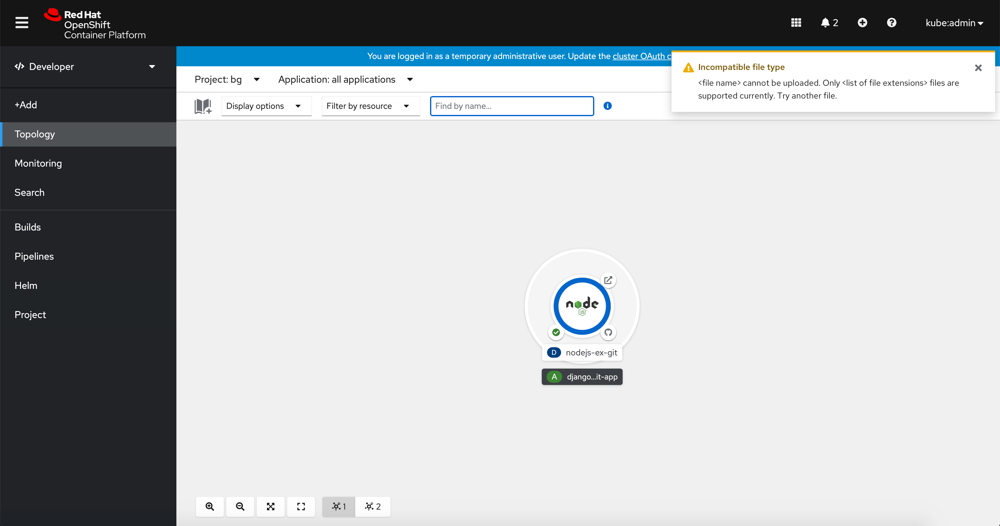

# Toast notifications

Toast notifications can be used to convey important messages or updates to the user regardless of where they are in the console. They should be used sparingly in the OpenShift console.

## Guidelines
### When to use

* To convey console related alerts that appear as a result of the user taking an action in the UI
* To convey status about longer running actions like:
  * A file being uploaded to Topology
  * Something being updated
  * Data being migrated
* To provide status messaging for a user-initiated process that is asynchronous
* To show an error related actions that would have otherwise been conveyed as a toast

### When not to use

* Alertmanager notifications should be used for persistent cluster related alerts
* User actions that provide immediate feedback, like adding labels or annotations for a single resource where you see the label or annotation get added within the modal

## Examples
### Longer running actions

A toast notification is used to provide the user with more information about a longer running action.

### Errors happening outside of a form view

A toast notification is used in this example to alert the user that the file type that they tried to drag and drop is incompatible so it caused an error. A toast notification can be used to show error messages if the error occurs outside of a form view.

The types of errors that produce a toast notification should be limited and vetted.

### Update available and a refresh is needed

A toast notification prompts the user to refresh their browser/console after doing an update.
