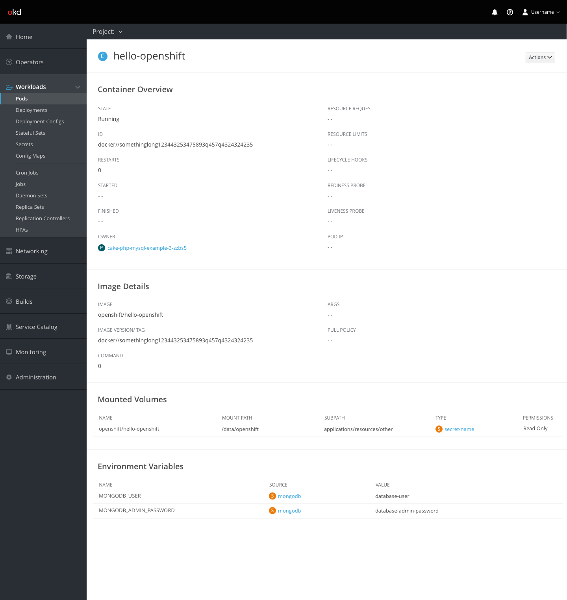
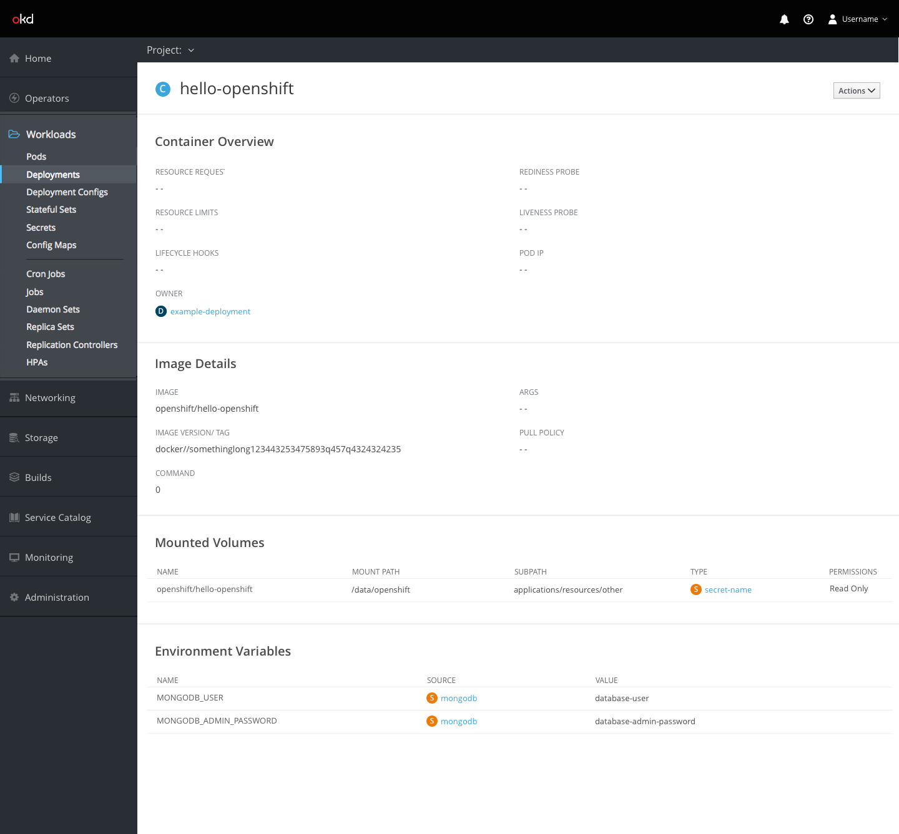

# Containers

## Resource Details: Containers Section

- The following resource types will include a "Containers" section on their object detail pages.
  - Pods
  - Deployments
  - Deployment Config
  - Replica Sets
  - Stateful Sets
  - Cron Jobs
  - Jobs
  - Daemon Sets
  - Replication Controllers
- The Containers section will always be displayed below the general overview details.
- The Containers section consists of a table with 4-6 columns, depending on the resource type.

**Pod Details Page**

- For Pods, the columns include the following:
  - Name
  - Image
  - State
  - Restarts
  - Started
  - Finished
- The Name column should use the Container badge and be shown as a link to the container details page.

**Deployment Details Page**

- For all other resources, the columns include the following:
  - Name
  - Image
  - Resource Limits
  - Ports
- The Name column should use the Container badge and be shown as a link to the container details page.

## Container Details

- The container details page is accessed via one of the resource details pages mentioned above (pods, deployments, stateful sets, etc.)
- The page includes the following sections:
  - Overview
  - Image Details
  - Mounted Volumes
  - Environment Variables

### Overview Section

**Container Details with Pod Owner**

- **Note** The overview will differ only for the instance where a Pod is the owner. For those cases, the runtime information is included.

**Container Details with Deployment Owner**

- For all remaining owner types, the following fields are hidden from the overview section:
  - State
  - ID
  - Restarts
  - Started
  - Finished

### Mounted Volumes Section

- The Mounted Volumes section should include the following columns:
  - Name
  - Mount Path
  - Subpath
  - Type (with a badge and link to the specific resource)
  - Permissions
- **Note** The mounted volumes section shown on the resource detail pages should match the one shown here for the Container details.

### Environment Variables Section

- The Environment Variables section should include the following columns:
  - Name
  - Source (Resource badge and link)
  - Value
