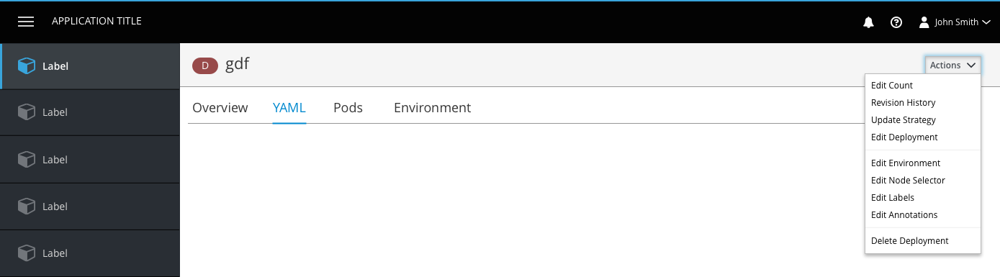
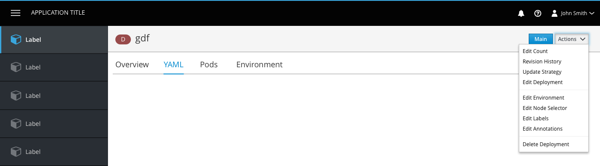
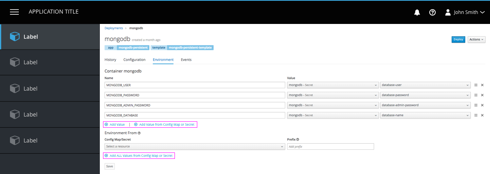

# Actions

## Actions dropdown
There is a single strategy for the order of actions in a Summary and Details view dropdown. Follow the below guidelines:

* Primary Action(s)
* Edit (if form exists, then go to YAML)
* ––––––––––
* Object actions (alphabetically)
* Edit Labels
* Edit Annotations
* ––––––––––
* Delete Object

**Note**: Use a horizontal separator between sections of the dropdown.

## Design

**Detail Page Actions**

* Actions dropdowns should be in the top right corner of the page, in line with the page title.
* No icon should be used on the dropdown title.
* Action items in the dropdown should not have ellipses at the end.
* If there is a primary action, that action can be pulled out of the actions dropdown and displayed as a button to the left of the dropdown.

**Summary Page (List View) Actions**

* All summary pages should have a primary Create button, located in the upper left corner of the page.
  * Button text should read “Create [Object]”.
* An icon on each row should allow users to access the actions dropdown for a single object.

**Form Actions**

* Actions beneath the tabs such as form actions should follow PatternFly guidelines (styled as a link with an associated icon to the left).
* A vertical separator should be used to separate form actions.
