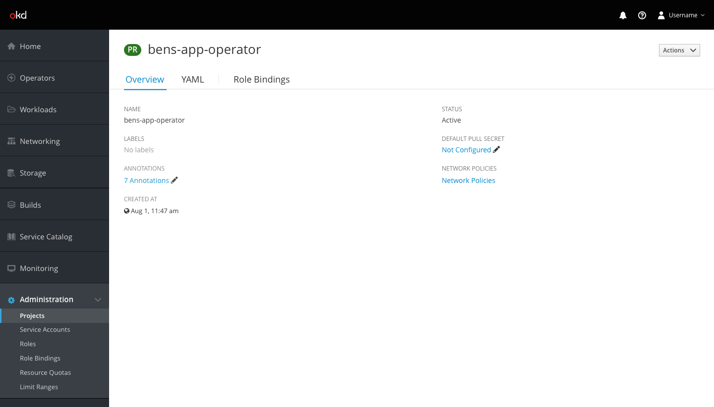
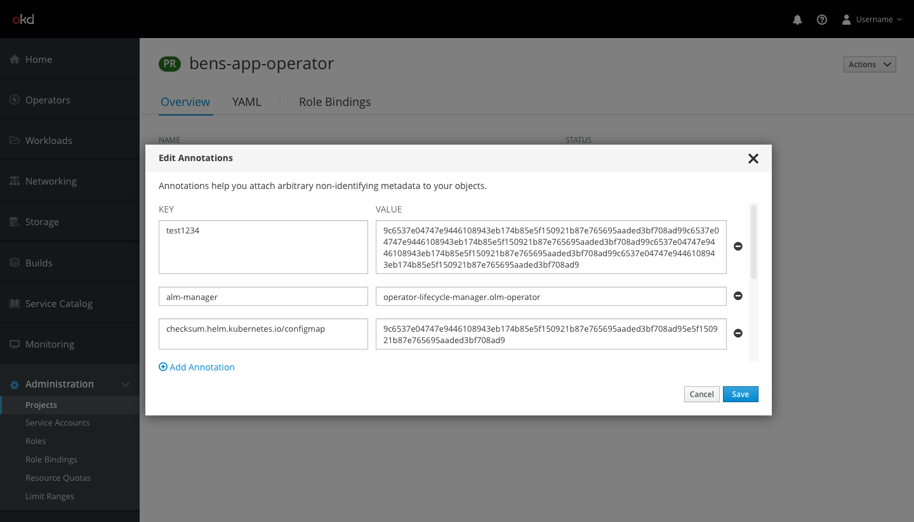
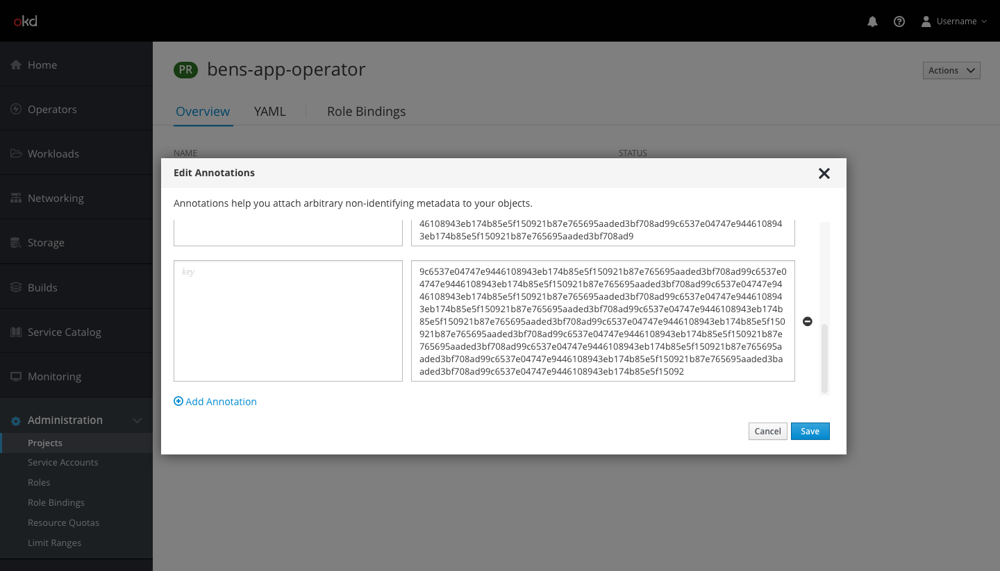

# Annotations

## Design

* Annotations will appear on the details pages for all workloads and projects.
* Users can edit a resource's annotations by clicking the Annotations link (pf-blue-400, #0088CE) or the black pencil icon (pf-black, #030303; pficon-edit) next to it.
* Users can also select `Edit Annotations` from the actions dropdown.
* Both actions will open a modal where users may add, remove, and edit annotations.

* The Edit Annotations modal will allow users to view, edit, and remove their current annotations, and add new annotations.
* At the top of the modal there will be a line of help text.
* A single annotation will be one row, separated into `KEY` and `VALUE` fields.
  * The `KEY` input fields will be shorter in length than the `VALUE` input fields.
  * The input fields will expand vertically as users type in order to show the entire string of characters. Both the `KEY` and `VALUE` fields in a row will expand together so they are always the same height.
* Users may add an annotation by clicking the `Add Annotation` link (pf-blue-400, #0088CE). This will add another row of input fields for a new annotation. New input fields will have help text that indicate to the user whether they should input a key or value in the field.
* Users may remove an annotation by clicking the black minus icon (pf-black, #030303; fa-minus-circle) to the right of any row.
* A vertical scroll bar will appear on the right side if there are more annotations than fit in the modal window at one time.
  * Note: The `Add Annotation` link and the help text will not scroll.
* Users can click Save to save their edits, or click Cancel or the 'x' in the top right of the modal to close it without saving changes.
* The "ANNOTATIONS" section on the details page will update to reflect the number of annotations for that object.
