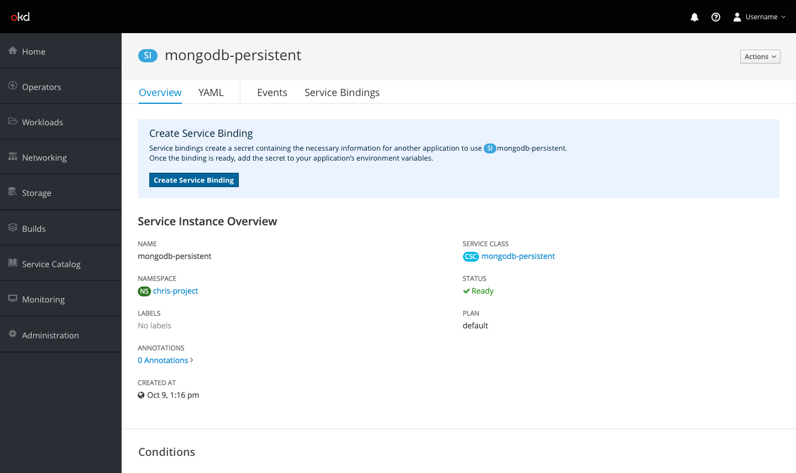
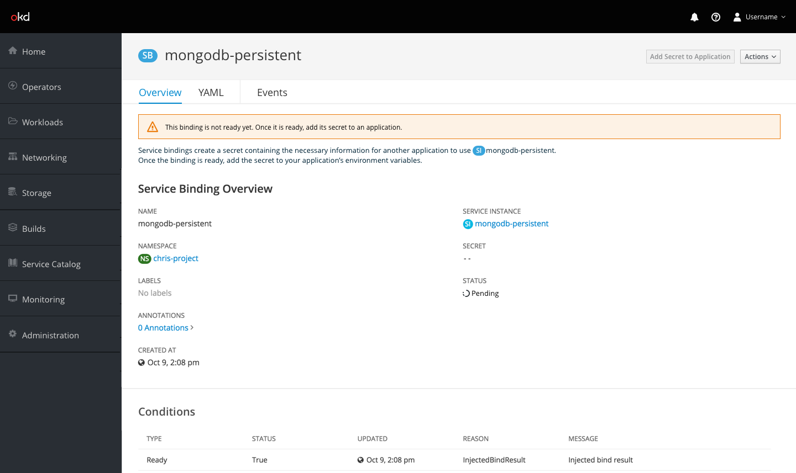
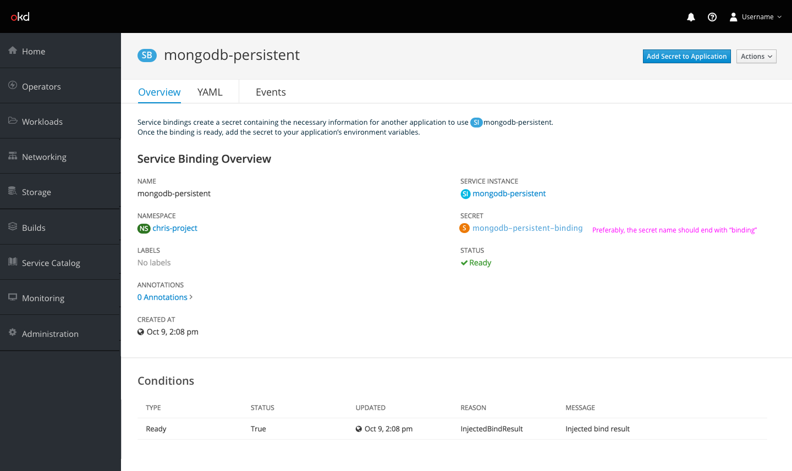
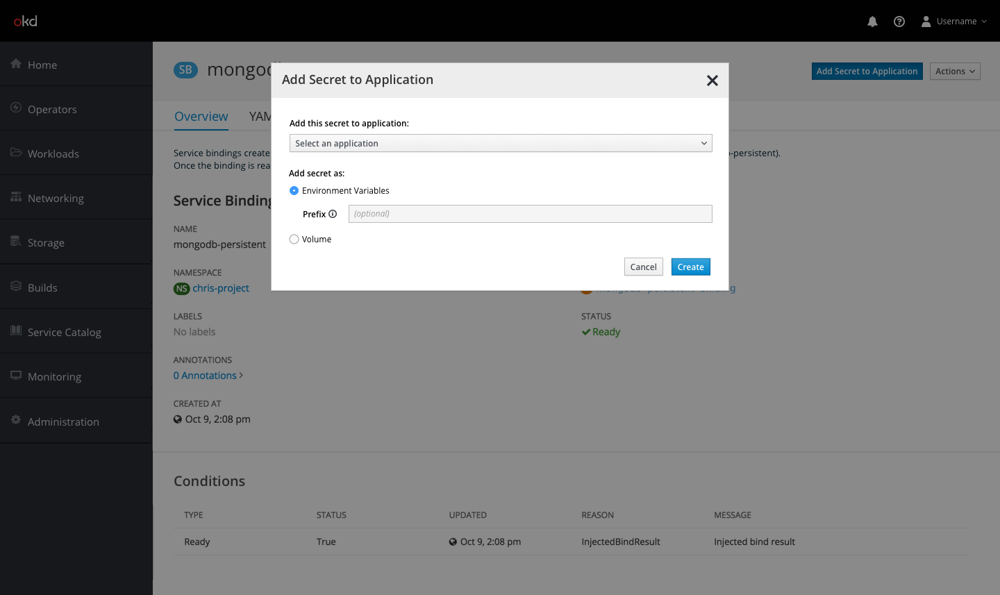

# Binding

## Create binding

- New service instances will have a section at the top that describe what service bindings are for and how to use them. The box will also contain a button to create a service binding for the service instance.
- This box should disappear once a binding has been created.

- Clicking on the create button enables the user to select a name for their binding and approve its creation.

## Add secret to application

- Once the binding has been created, the user will be taken to the details page for the new binding, which will contain a small statement at the top explaining bindings.
- While the binding secret has not yet been created, A notification should appear that explains that the binding is not ready yet and the primary action of the page should be disabled.

- Once the binding is ready and the secret has been created, the notification should disappear and the `Add Secret to Application` button should become available.

- Taking the action to add a secret to an application will produce a modal that enables the user to select which application to bind to and whether to add it as an environment variable or as a volume.

- The `Add Secret to Application` action should also be available from secrets detail pages and should behave just as from a binding page.
