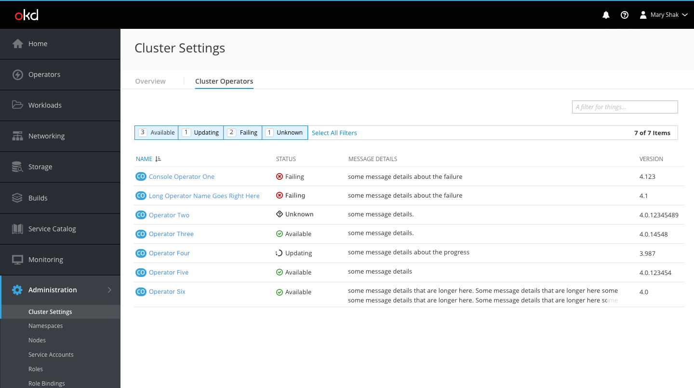
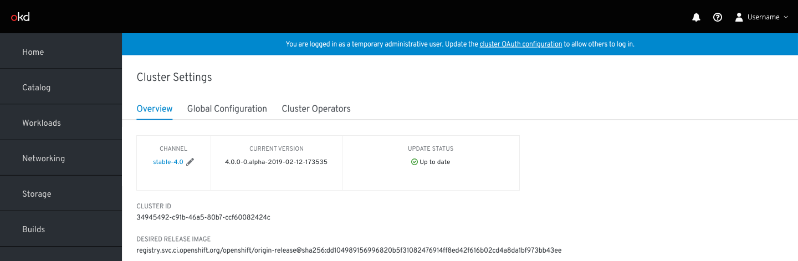
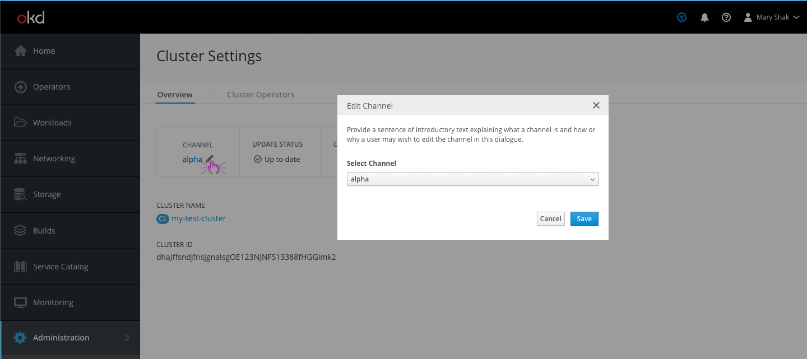
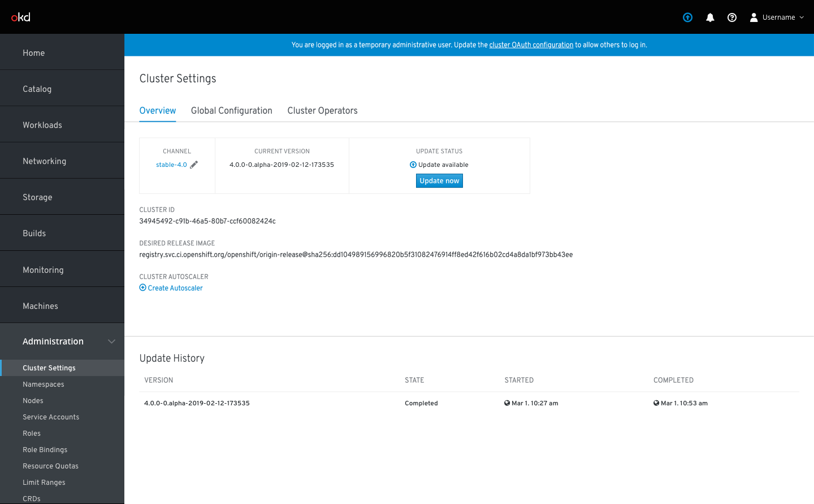
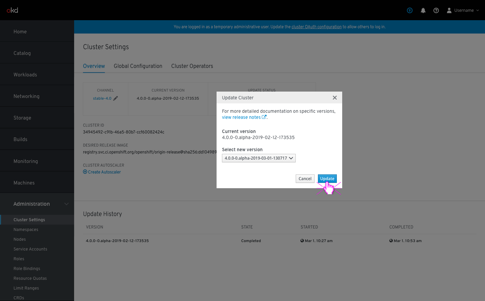
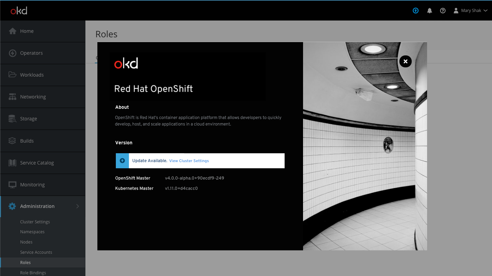
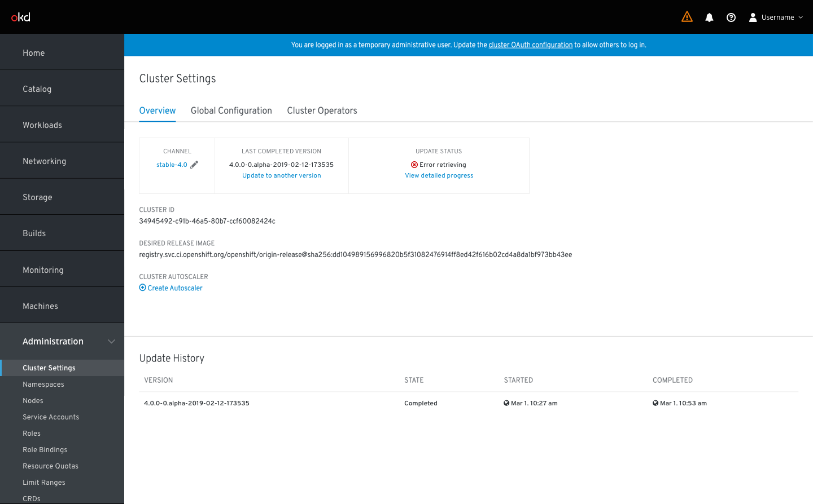

# Cluster Settings

- The Cluster Settings page is located under the Administration primary nav item.
- There are two main sections on the cluster settings page, the overview and the operators.

## Operators

- The Cluster Operators tab shows a list view of operators with search and filter components at the top.
- The list view columns include resource name and badge, status, message details, and version. For now there are no inline kebab actions available, but these may be added to the rows once they become available.
- The filter options are based on the possible status types: available, updating, failing, unknown.
- The status column includes the following icons:
   - Available should use the pficon-ok	icon
   - Updating should use the fa-refresh icon
   - Failing should use the pficon-error-circle-o	icon
   - Unknown should use the pficon-unknown icon
- Message details can use up to two lines. Once a message exceeds two lines, the end should be truncated and users can click the cluster operator to see the full message.

**Add Hint for First Time Users**

- When first time users arrive on this page, they may benefit from some explanation regarding cluster operators.
- This blue hint box can be dismissed at any time and will not show again to the same user once dismissed.

## Overview

- The overview tab will always have a top highlighted area with remaining fields listed below.
- The highlighted area shows the channel, current version or last completed version, and update status.

### Channel

- The channel can be edited by clicking the pencil.
- A modal will appear, giving the user an option to select a different channel from the dropdown and save changes.

### Update Status

The update status will be displayed in the box area beneath the tabs. Update information will be shown in both the `Current Version` box and the `Update Status` box.

**Up to Date**

- For clusters on the latest version, the update status will be `Up to date` with a green pficon-ok displayed to the left.

**Update Available**

- For clusters with new updates available, the update status will be `Update available` with a blue fa-arrow-circle-o-up displayed to the left. A primary button will allow users to `Update now`.

- Clicking the `Update now` button opens a modal with a dropdown of versions for the user to select from.
- If users need documentation help regarding the versions, they can click the link in the instructions to view the release notes, which opens in a separate window.
- Once the user selects a new version, they can click Update to begin the update process.
- **Note**: When an update is available there will also be the same blue fa-arrow-circle-o-up icon in the masthead to inform users of this update. Clicking the icon will bring the user to this cluster settings overview page where they can take action.

- If a user opens the about modal when an update is available, in addition to the blue masthead icon, users will get an inline notification below the Version section to explain an update exists and link users directly to the cluster settings page to take action.

**Update in Progress**

- For clusters with an update in progress, the update status will be `Working towards` and the new version. An fa-refresh icon will be displayed to the left. The percent completion will also be displayed here. The `View detailed progress` link will bring users to the Cluster Operators tab where they can monitor progress more closely.
- The `Current Version` box will change to display `Last Completed Version`. Below the version, a link will allow users to update to another version. Clicking this link will open the modal with the dropdown of versions for the user to select from.

**Error Retrieving Updates**

- For clusters that are failing to update, the update status will be `Error retrieving` or a related error message, with a red pficon-error-circle-o displayed to the left. The `View detailed progress` link will bring users to the Cluster Operators tab where they can see details regarding the failure(s).
- The `Current Version` box will continue to display the `Last Completed Version` with a link for users to update to another version.
