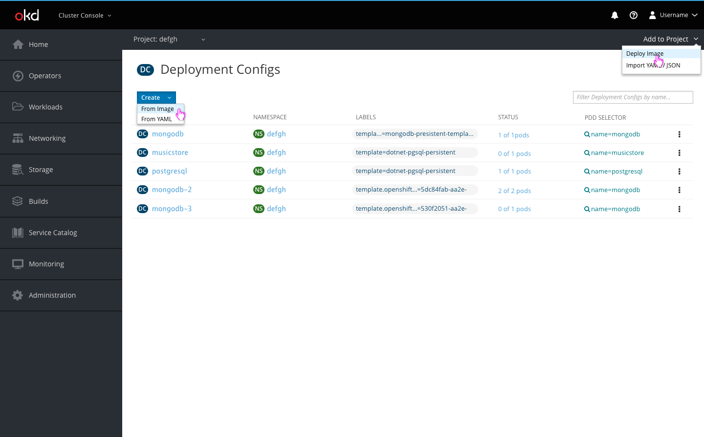
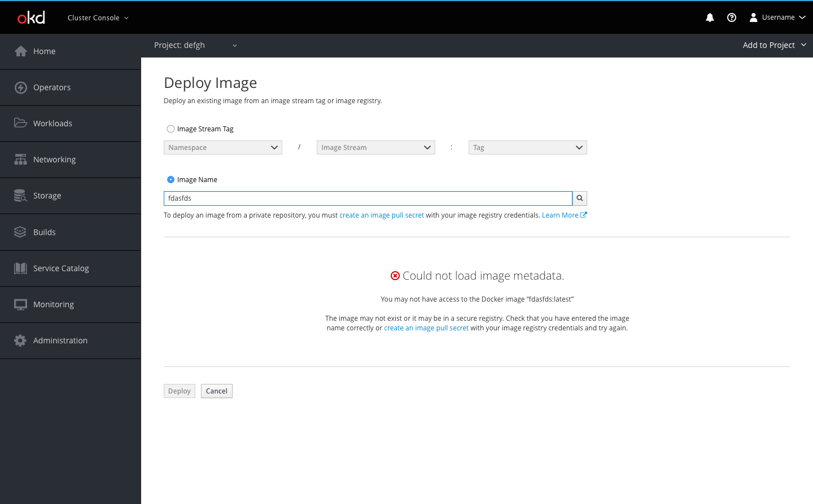
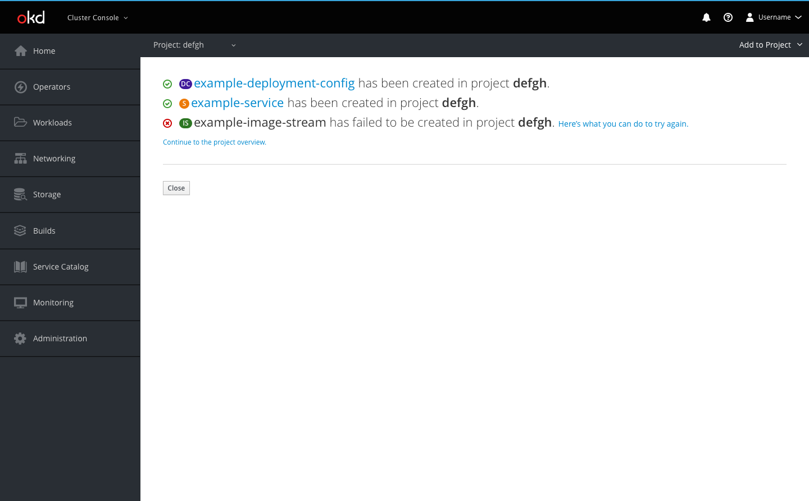

# Deploy Image

The Deploy Image action will be accessible from two places within the console: the deployment config page and the secondary masthead.

**Deployment Config page**

* The deployment config page Create button will be a dropdown with two creation options: Create from Image and Create from YAML
  * Create from Image will open the Deploy Image creation page
* The deploy image action will also be accessible through the Add to Project dropdown

**Deploy Image**

* Users can deploy an existing image from an image stream tag or image registry
* The button bar allows users to Deploy or Cancel
  * The Deploy button will be disabled until a user has completed the form without any errors
  * Cancel will bring the user back to the page they were previously on

**All Projects selected**

* If All Projects is selected in the project selector and a user begins the deploy image flow, a project dropdown will be at the top of the page
* Users can select in which project they would like to deploy the image using the project dropdown

**Error examples**

* If there are errors, the Deploy button will be disabled
* Inline notifications will be used to indicate to a user that there is an error in the form
* An empty state pattern will be used when the image metadata cannot be loaded

**Success page**

* After users click Create, they are redirected to the results summary page
* The user will be able to see a list of the resources they created and in which project they were created
* Successful creations will be displayed with the pficon-ok to the left
  * The resource name for successful creations will link users to that resource's overview page
* Failed creations will be displayed with the pficon-error-circle-o to the left and a recommendation on how the user can remedy the error
* Users may also go to the project overview page using the link or go back to the page they were previously on using the Close button
