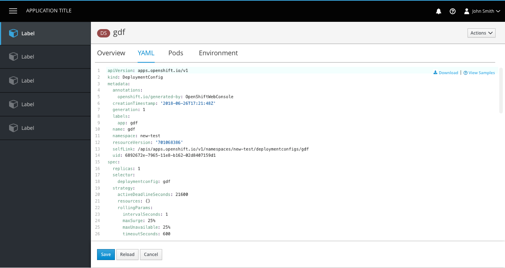

# YAML Editor

## Edit YAML

- The code area is borderless at the top and has the button bar at the bottom as a separator.
- The Download and View Samples links are sticky in the top right corner of the YAML editor, with vertical separators between them. The icons belong to the left of each link.
  - Download will produce a YAML output for the user to view outside of OpenShift.
  - View Samples will open a panel for resources that have available templates.

#### View Samples

- Some resources have additional YAML samples available for users to paste or download.
- View Samples should use the help icon and should always be the right-most link.
- Clicking the link will open a [modaless overlay](https://www.patternfly.org/pattern-library/forms-and-controls/modeless-overlay/) with the YAML samples provided. Users can close the panel using the X in the top right corner.
- The download action will remain available.
