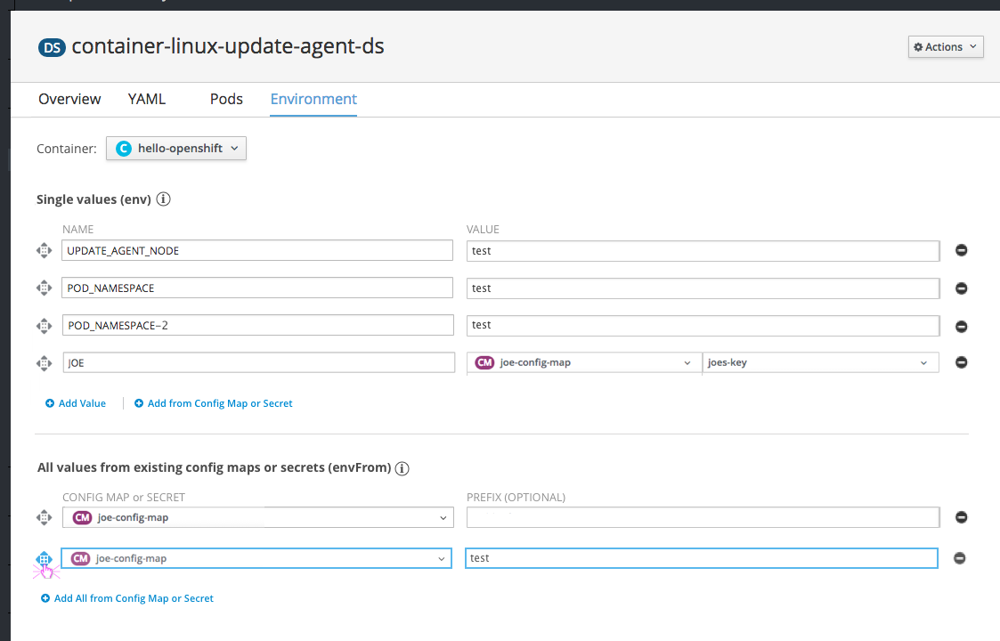
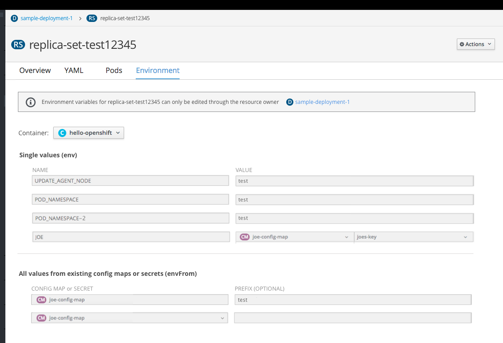

# Environment Variables

## Design

* Resource detail pages will have a tab called `Environment`, where users can define environment variables as key-value pairs to store configuration settings.

- The dropdown at the top of the page allows users to switch to another container to view and edit variables if more than one container exists. This same dropdown is present on the Logs and Terminal tabs.
- The first section on this page, `Single values (env)` allows users to add single values as environment variables, either by entering new text or by referencing a specific value from an existing config map or secret.
- The second section on this page, `All values from existing config maps or secrets (envFrom)` allows users to create environment variables by referencing all values associated with an existing config map or secret. This option may add a number of variables at one time, depending on the values associated with the corresponding config map or secret.

### Field Level Help

- Clicking the info icon (pficon-info) provides [Field Level Help](https://www.patternfly.org/pattern-library/forms-and-controls/help-on-forms/) for interacting with each section. For example:
  - Users can drag and drop variables within each section to change the order in which they are run.
  - Users can also reference any other variable that comes before it in the list.
  - When identical values exist in both lists, the single value in the top list will take precedence.

### Add and Remove Values
- Clicking add value will add a row at the bottom of the list.
- Clicking the remove icon on the right side of a row will remove the row.
- After adding or removing, users must click save at the bottom of the page to apply changes.
- In the first section, there are two options for adding new values.
  - Clicking `Add Value` will prompt users to enter a name and value for the new environment variable.
  - Clicking `Add from Config Map or Secret` will prompt users to enter a name, select a config map or secret, and select the specific value to reference from the config map or secret.
- In the second section, there is one option for adding new values.
  - Clicking `Add All from Config Map or Secret` will prompt users to select a config map or secret in which all associated values will be brought in as environment variables.
  - Users can optionally add a prefix name to reference the set of variables.  

### Reorder Values
- The drag and drop icon is available to the left of each row.
- Users can drag and drop variables within each section to change the order in which they are run.
- Users cannot drag a row from the top `Single Values` section, down to the bottom section. Variables in the top section will always take precedence over those referenced in the bottom.

**Hovering**

- Hovering over the drag and drop icon will highlight it in blue.

**Dragging**

- Clicking the icon will highlight the entire row.
- Dragging the row will leave a grey background to show the starting position, and will add a blue background to demonstrate where the row will be placed in the list if dropped.

**Dropping**

### Read-only Variables

- For resources with environment variables that cannot be edited from the Environment tab, all fields will be in the disabled state where users can view only.
- When this occurs, an inline notification should be placed at the top of the page, informing the user that these variables can only be edited via the resource owner. A link to the owner should be provided.
- The field level help icons should be hidden for this case.
