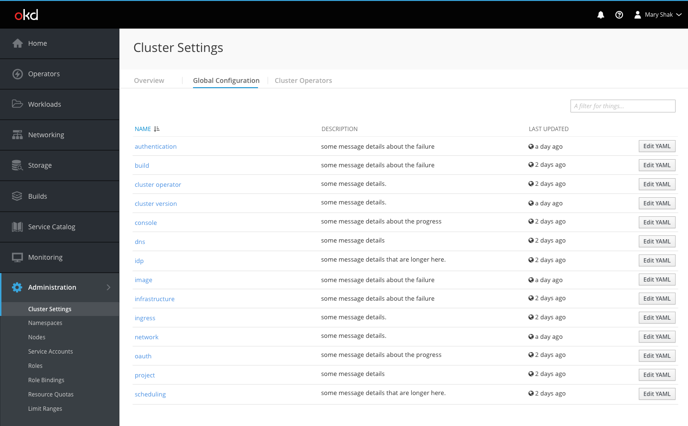
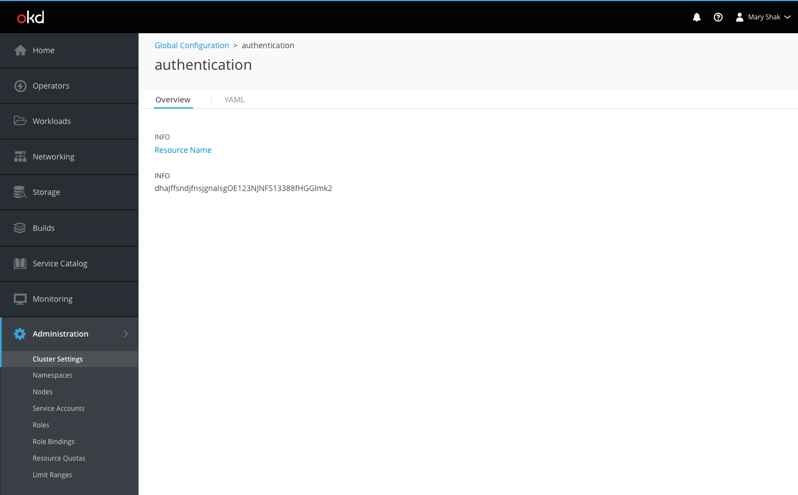
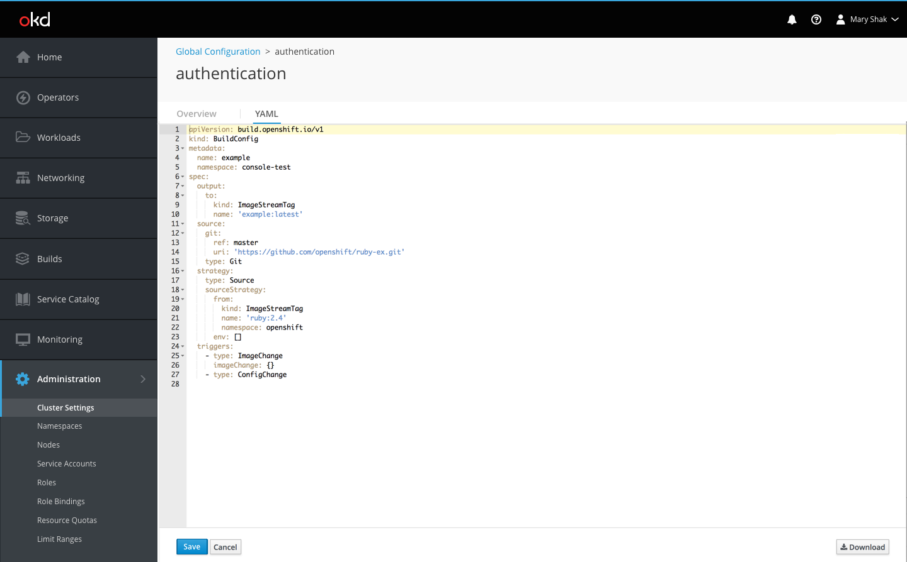

# Global Configuration

- Global Configuration is being added as a tab on the [Cluster Settings](http://openshift.github.io/openshift-origin-design/web-console/4.0-designs/cluster-settings/cluster-settings) page.
- The tab shows a list view of resources with a search bar in the top right.
- The resources are sorted alphabetically by name by default. 
- Description and date columns may not be available initially. Columns will be added if data becomes available. 
- For first time users, some hint text may be added at the top of the page to better explain Global Configs and link directly to documentation.
- Users can dismiss the blue hint box at any time.

- An edit action is available at the end of the rows to take the user directly to the YAML tab of the resource detail view. Otherwise, the Overview tab is the default when navigating to the resource.
- Clicking a resource name will bring the user to the detail view of that resource.
- Breadcrumbs will appear above the resource name on these pages in order to allow users to navigate back to the global config list view of the  Cluster Settings page.

- The detail resource views have two tabs, an overview and a YAML tab.
- The overview tab will list some resource-specific details which will vary across resources.

- The YAML tab will allow the user to edit the global configuration.
- Users can save or cancel changes using the buttons at the bottom of the page.
- If a user leaves the tab, changes will not be saved.
