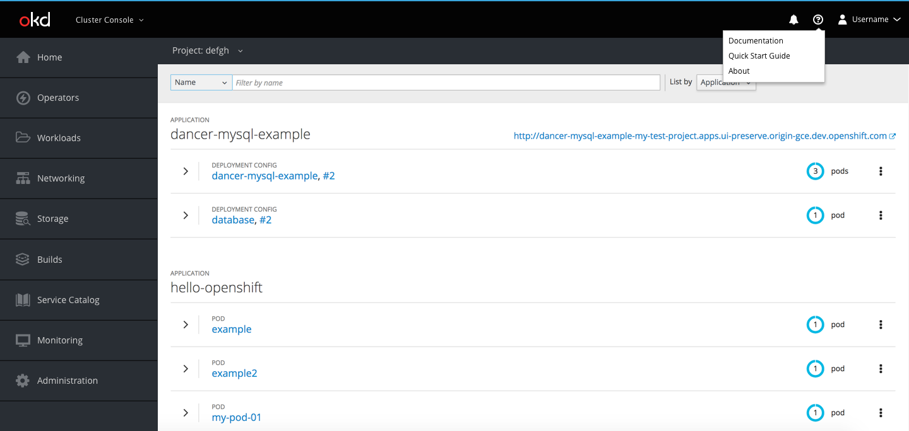

# Help Menu

The help menu will be accessible at all times from the primary masthead. Users can access it by clicking the help menu dropdown (fa-question-circle-o).

**Menu Dropdown**

* The menu dropdown will include links to Documentation, the Quick Start Guide, and the About modal
  * Documentation will redirect users to an external link
  * Quick Start Guide will take users to the Quick Start Guide landing page
  * About will open the About modal

**Quick Start Guide**

* The [Quick Start Guide](../quick-start-guide/quick-start-guide.md) landing page will have the quick start guide info, information regarding documentation and additional support links, and information about the oc client and command line tools
* A dismissible version of the first panel of this landing page will be displayed to first time users on the Status page

**About**

* The About modal will have information regarding OpenShift, the user's account, version information, and software information
