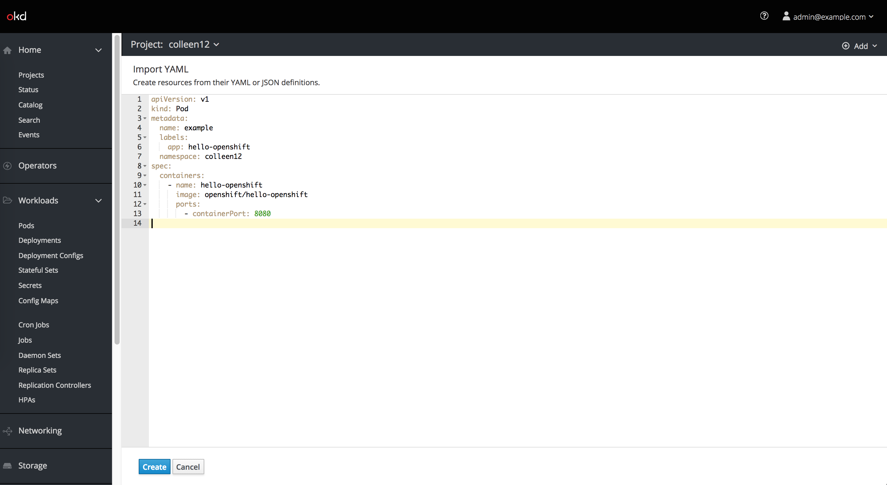

# Import YAML

The Import YAML action will be accessible from the Add dropdown in the project selector bar, making it accessible from most every page within the console.

**Import YAML button**

* The Import YAML button opens the embedded YAML editor

**Create page**

* Users can create resources using YAML or JSON by dragging and dropping a file, pasting in code, or browsing their directory to upload
* The button bar allows users to Create or Cancel
  * The Create button will create the resource(s) and display a resource details page.
  * If there are errors, the button will prompt an inline notification to appear with error details
  * Cancel will bring the user back to the page they were previously on.
