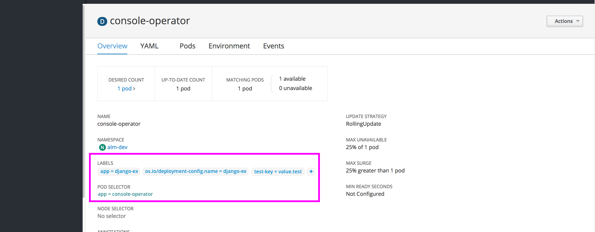
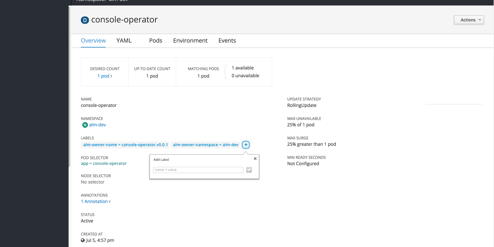
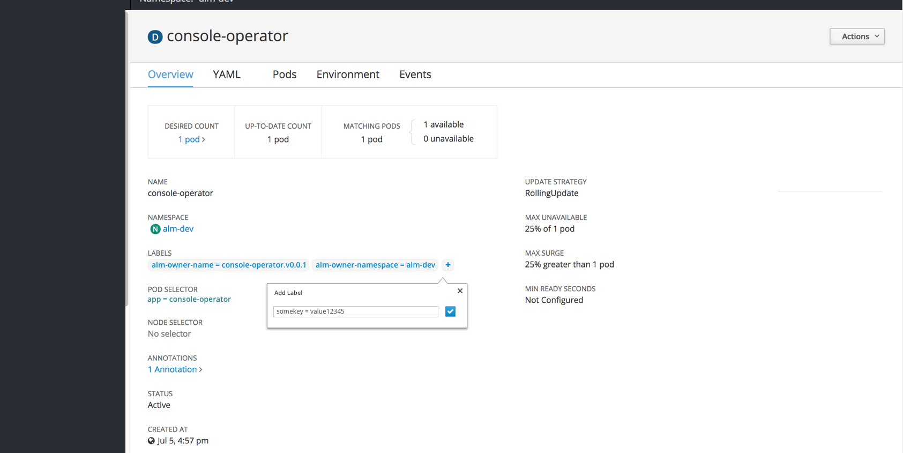
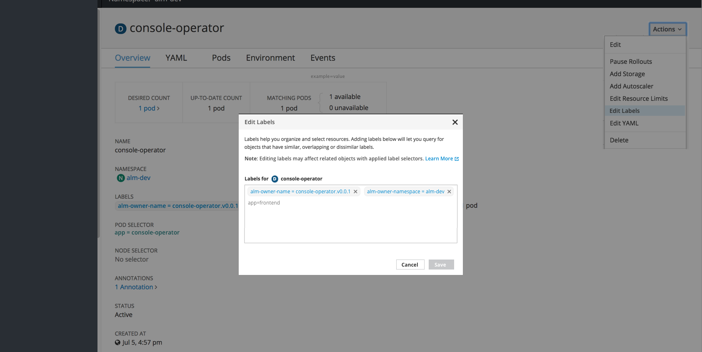
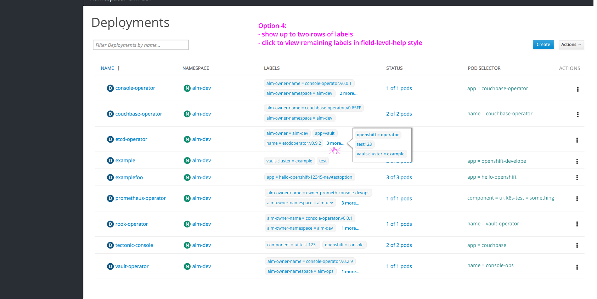

# Labels

## Styles

- Label text should match link text color (#0088CE), with a light grey background (#F5F5F5) to differentiate from other links. The grey border around the shape should be a darker grey (#EDEDED).
- Label text color will not be matched to the corresponding resource badge color. All label colors will be the same across resource objects
- Selectors will remain in various link colors depending on the selector type. These do not have background colors in order to distinguish from labels.
- Editing labels will be done in paragraph form, using the equal sign between the key and value. When editing, each label will also have an x to delete individual labels as needed.

## Detail Pages
- Every resource detail page should include a section for “LABELS” just below name and namespace sections
- Clicking a label will jump to a filtered view of the Search Page

- There will be an option for a quick add + button for adding a label with a popover. The save button (checkmark icon) will be disabled until valid text is entered. Saving the label will add the new item to the list in the detail view.
- There will be an option to edit labels, visible in the Actions dropdown in the top right
- Clicking Edit Labels will open a modal where users can add, remove, and edit labels.
- There should be an added line of instructions with a "Learn More" link to documentation on how labels interact with label selectors.

## Summary Pages
- For now, the labels column should be hidden from the summary pages.
- Each row should have kebabs on the right with the "Edit Labels" action present in the dropdown.

## Future Considerations
- The "Labels" column could be added to summary pages across the board or as needed for specific resource types.
- Filtering by label may be added to summary pages to enhance the current filter by name.
- To save vertical space, a max of 2 labels could be shown, with a "more" popover to display the remaining labels for a row.

