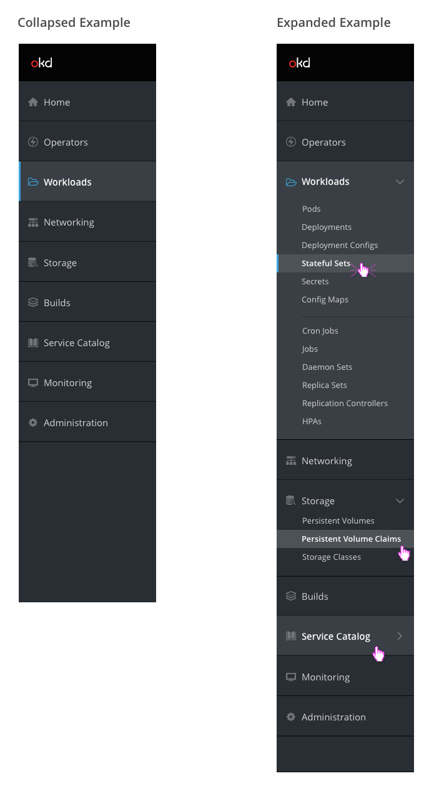

# Navigation

## Navigation Order

1. **Home** 
  1.1 Overview 
  1.2 Status 
  1.3 Catalog 
  1.4 Search All Resources 
  1.5 Events 
  –––––––––––– 
  1.6 My Super Special CRD 

2. **Operators** 
  2.1 Kubernetes Marketplace 
  2.2 Cluster Service Version 
  –––––––––––– 
  2.3 Catalog Sources 
  2.4 Subscriptions 
  2.5 Install Plans 
  –––––––––––– 
  2.6 My Super Special CRD 

3. **Workloads** 
  3.1 Pods 
  3.2 Deployments 
  3.3 Deployment Configs 
  3.4 Stateful Sets 
  3.5 Secrets 
  3.6 Config Maps 
  –––––––––––– 
  3.7 Cron Jobs 
  3.8 Jobs 
  3.9 Daemon Sets 
  3.10 Replica Sets 
  3.11 Replication Controllers 
  3.12 HPAs 
  –––––––––––– 
  3.13 Virtual Machine 
  3.14 My Super Special CRD 

4. **Networking** 
  4.1 Services 
  4.2 Routes 
  4.3 Ingress 
  4.4 Network Policy 
  –––––––––––– 
  4.5 My Super Istio Special CRD 

5. **Storage** 
  5.1 Persistent Volume 
  5.2 Persistent Volume Claims 
  5.3 Storage Classes 
  –––––––––––– 
  5.4 My Super Special CRD 

6. **Builds** 
  6.1 Builds 
  6.2 Build Configs 
  6.3 Image Streams 
  –––––––––––– 
  6.4 My Super Special CRD 

7. **Service Catalog** 
  7.1 Brokers 
  7.2 Service Instances 
  7.3 Bindings 
  –––––––––––– 
  7.4 My Super Special CRD 

8. **Monitoring** 
  8.1 Metrics 
  8.2 Alerts 
  8.3 Dashboard 
  –––––– 
  8.4 My Super Special CRD 

9. **Extensions** 

10. **Administration** 
  10.1 Roles 
  10.2 Role Bindings 
  10.3 Service Accounts 
  10.4 Projects 
  10.5 Resource Quotas 
  10.6 Limit Ranges 
  10.7 Chargeback 
  –––––– 
  10.8 Cluster Manager 
  10.9 VM Super Admin 

## Design

* The default navigation background should be pf-black-900 (#292E34). When a primary navigation item is hovered or selected, the section background should be pf-black-800 (#393F44).
* Icons should be from the PatternFly library. See below for the complete list of icons.
* The default icon color should be pf-black-600 (#72767B). When a primary navigation item is selected, the associated icon should be pf-blue-300 (#39A5DC).
* The default text color should be pf-black-300 (#D1D1D1). When a navigation item is hovered or selected, the text color should be white (#FFFFFF) and the text should be semibold.
* Primary navigation text should be size 14. Sub navigation text should be size 12.
* Horizontal separators should be used to separate subsections within the same primary navigation section.
* The selected page in the navigation should have a vertical indicator on the left side in pf-blue-300 (#39A5DC).
  * When the nav item is collapsed (Ex: Workloads), the blue vertical indicator spans the entire nav item.
  * When the primary nav item is expanded, the blue vertical indicator is shown only on the specific secondary nav item.
* The fa-angle-down icon should be displayed for primary sections that are in the expanded state.
* When hovering over a collapsed primary nav section, the fa-angle-right icon should be displayed to the right of the name,

#### Icons

| Navigation Item | Icon |
| ----------------|------|
| Home | pficon-home |
| Operators | pficon-on-running |
| Workloads | fa-folder-open-o |
| Networking | pficon-network |
| Storage | pficon-storage-domain |
| Builds | pficon-build |
| Service Catalog | pficon-catalog |
| Monitoring | pficon-screen |
| Extensions | TBD |
| Administration | fa-gear |

