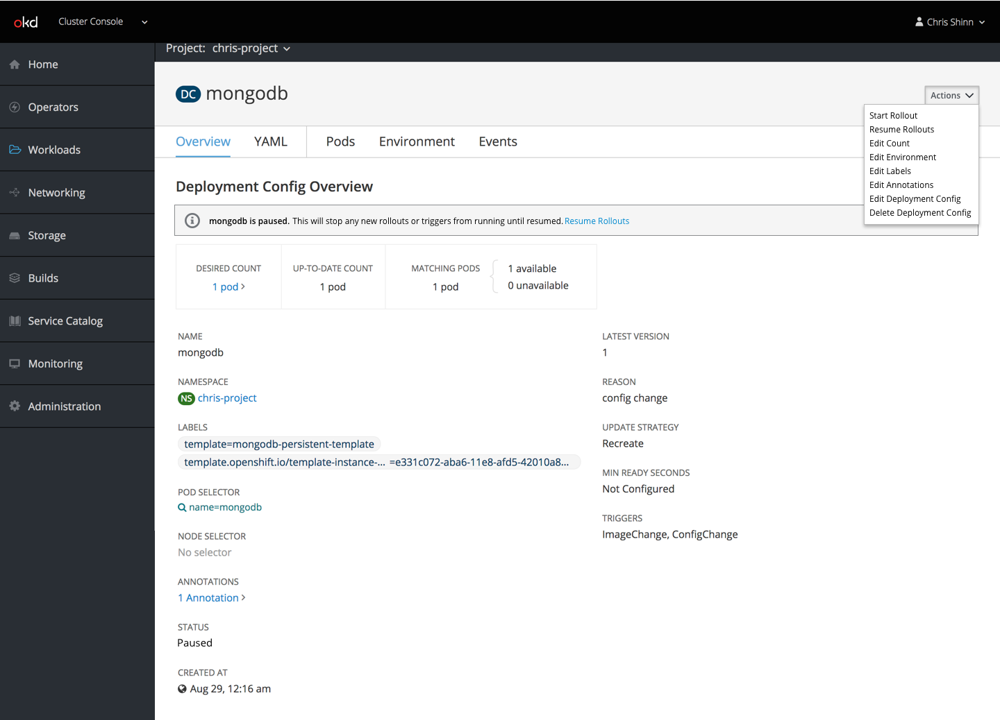

# Object Details

## Paused Objects
Some objects, such as Deployments and Deployment Configs can be paused.
When an object is paused, some of its automated functions do not run until the object is unpaused.

 - Objects that can be paused have an additional action in their actions dropdown with a relevant label, such as `Pause Rollouts` or `Pause Builds`
 - Selecting this action will pause the objects

- When an object is paused, an informational inline notification appears that explains that the object is paused and the consequences of that state.
- When possible, the notification includes an action to resume normal function.
- The pause action in the actions menu is replaced with a resume action that returns the object to normal function.
