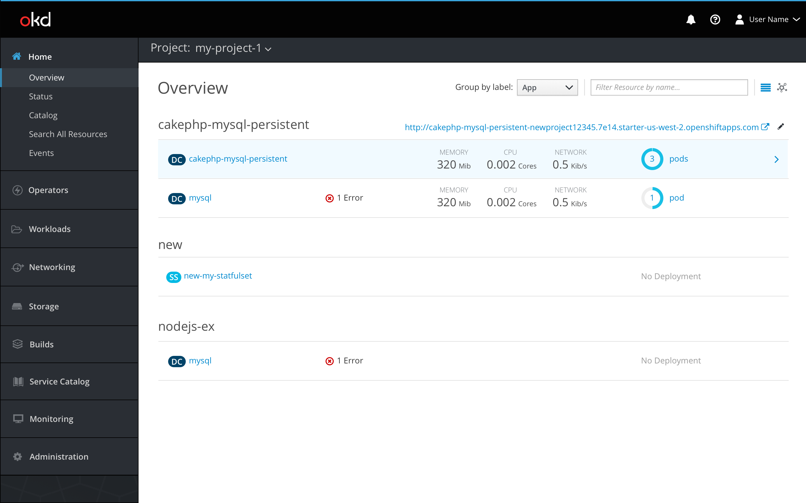
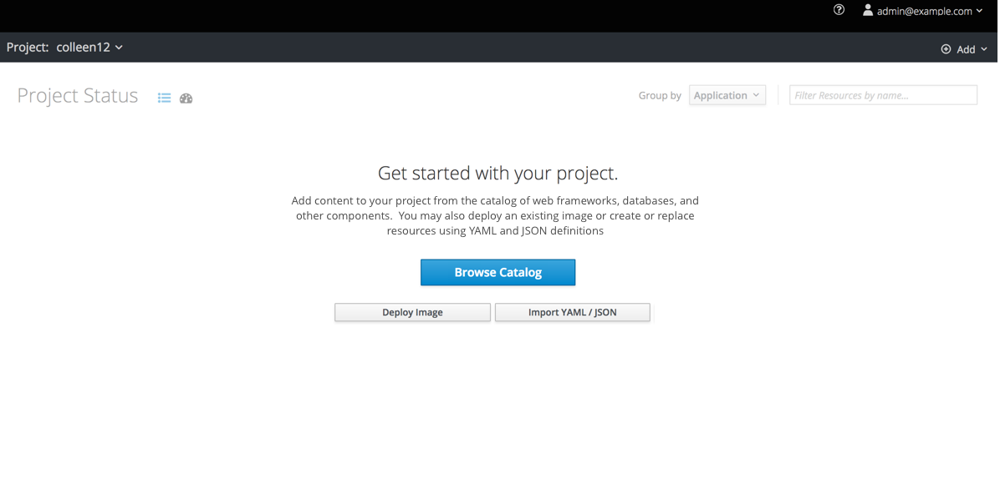
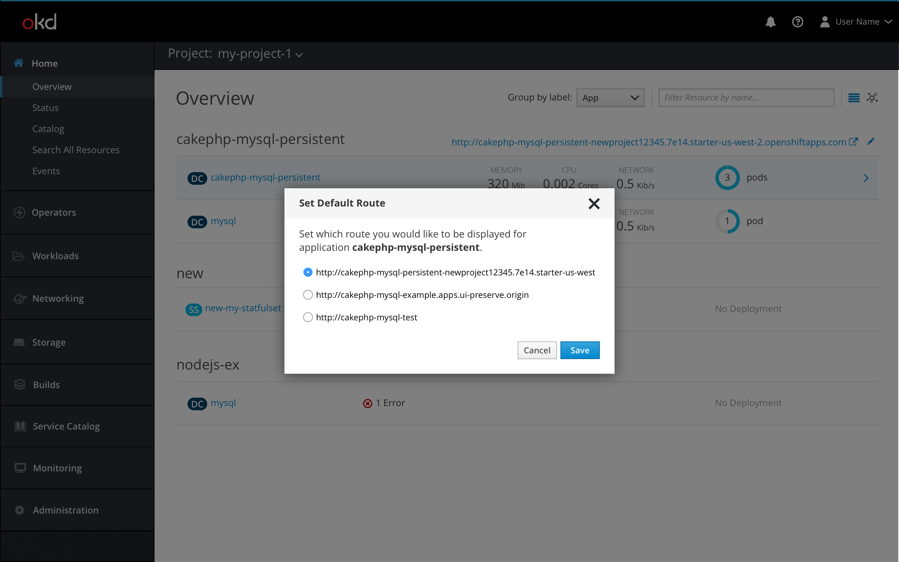
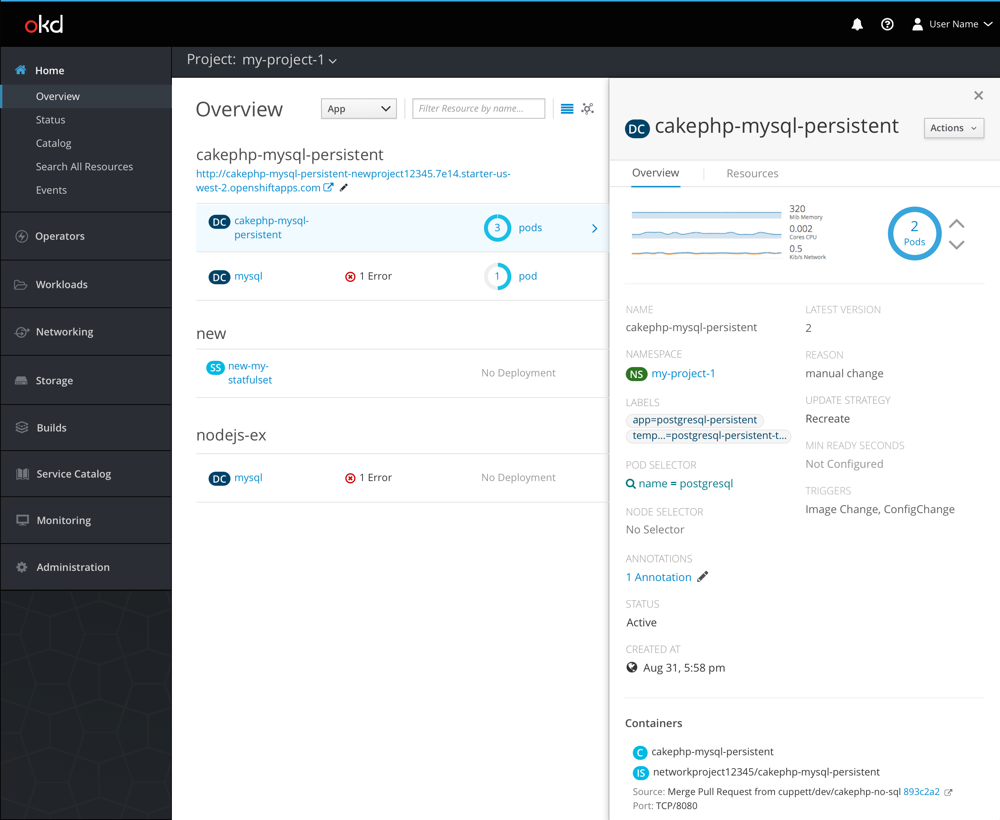
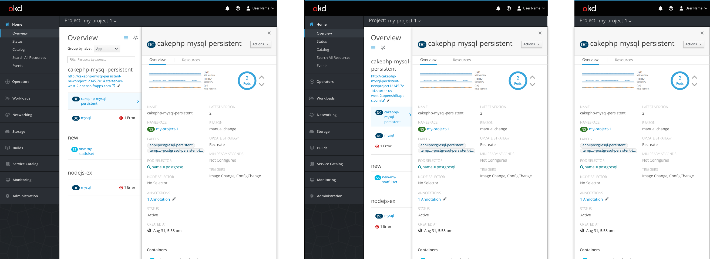

# Overview

## Collapsed list view

### General

* The project overview may be viewed in list view or topology view. It will default to show the list view. Users can toggle between the two views by using the view selector icons at the top right corner of the page.
* Users may filter resources by name by using the filter bar in the top right.
* The collapsed list view of the project overview will group items by app label (for example, `app=foo`) by default. Users may group by a different label by using the `Group by label` dropdown selector. The selector will be populated with existing labels.
  * If no resources have labels, items will be shown in a regular list view listed alphabetically by resource type and then name and the `Group by label` dropdown will be hidden.
* On hover, the row will be highlighted (#EDF8FF) and the icon fa-angle-right (pf-blue-400, #0088CE) will appear at the end of the row. When a row is selected (#DEF3FF), the side panel will open with a summary of that resource's overview, pushing the content over to the left.
* If a user is not in the context of a selected project, the user will be shown an empty state until they select a project from the project dropdown.

* If a user is in the context of a project, but does not yet have anything in their project, a different empty state will appear, prompting them to add items to the project. 
they select a project from the project dropdown.

### List columns

* The first column will include resource badges and names. Users can redirect to a resource's details page by clicking the resource name.
* The second column will display status updates and other relevant notifications and events such as crash looping containers and deployment failures. Users can hover on a status or notification to see more information.
* The third column will be a summary of the item's metrics, including memory, CPU, and network. If metrics are not enabled, this column will be blank. If metrics are enabled but are not currently available, users will see "--" in place of the values.
* The fourth column will show how many pods have deployed for that item. Users can click on the pods link to be directed to the resource's pods page.

### Route URL

* Users may navigate to the application by clicking the route URL link (pf-blue-400, #0088CE) across from the application name. The icon fa-external-link (pf-blue-400, #0088CE) will be to the right of the URL to indicate that the link redirects users to an external location and opens a new browser tab.
* Users may edit which route URL is displayed by clicking the black (pf-black-900, #292E34) pficon-edit icon. A modal will open where users may set their default route from a list of their routes. Users may also copy route URLs from this modal. Users may click Cancel or ‘x’ to close the popover, or click Save to confirm their selection.
  * The default route will be set only for the current user.

## Side panel view

### General

* When a row is clicked, the side panel will open with a summary for that resource.
* The object badge and name are displayed at the top of the panel, along with an actions dropdown for users to take action on the object.
* The side panel has two main tabs: `Overview` and `Resources`.
* The `Overview` tab is the default view, and the list view content is pushed to the left.
* The selected row remains highlighted, and the metrics column is hidden.
* When necessary, the resource name, notifications, and route URL will wrap.
* Users can close the side panel by clicking the 'x' in the top right corner of the panel or hitting 'Escape' on their keyboard.
  * If a user closes the side panel, it will always reopen to the `Overview` tab.
  * If a user changes which resource they are viewing with the side panel open, the current tab should remain selected for the new resource.
  * If a user changes to the topology view with the side panel open, the panel will remain open on the same object.

### Overview tab

* Each section is separated by a horizontal separator.
* The first section has metrics and pod information.
* The second section matches the details page view, including data such as the resource name, namespace, and labels.
* The third section displays the resource's container information.

**Pod Visualization**

* The pod visualization is the same animation that occurs on a resource's full overview page, but scaled down to fit in the side panel. While the pod animation is occurring, the metrics graph is hidden from view.
* Users can scale pods by using the up and down arrows next to the pod donut.
  * If the side panel is closed while a pod is scaling, the animation will be displayed in the pods column in the list view.

### Resources tab

**Builds section**

* The first section provides information about the resource's builds.
* Users may redirect to a build overview by clicking the build number.
  * An icon to the left of the build number will indicate the build status.
  * A relative timestamp will be displayed after the status.
  * A `View Log` link will be available to access the full log for every build.
* The builds will be listed in order of recency and will always show at least the one latest build and any currently running builds. The max number of builds that will be displayed at a time is three.
* Users may see a log snippet of any currently running builds.

**Services section**

* Services are listed with their badge to the left and the port name below.
* Users can navigate to the services overview by clicking the services name.

**Routes section**

* Routes are listed with their badge to the left and their URL below.
* The icon fa-external-link (pf-blue-400, #0088CE) will be to the right of the URL to indicate that the link redirects users to an external location and opens a new browser tab.
* If a URL is too long to fit within the designated area, a text fade should be used to indicate that the URL is longer than can fit.

## Responsive views

* In a tablet view, the navigation and list view are still visible.
  * When the list view is visible, always show at least two columns: the resource name and associated notifications.
  * The name and notification columns may stack if needed.
* In a smartphone view, the navigation and list view are not visible and the side panel will take up the entire screen.
