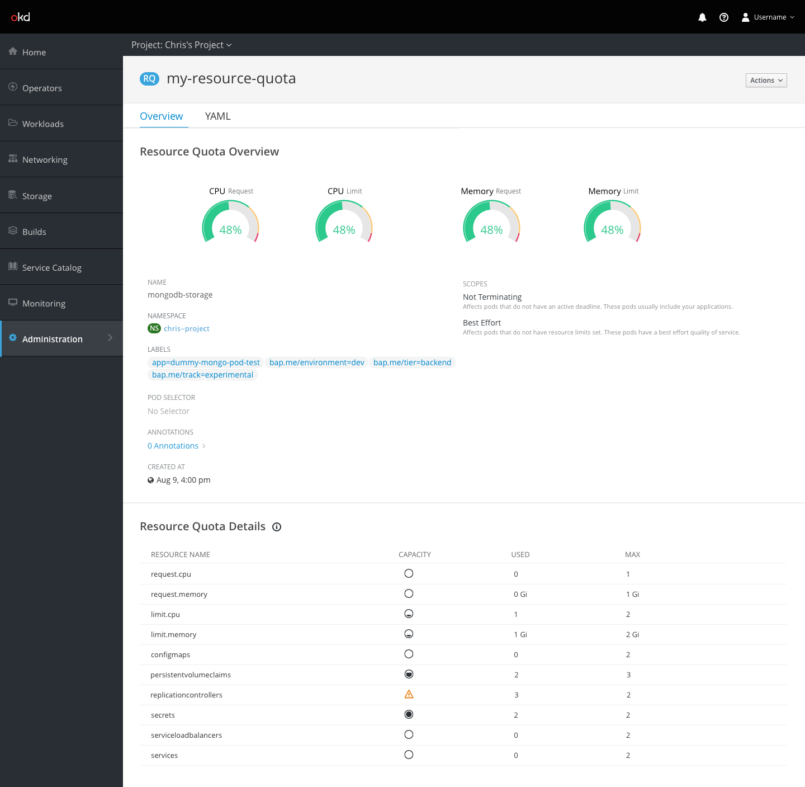
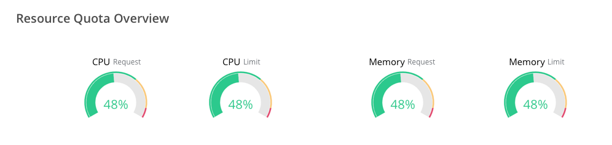
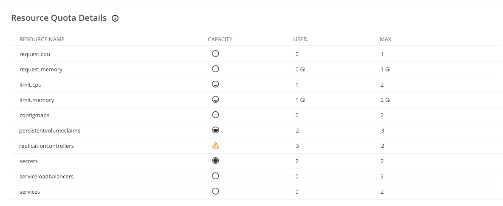
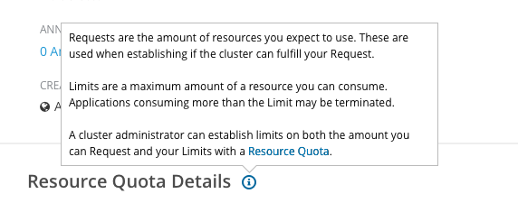

# Resource Quota

## Compute Resources

- Compute resource request and limit utilization are displayed at the top of the overview as gauges

## Scopes

- Each scope applied to the resource quota should be visible in the overview along with a short description below. Descriptions should be as follows:
- Best Effort
  - `Affects pods that do not have resource limits set. These pods have a best effort quality of service.`
- Not Best Effort
  - `Affects pods that have at least one resource limit set. These pods do not have a best effort quality of service.`
- Terminating
  - `Affects pods that have an active deadline. These pods usually include builds, deployers, and jobs.`
- Not Terminating
  - `Affects pods that do not have an active deadline. These pods usually include your applications.`

## Resource Quota Details

### Capacity
The capacity column should include an icon that corresponds to the utilization of each resource (max / used)
- Utilization = 0
  - `fa-circle-thin`
- 0 < Utilization < .5
  - `pficon-resources-almost-empty`
- .5 <= Utilization < 1
  - `pficon-resources-almost-full`
- Utilization = 1
  - `pficon-resources-full`
- Utilization > 1
  - `pficon-warning-triangle-o`

### Resource Quota Help

Clicking the informational icon should display a brief description of requests and limits along with a link to the relevant documentation (https://docs.openshift.com/container-platform/3.11/dev_guide/compute_resources.html#dev-compute-resources)

    Requests are the amount of resources you expect to use. These are used when establishing if the cluster can fulfill your Request.


    Limits are a maximum amount of a resource you can consume. Applications consuming more than the Limit may be terminated.

    A cluster administrator can establish limits on both the amount you can Request and your Limits with a Resource Quota.
