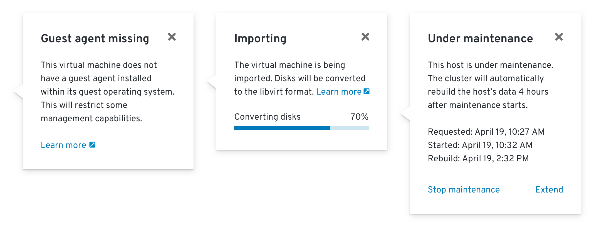

# Resource Statuses
The status of resources is primarily displayed on pages such as Summary and Details pages.

Summary Page

Details Page

## Icon Usage
When displaying status in the console, use the appropriate icon for the associated status.

Icon | Status(es)
--- | ---
pficon-ok  | Accepted Active Bound Complete Completed Enabled Ready Up to date
pficon-error-circle-o  | ContainerCannotRun CrashLoopBackOff Critical Error Failed InstallCheckFailed Lost Rejected
pficon-in-progress  | ContainerCreating Updating Upgrading In Progress
pficon-warning-triangle-o  | Warning
pficon-unknown  | Unknown
fa-ban  | Expired Cancelled Not Ready Terminating
fa-refresh  | Running
pficon-off  | Off Offline
pficon-maintenance  | Under Maintenance
fa-hourglass-1  | New
fa-hourglass-half  | Pending

The following statuses do not require icons:
* X of X pods
* True
* False

If a status has a recommended icon, show the status with both the icon and the associated status text. For cases where a status does not have a recommended icon, only show the status text.

Note: Icons should never be animated in a list view.

#### Icon Colors
* **pficon-ok**: pf-green-400 #3F9C35
* **pficon-error-circle-o**: pf-red-100 #CC0000
* **pficon-warning-triangle-o**: pf-orange-400 #EC7A08
* **All other icons**: pf-black-900 #292E34

#### Spacing
* Dependent on context and element sizes
* Icon and text should never touch

#### Text
* [Sentence style](https://www.patternfly.org/styles/terminology-and-wording/)
  * In cases where a status is a reason string condition, the status may remain in camel case with no spaces.
* [Color](https://www.patternfly.org/styles/color-palette/)
  * **Black**: pf-black #030303
  * **Blue**: pf-blue-400 #0088CE (for links only)

## Status Popovers

If additional information about a status is available, a popover should be used to provide context and one or more suggested actions. This is based on the [Infopop pattern](/web-console/future-openshift/contextual-help/contextual-help.md#infopop-pattern) that can be used to provide contextual help in other areas of the console.

Statuses with popovers should be styled in the same way as inline link buttons to indicate interactivity.

Status popovers can include internal links, external links (with an external link icon), progress bars, and dynamically-updated content.

Contextually relevant actions should generally be placed within the footer of the popover, but can be included within the body when it makes sense to do so.

