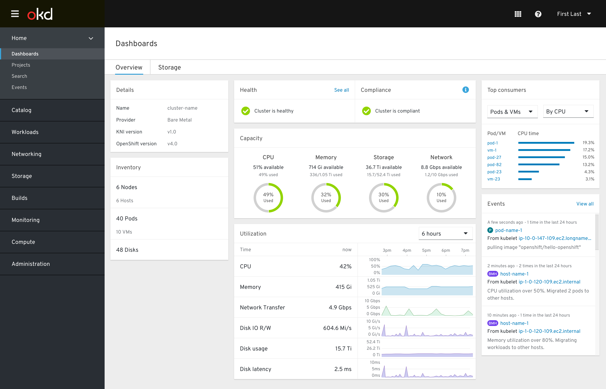

# Cluster Overview Dashboard

The Cluster Overview dashboard provides a birds-eye view of the cluster's current health, capacity, inventory, utilization, and activity.

The Overview dashboard is the first cluster-level dashboard that appears when the Dashboards nav item is selected. Additional cluster-level dashboards are available as tabs.

The dashboard is made of 7 cards, each of which was designed to be:

1. Contextual - able to be used across products
2. Reusable - applicable to multiple dashboards
3. Responsive - viewable on any screen size

The Overview dashboard is a particularly useful place to identify cluster-wide problems and begin troubleshooting alerts.

## Cards

### Details card

The **"what am I looking at?"** card that serves as a contextual anchor for the rest of the dashboard.

### Health card

The **"is everything okay?"** card that alerts the user of any unhealthy subsystems.

This card has 3 sections.

The Health section combines health statuses from all subsystems and resources. Clicking “See all” shows a “Subsystem health” popover with each subsystem’s health listed.

The Compliance section notifies the user of any compliance issues that need to be addressed, or when security/software updates are available.

The Alerts section appears when any AlertManager alerts are firing or pending. Each alert's description is shown, and a link directs the user to either the alert's details page or the details page of a relevant object.

### Events card

The **"what’s happening?"** card that shows most of the same information as the Events page, which can be accessed by clicking "View all". Events within this card can be filtered to only include ones that are relevant to the current dashboard.

### Inventory card

The **"what are you made of?"** card that displays the quantity and current status of a variety of relevant objects.

Abnormal statuses are shown within the object's row. Clicking the status should bring the user to the object's list page with an appropriate filter (if one is available). Clicking an object's name should bring the user to the same list.

### Capacity card

The **"how stressed are you right now?"** card that shows how much resource headroom is available to the cluster at the current moment.

### Utilization card

The **"how stressed have you been?"** card that shows the history of a variety of metrics over a user-specificable amount of time.

### Consumption card

The **"who’s mining cryptocurrency?"** card that pinpoints the workloads or projects that are using the most of a given resource. Clicking the name of an item will bring the user directly to that item’s details page, or expose more information.