# Dashboards

[Card-by-card documentation is down below](#card-by-card-documentation)

[Sketch file](http://openshift.github.io/openshift-origin-design/web-console/dashboards/4.3/dashboards.sketch)

## Dashboards

Note: The documentation within each of these dashboard sections only includes information that is unique to that dashboard. The functionality of each card is covered in the [card-by-card documentation](#card-by-card-documentation) further down below.

### Cluster Overview Dashboard

This dashboard is the first thing that users see when logging into the Web Console, and is intended to be the primary jumping off point to any objects or components within the cluster that may need the human operator’s attention.

#### Healthy state

#### Error state

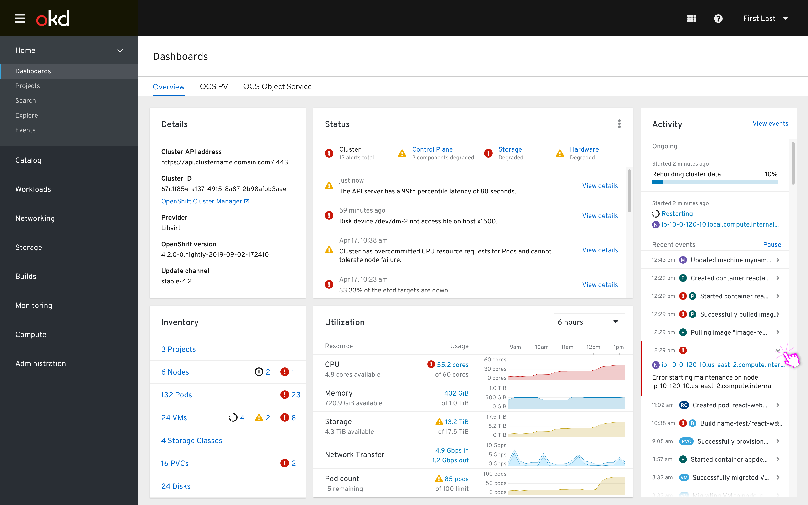

#### Update available state

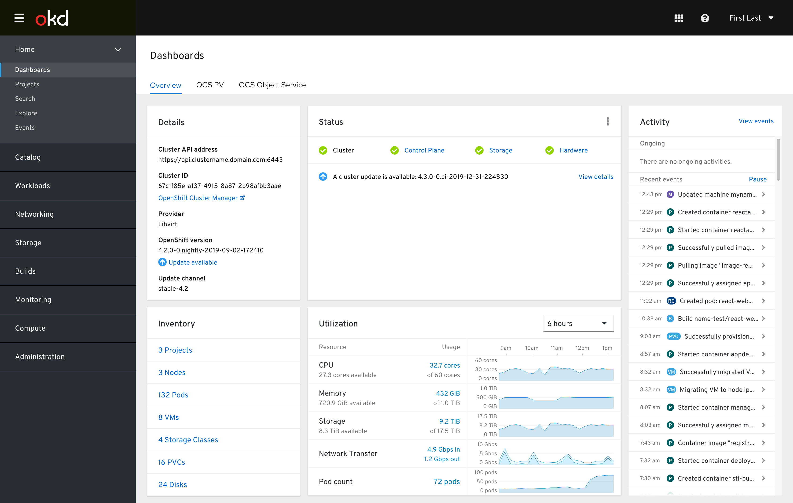

#### Mid-update state

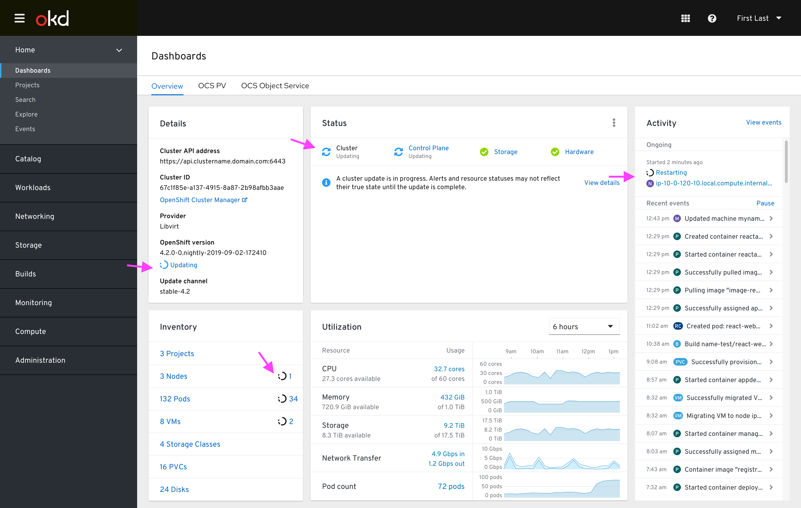

#### Overview dashboard-specific card documentation

The **Details card** includes the Cluster API address, Cluster ID, Provider, OpenShift version, and Update channel. In IPI deployments the Provider field changes based on its environment, and becomes "Unavailable" in UPI deployments where the environment is unknown.

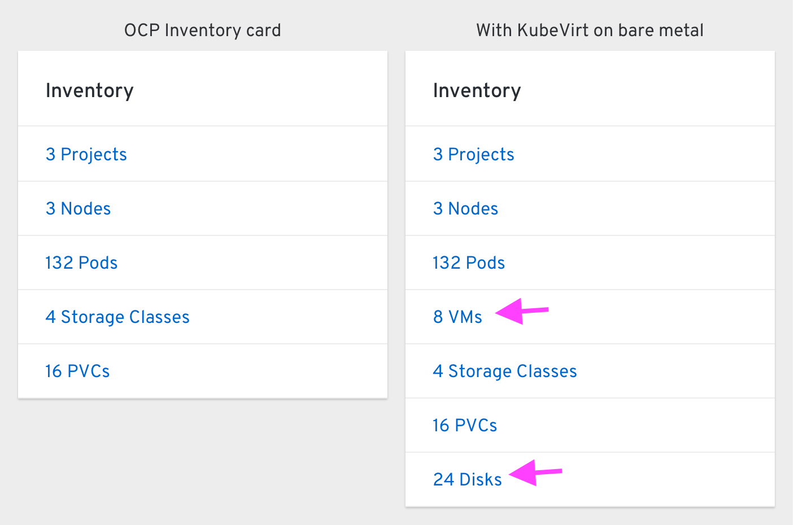

The **Inventory card** includes rows for Projects, Nodes, Pods, Storage Classes, and PVCs. When KubeVirt is available a row for VMs appears directly beneath the Pods row. In bare metal clusters, a row for Disks appears directly below PVCs.

The **Status card** includes the cluster’s overall status, a grouped status for the Control Plane components, Storage status (with OCS installed), and Hardware status (on bare metal platforms).

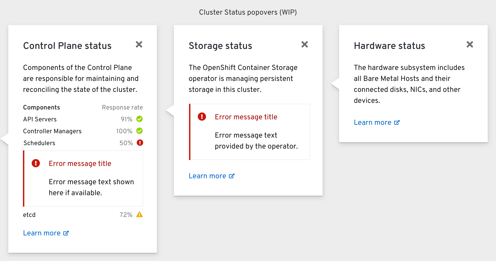

The Control Plane status popover shows the response rate of the API Servers, Controller Managers, Schedulers, and etcd. Any error messages related to a component would appear below the subcomponent’s row.

The Storage status popover shows any error messages from the OCS operator, and the Hardware status popover shows any errors from the Metal3 operator.

Clicking the "View details" action button on update-related messages should bring the user to the Cluster Settings page.

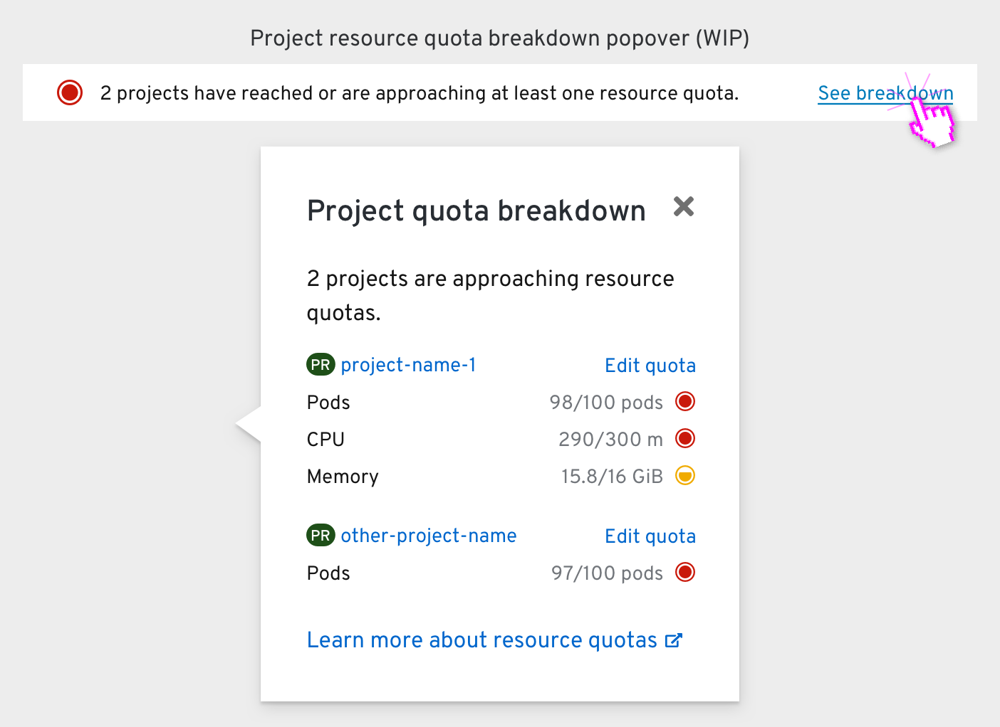

Clicking the "See breakdown" action button in a project quota message reveals a quota breakdown popover. The resources approaching their quota within each project is shown, and the "Edit quota" link next to each project name brings the user to the relevant ResourceQuota object’s Details page.

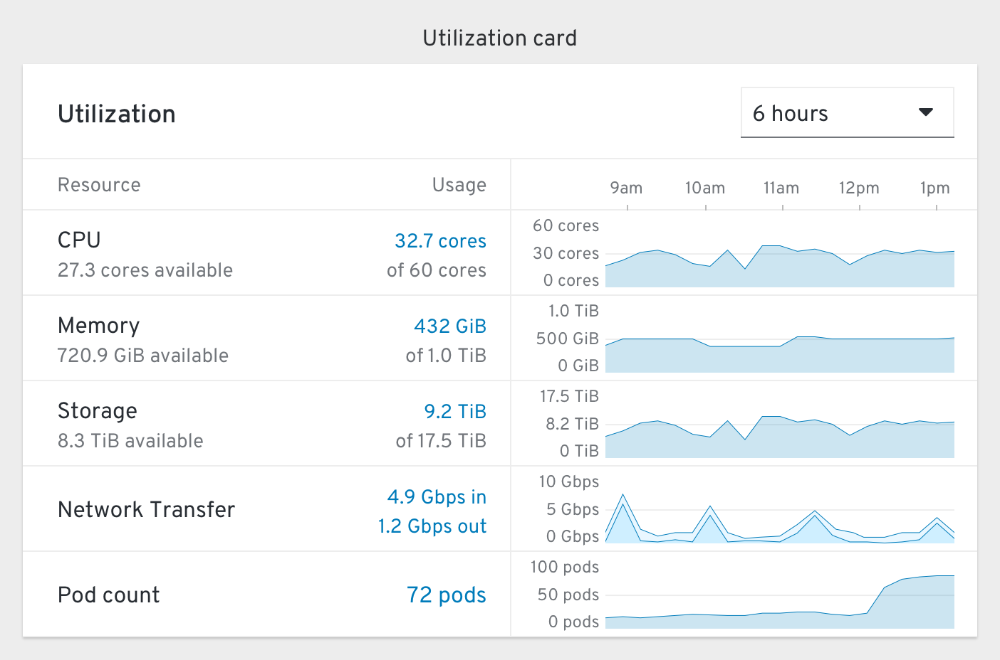

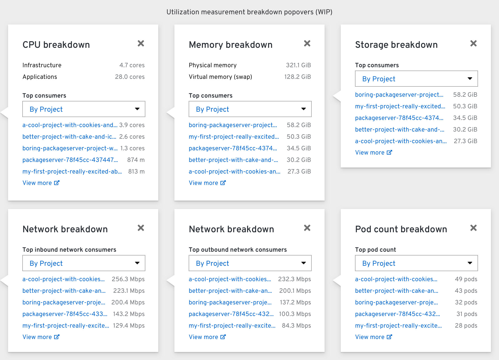

The **Utilization card** includes rows for CPU, Memory, Storage, Network Transfer in/out, and Pod count. The time dropdown includes options for 1 hour, 6 hours (default), and 24 hours, and adjusts the timescale of the chart.

The top consumers dropdown within each breakdown popover should include options for "By Project", "By Node", and "By Workload" (which includes Pods and VMs).

The **Activity card**’s "Ongoing" section should include all possible ongoing statuses, and mirror the events shown in the Cluster Events page.

### OCS PV Dashboard

#### Hyperconverged bare metal mode

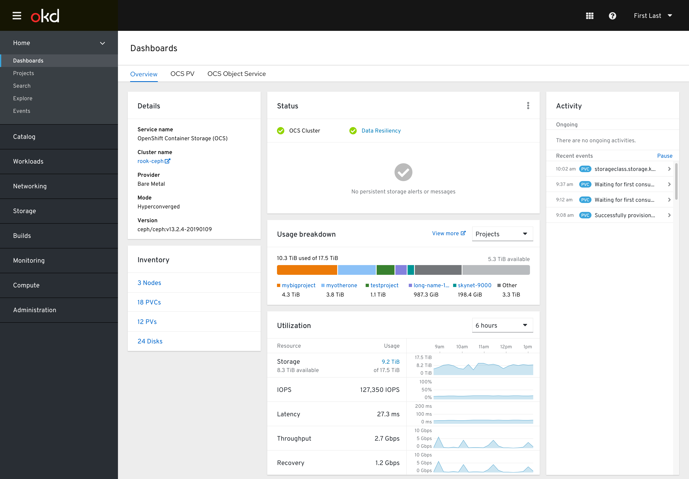

The **Detail card**’s cluster name ("rook-ceph") should link to Ceph’s native dashboard. It should also include a "Mode" field that changes from "Hyperconverged" to "Independent" depending on the cluster environment.

The **Usage Breakdown card**’s dropdown options should include Projects (default), Storage Classes, and Pods.

The **Utilization card**’s "Used Capacity" measurement should reveal a Breakdown Popover when clicked:

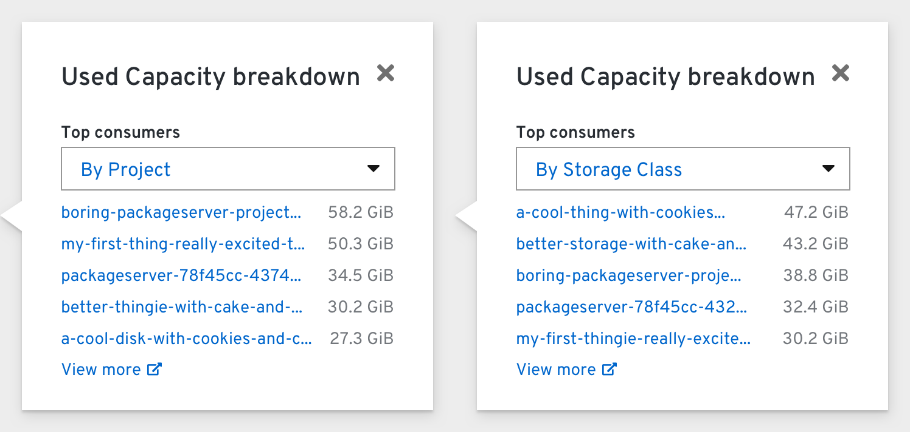

The **Activity card**’s "Ongoing" section should include:
- Rebuilding data resiliency (Note: "Rebuilding" covers rebalancing, redistributing, scrubbing, etc.)
- Upgrading OCS
- Expanding OCS Cluster
- OCS Entering/Exiting Maintenance

#### Independent cloud-based mode

In cloud-based environments, this dashboard changes slightly.

The **Detail card**'s Provider would be something like "AWS", and the Mode would become "Independent"

The **Inventory card**'s information would not be available in independent mode, so a link to the rook-ceph console is provided instead.

The **Usage Breakdown card** would not include the max amount available.

### OCS Object Service Dashboard

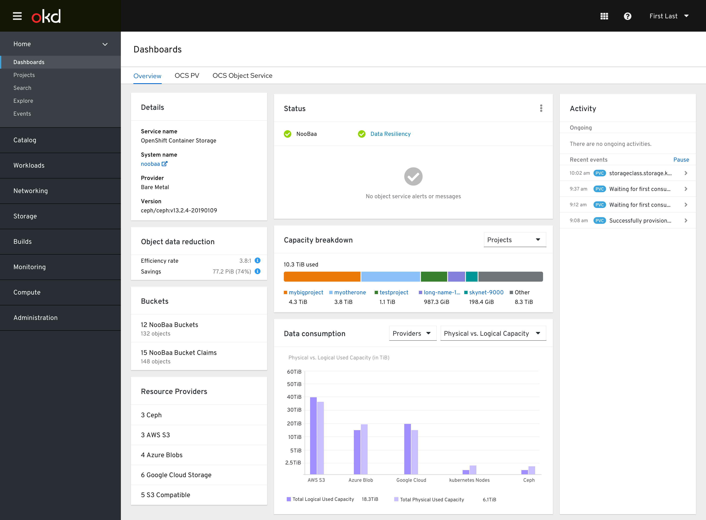

### Project Dashboard

#### Healthy state

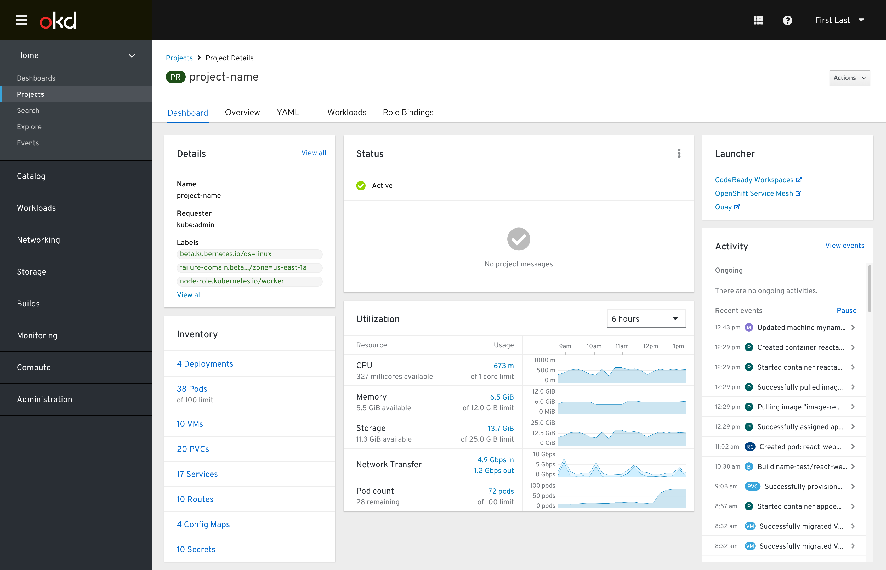

The **Details card** includes the project’s Name, Requester, and first three Labels. Clicking "View all" below the third label should bring the user to the project’s Overview page.

The **Inventory card** includes a selection of relevant objects. Sublabels appear for any resource quotas that may be imposed by the project’s ReourceQuota object.

The **Status card** displays the project’s status and any messages related to the project or any of the objects within it. Resource quota messages are the most common.

The **Utilization card** includes the same metrics as the cluster-level Utilization card. Clicking a blue measurement should reveal a Breakdown popover.

The **Launcher card** is a re-titled Details card that only includes a few external links related to the current Project. These links are added via ConsoleLink custom resources that are configured by the cluster administrator.

The **Activity card** displays ongoing statuses and events for the objects within the project.

#### Non-admin perspective

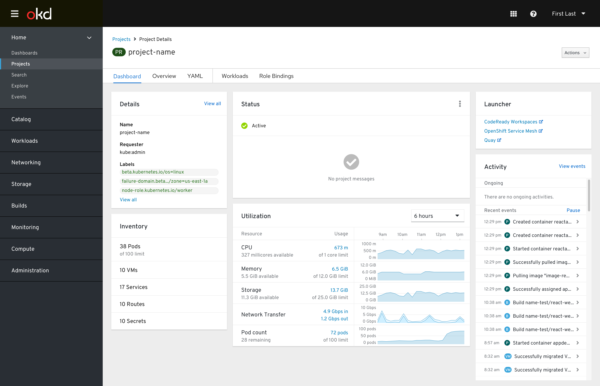

Depending on the user's permissions, some of the rows and links within the **Inventory card** may be removed. In this example, links to all resource list pages and rows for Deployments, PVCs, and Config Maps are removed.

#### Resource quotas reached

When research quotas are being reached, the charts of the Utilization card change color and status messages appear in the Status card.

### Node Dashboard

### Bare Metal Host Dashboard

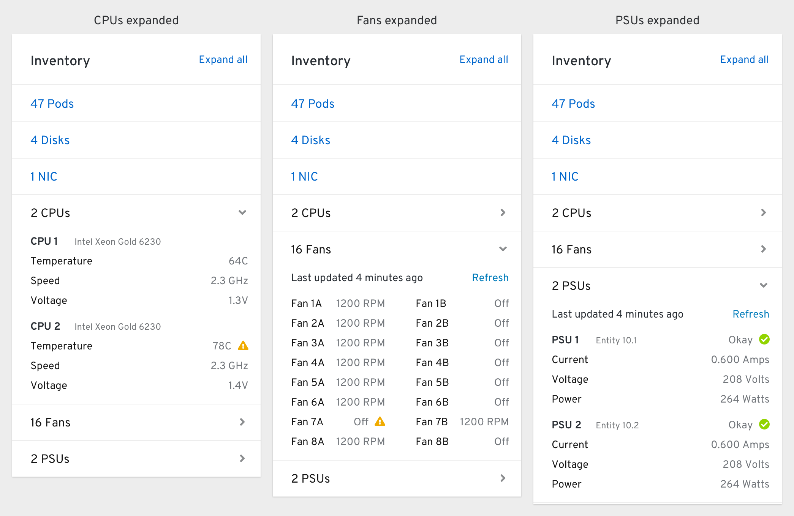

The **Inventory card** contains three collapsible sections that display metrics related to the bare metal host's CPUs, Fans, and PSUs.

### Virtual Machine Dashboard

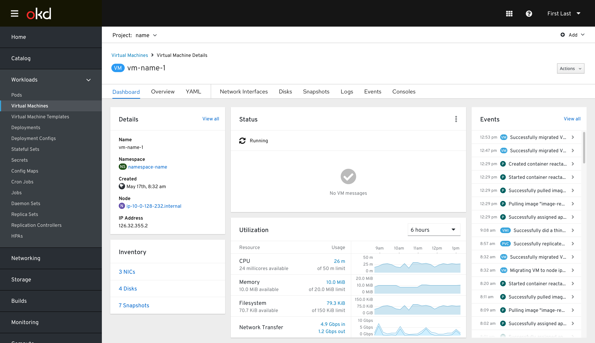

The **Details card** includes the same information as the VM List, _except_ Status (which is moved to the Status card instead).

The **Inventory card** includes the NICs, Disks, and Snapshots of the current VM (and Containers/Volumes for Pods).

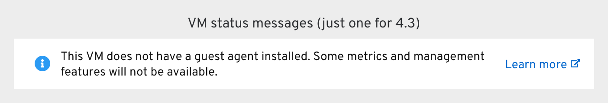

The **Status card** includes the Pod/VM’s current status in the status row, and any alerts/messages related to the Pod/VM are included as well.

The **Utilization card** includes the CPU, Memory, Filesystem (storage), and Network Transfer rates of the Pod/VM. Any limits on the Pod/VM are shown as well.

The **Events card** (retitled from “Activity”) includes all events related to the Pod/VM and related objects (VMIs, DataVolumes, PVCs, Pods). It does not include an Ongoing section - any ongoing statuses related to the VM are shown in the Status card instead.

## Card-by-card documentation

### Activity/Events card

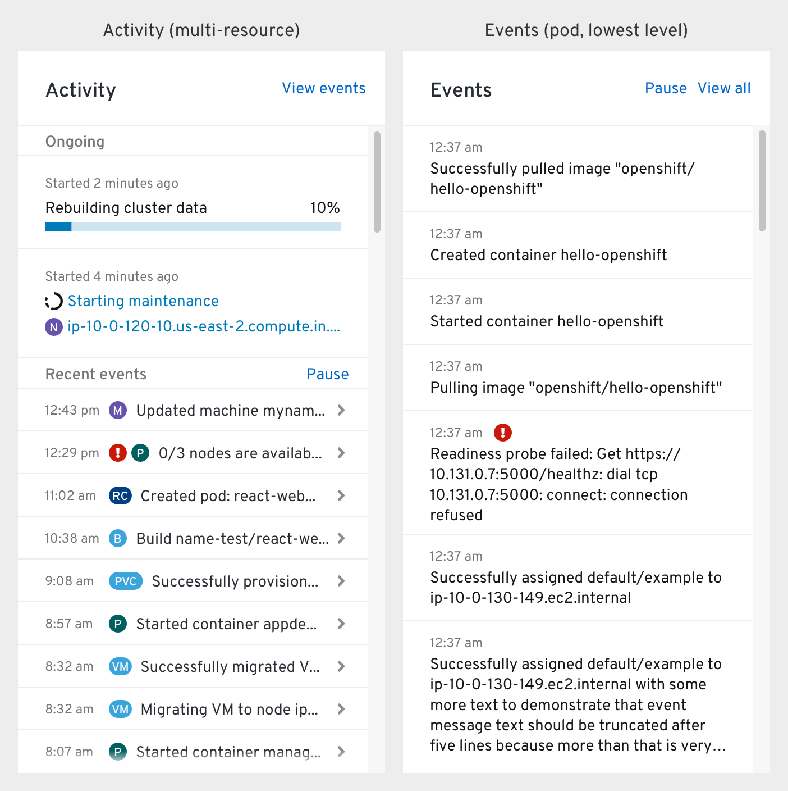

The **_"what’s happening?"_** card that displays ongoing statuses and recent events of relevant resources.

An Ongoing status is a transitional status that takes more than a few seconds to complete and usually includes a [Status Popover](http://openshift.github.io/openshift-origin-design/web-console/4.0-designs/status/status#status-popovers) with additional information. Ongoing statuses can either be finite (progress bars) or indeterminate (spinners).

The Ongoing section includes the ongoing statuses of objects **_below_** the current dashboard’s level. A node’s Activity card would include the statuses of all workloads running on the node, for example. The status of the node itself would be included in the status bar of the node dashboard’s Status card instead.

At a cluster level, the "Ongoing" section also includes cluster and operator-level statuses.

At the lowest object levels where all all events are related to the object being viewed, this card can be re-titled "Events" and the object’s events are not collapsed.

Ongoing statuses include:
- Cluster upgrading
- Cluster operators upgrading
- OLM operators upgrading
- OCS
  - "Rebuilding data resiliency" - covers rebalancing, redistributing, scrubbing, etc.
  - Upgrading OCS cluster
  - Expanding OCS cluster
  - Entering/Exiting Maintenance
- Node operating system upgrading
- Node entering or exiting maintenance
- Node powering off, on, or restarting
- VM importing (v2v migration)
- VM live migration
- VM disk image being imported
- VM backing up (or snapshotting)

Clicking an object’s Ongoing status label should reveal the same [Status Popover](http://openshift.github.io/openshift-origin-design/web-console/4.0-designs/status/status#status-popovers) that would appear anywhere else in the Console’s List and Details pages.

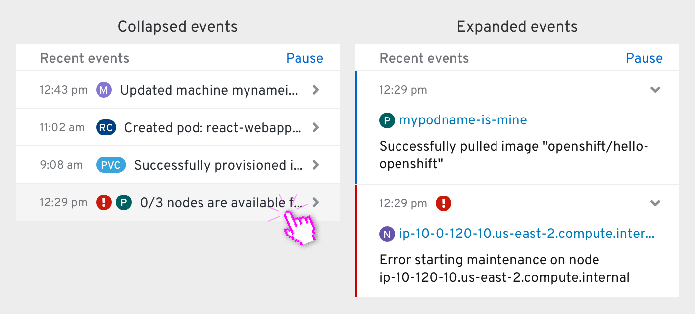

The Recent events section includes all of the events **_at or below_** the current dashboard’s level. The Cluster Overview dashboard’s card would include every event in the entire cluster, for example, while a Project dashboard would include events only for the resources within it.

Clicking Pause in the heading row will pause the stream of events. Clicking Resume will resume the stream.

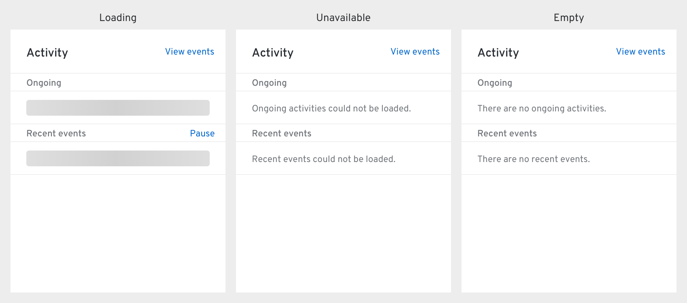

### Breakdown card

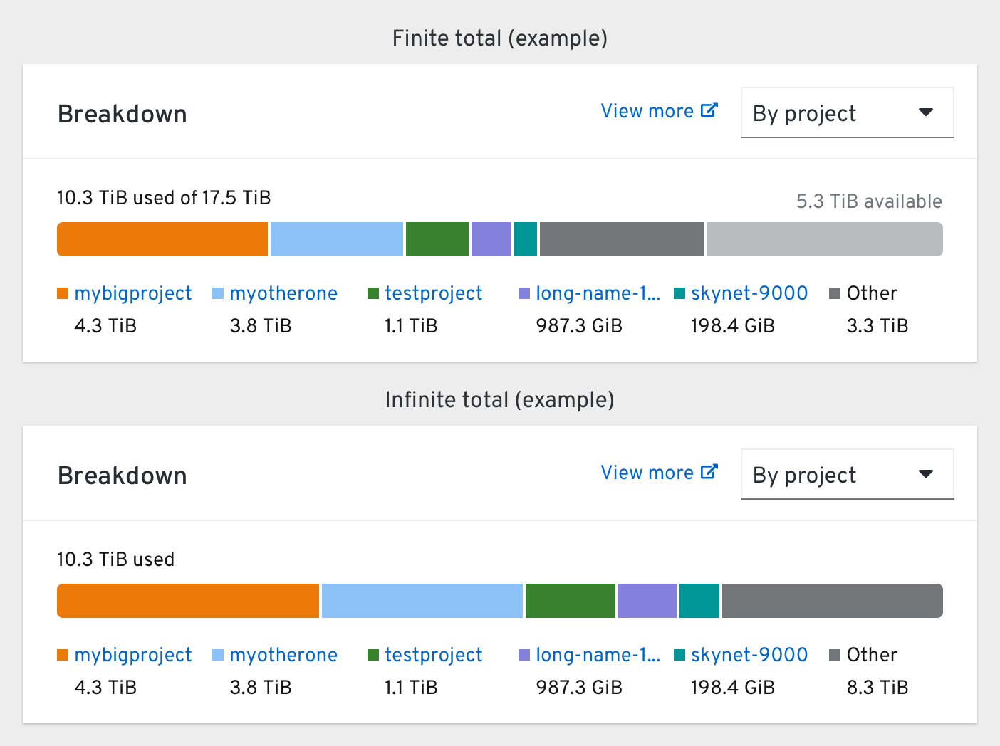

The **_"who’s using the most X?"_** card that visualizes the top 5 consumers of a single resource. This card is used primarily in dashboards that focus on a particular resource like Storage.

Users can change the consumer type using the dropdown in the top-right. Clicking "View more" should bring the user to the Prometheus dashboard to see the top 20 consumers for the same query.

In cloud contexts where there is no "total" to compare to, the amount available is removed.

The amount available is always right-aligned and colored a light grey. The "Other" category is calculated by subtracting the usage of the top 5 consumers from the total amount used.

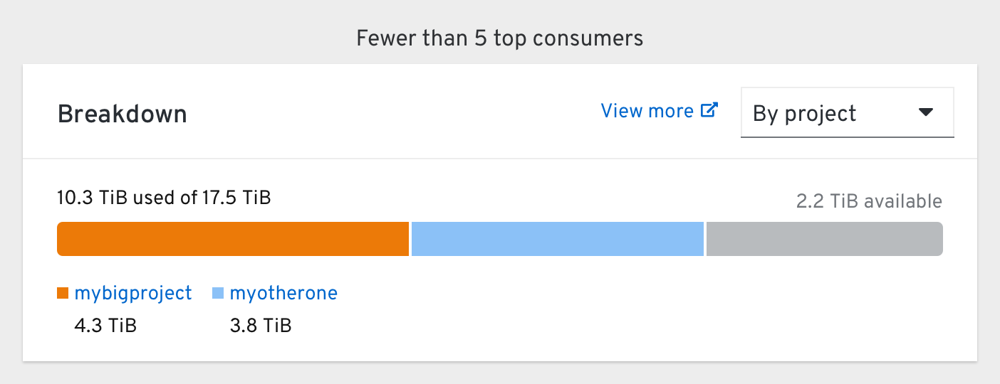

If fewer than 5 top consumers are present, the dark grey "Other" category is not shown (and not applicable). Legends should be left-aligned.

### Chart card

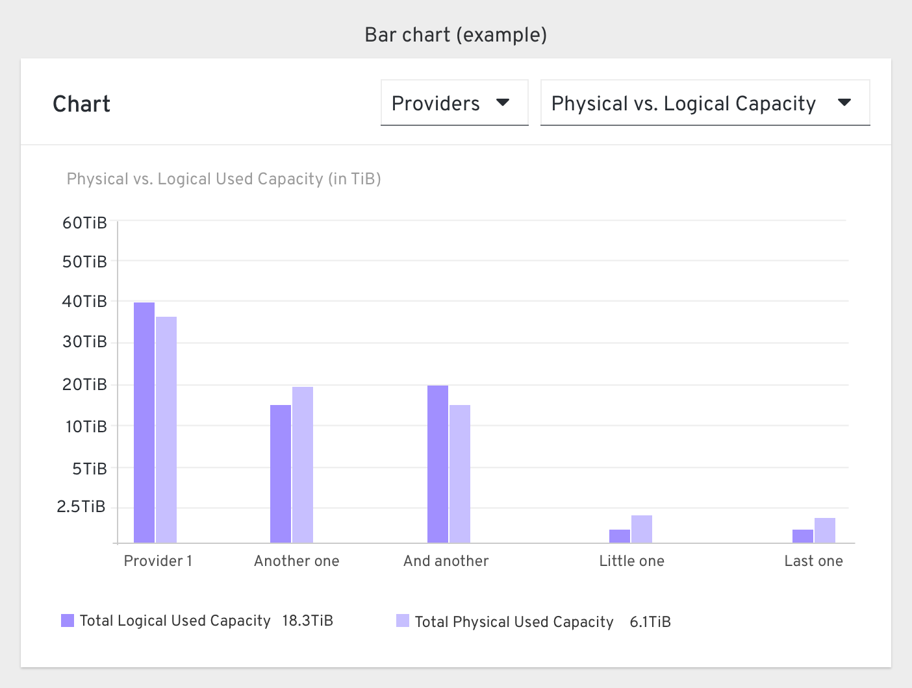

The **_"chart"_** card is basically just a chart. It includes any standard PatternFly [Chart](https://www.patternfly.org/v4/documentation/react/charts/chartbar/) in the card body and optional [Dropdowns](https://www.patternfly.org/v4/documentation/react/components/dropdown/) in the card header to adjust the chart’s data.

### Details card

The **_"what am I looking at?"_** card that explains the scope of the rest of the cards, serving as a standard contextual anchor for each dashboard. This card should be placed in the top-left corner of every dashboard.

Detail cards within an object’s Details page should include a "View all" link in the top-right corner to bring the user to the object's Overview tab. The fields of the card should match the columns included within the object's List page _except_ for the Status field (it’s included in the object's Status card instead).

In some dashboards (like Project) a second Details card can be included for related information or external links.

Label fields should only display the first three alphabetical labels. Clicking "View all" below the labels should bring the user to the object's Overview tab to see the full list.

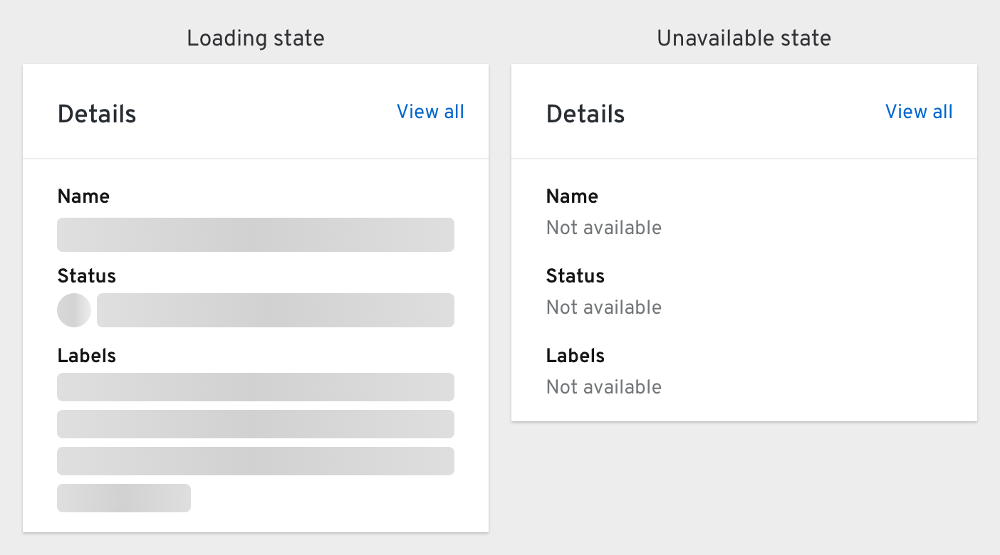

### Inventory card

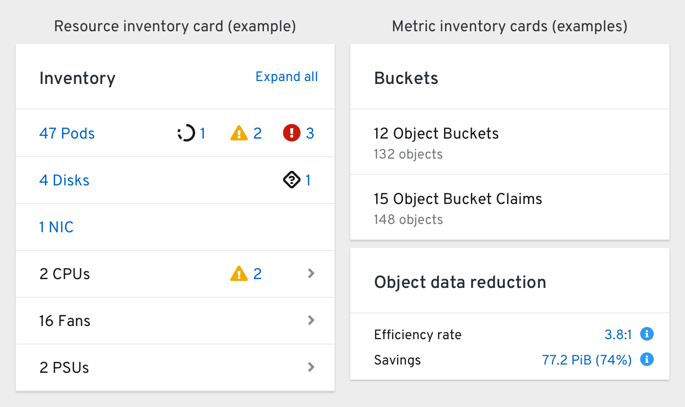

The **_"what are you made of?"_** card that provides an at-a-glance look at the quantity and status of relevant objects, hardware, and metrics, and allows users to quickly navigate to common resource lists.

Object rows with List pages have blue-colored labels that can be clicked to go to those pages.

Clicking a status icon brings the user to the same list, but with a filter applied to only show objects with that particular status (if available).

Clicking a quota icon reveals a breakdown popover.

A maximum of 3 statuses can be shown in each row. Errors, warnings, and in-progress have the highest priority, but other status types can be included when room is available. Green "okay" statuses should not be shown (they are assumed).

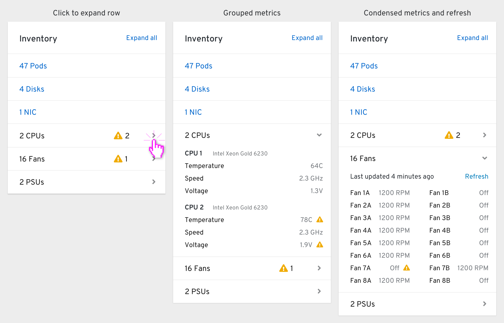

Clicking an expandable row’s caret reveals additional metrics. Clicking "Expand all" in the card’s header expands all expandable rows when multiple are available. Any status icons disappear from the row when expanded.

If a set of metrics has a long polling interval of more than 60 seconds, a timestamp row should appear at the top of the expanded region that includes a manual "Refresh" button.

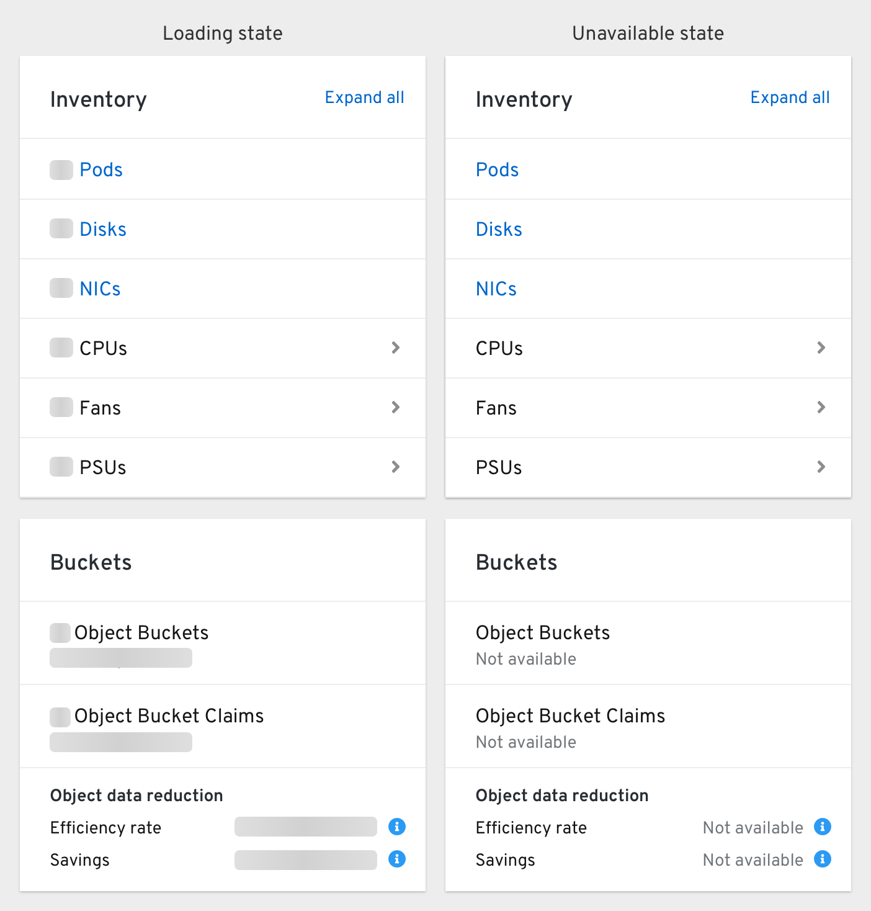

### Status card

The **_"talk to me, computer"_** card that displays subsystem statuses, Prometheus alerts, and Console-only messages that human operators should know about.

This card has 3 parts:
1. A title bar with an actions kebab
2. A status bar
3. An alerts & messages region

The actions menu includes a link to view all alerts within the Alerts page and an action to generate a diagnostics report.

#### Status bar

There are 3 kinds of statuses that appear within the cluster-level status bar.

1. The Primary status summarizes the overall status of the thing the user is looking at. They are always the first, left-most status in the bar. When any alerts are firing or a subsystem is degraded, the primary status becomes degraded and a sublabel displays the total alert count.
2. Grouped statuses combine multiple statuses into one. When a component of that group is degraded or is being updated, a sublabel appears.
3. Subsystem statuses are added by "infra" operators and reflect their status

In object-level dashboards, the Primary status is the status of the object itself (Ready, Running, Starting maintenance, etc.). Object-level status bars may also include other closely-related statuses.

Clicking any blue status reveals a status popover.

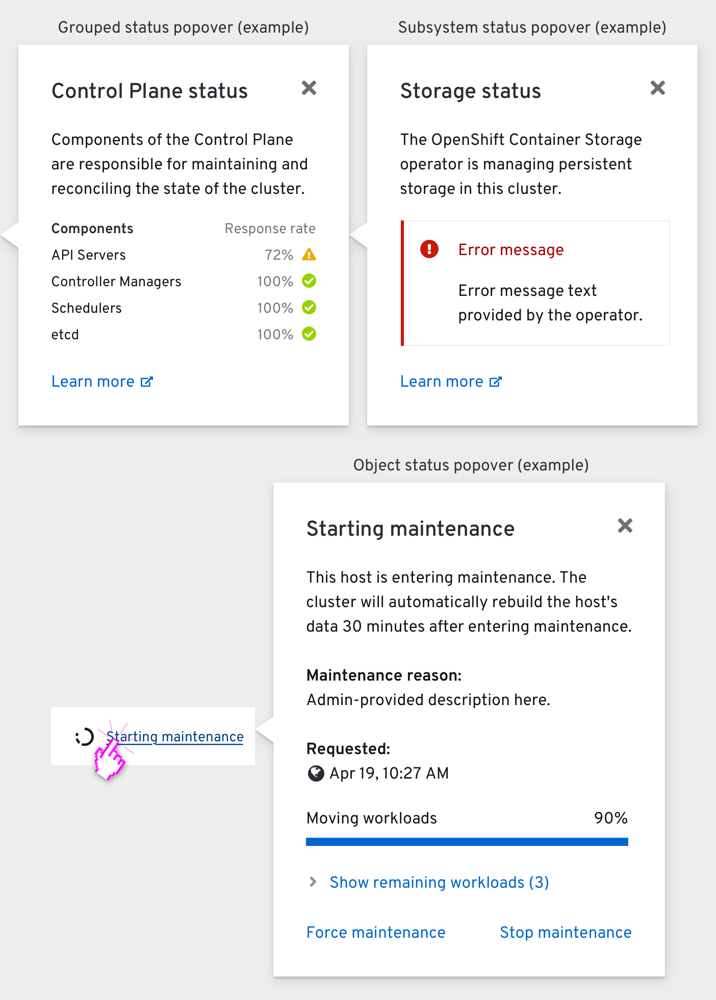

The status popover of a Grouped status (just "Control Plane" for now) includes a table of each component’s status.

Operator status popovers include any error messages provided by the operator to explain its degraded health.

Object status popovers are the exact same ones that appear in the rest of the Console’s List and Details pages (documented [here](http://openshift.github.io/openshift-origin-design/web-console/4.0-designs/status/status#status-popovers)).

#### Alerts and messages

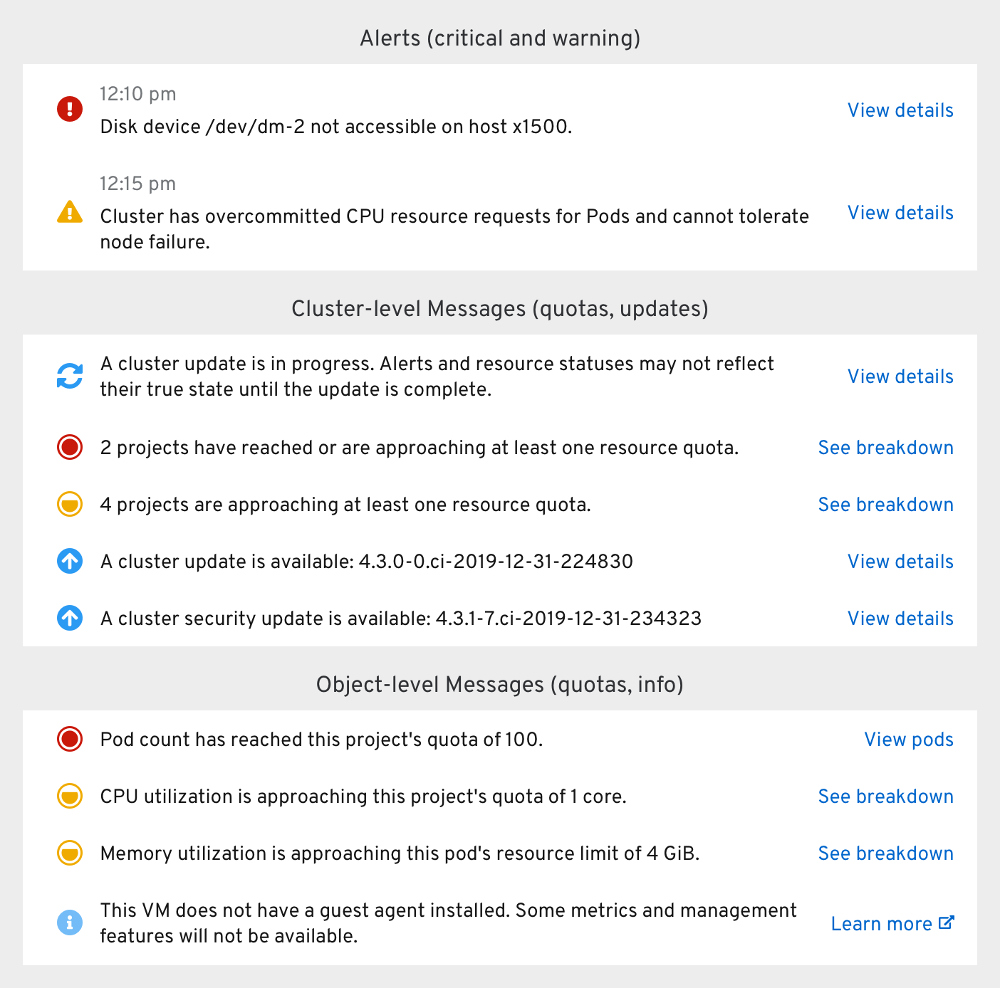

**Alerts** are firing Prometheus/AlertManager alerts arranged in chronological order within the alerts/messages region. They include a timestamp and a "View details" action that takes the user to the alert’s Details page.

**Messages** are Console GUI-only notices that "talk" to the human operator to suggest certain actions. These messages usually appear below any alerts, but can be pinned above them in certain cases. They can include either a "View details", "View X", or "See breakdown" action button. Clicking "See breakdown" should reveal a Breakdown popover with more information.

If statuses and/or alerts are not able to load, an unavailable state is shown. Clicking "Try again" should trigger a manual refresh.

### Utilization card

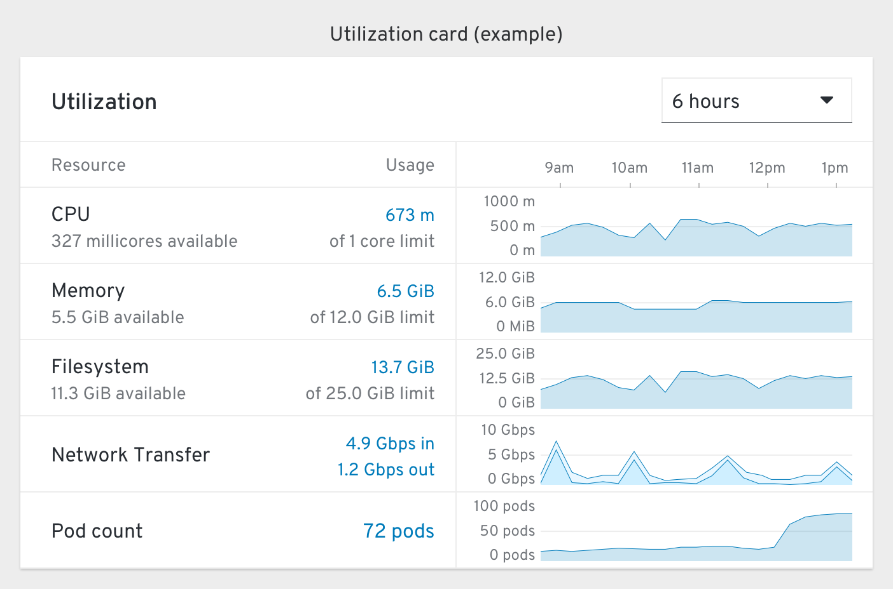

The **_"how much is being used?"_** card that displays current and historical measurements of various metrics.

The y axis of this card’s charts should generally not change and instead span the min/max possible values. If a resource quota or limit range is set, the y axis should span that possible range.

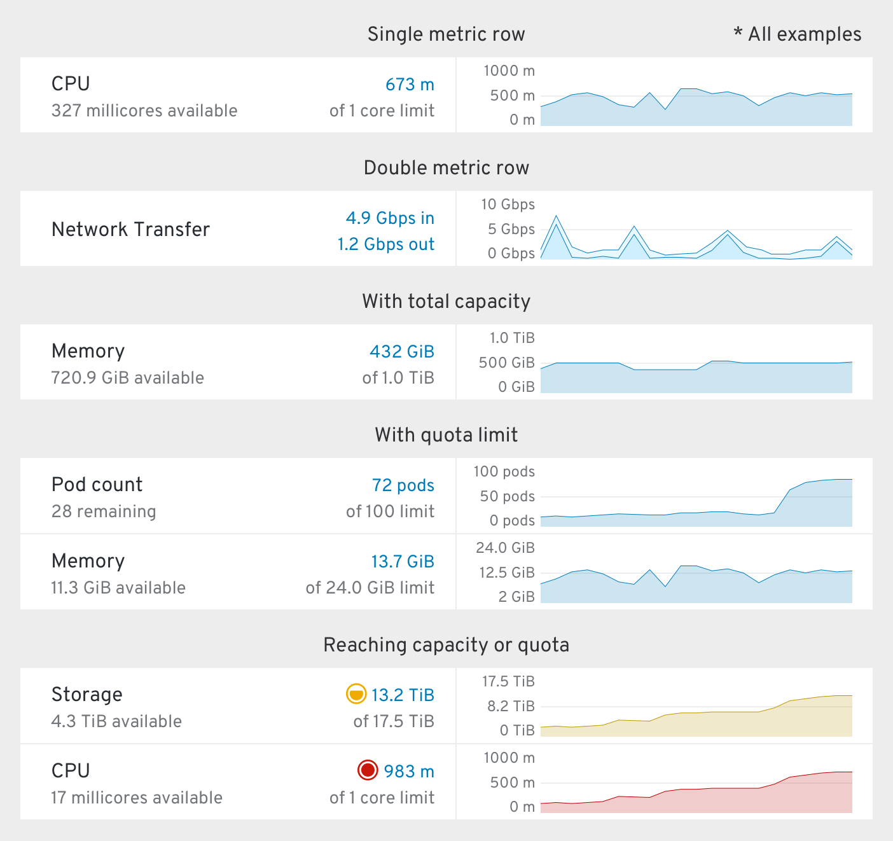

Measurements that reach a "warning" threshold (75-90%) should include a warning icon and their graph should turn yellow. If they reach a "critical" threshold (90%+) an error icon should appear and the graph should turn red.

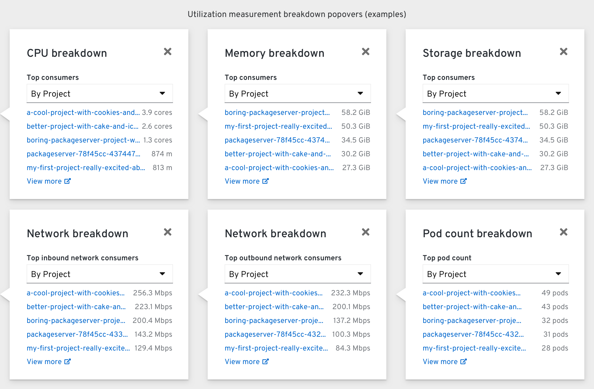

Clicking a measurement reveals a Breakdown popover scoped to that resource. The top consumers "By Project" are shown by default, but this can be changed to "By Node" and "By Pods".

Clicking the external "View more" link should bring the user to the Prometheus Dashboard with the same query pre-filled, but scoped to include the top 20 consumers.

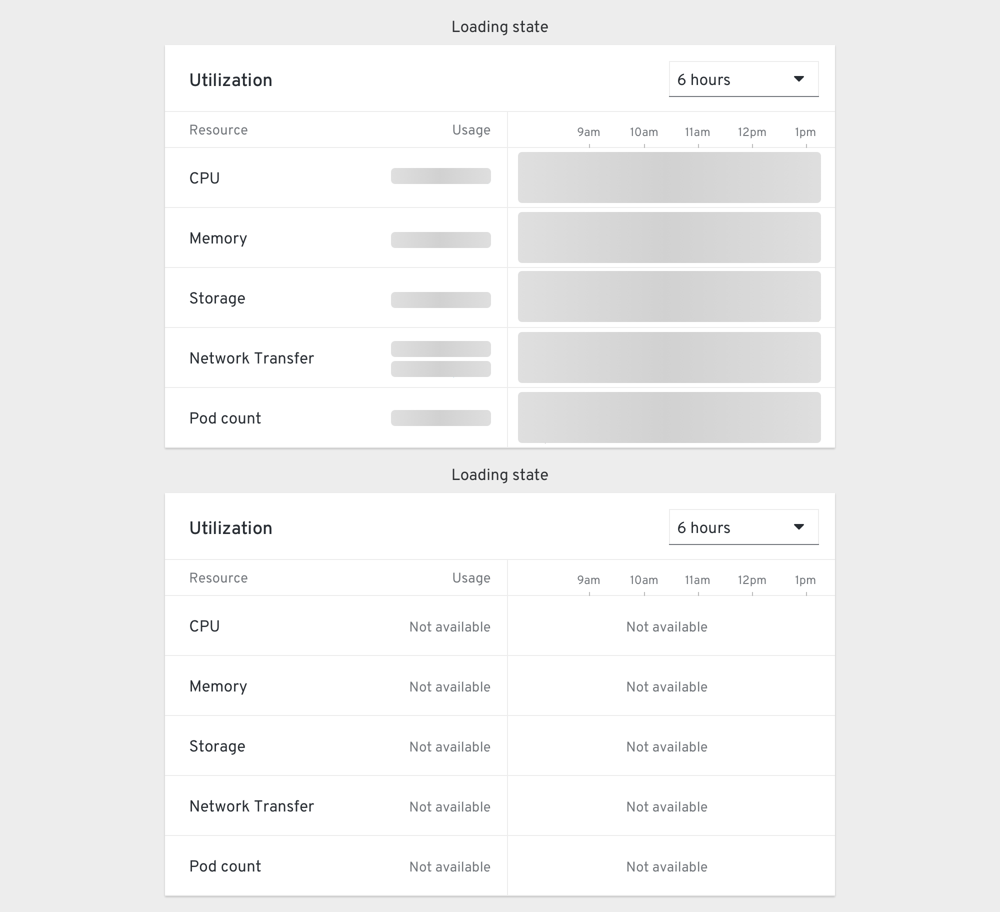
