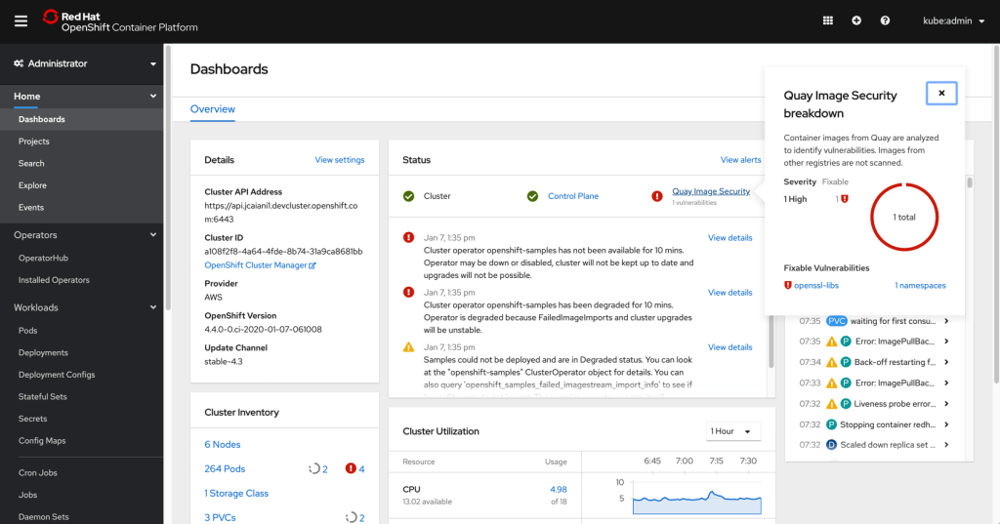
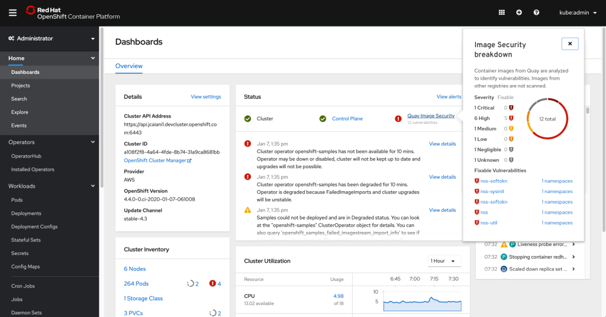

# Quay Image Security Integration

Users can now install the Container Security Operator to bring Quay and Clair metadata into OpenShift. Installing this operator enables cluster administrators to monitor known container image vulnerabilities in pods running on their Kubernetes cluster. After deployment, there is no additional configuration for the operator to start querying the container registry for vulnerability data. If the registry supports image scanning, like Quay, then the vulnerabilities found will be exposed to the user by populating the **ImageManifestVuln resource** list and surfacing it on the cluster dashboard.

## Vulnerability details on the cluster dashboard

- Once the Container Security Operator has been installed, the **Quay Image Security** status is shown on the cluster dashboard Status card.
- The card will list the number of vulnerabilities found and will provide a link to access more detailed information on the type of vulnerabilities.
- Clicking on the link opens a popover with the breakdown of vulnerability by severity. Critical and high vulnerabilities will be listed first, followed by medium and lower risk. Fixable vulnerabilities are listed with two links.
- One link is the vulnerability name that goes out to the vulnerability view for the Quay instance the image is hosted on (for example, Quay.io), and the other is a link to view the Image Manifest Vulnerability resource details in the affected namespace.

- Only the top five most severe vulnerabilities will be listed in the popover. For cases where there are more than five, users can navigate to the custom resource definition list to view all Image Manifest Vulnerability instances under the **ImageManifestVuln** resource.