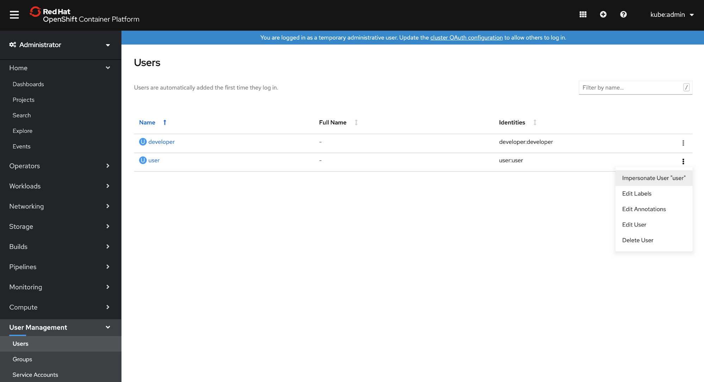
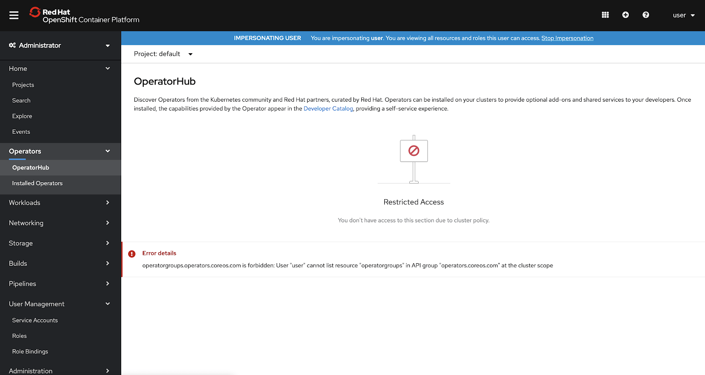
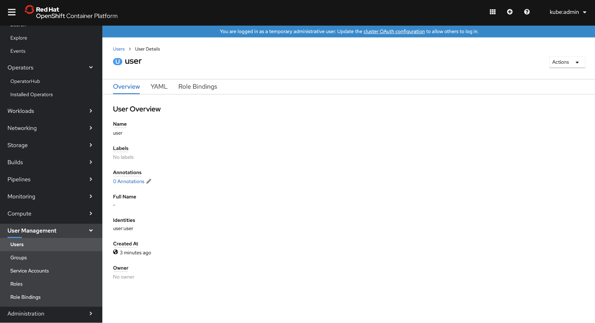
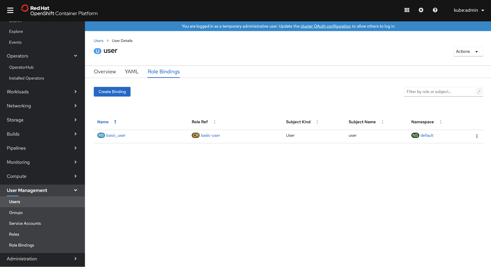
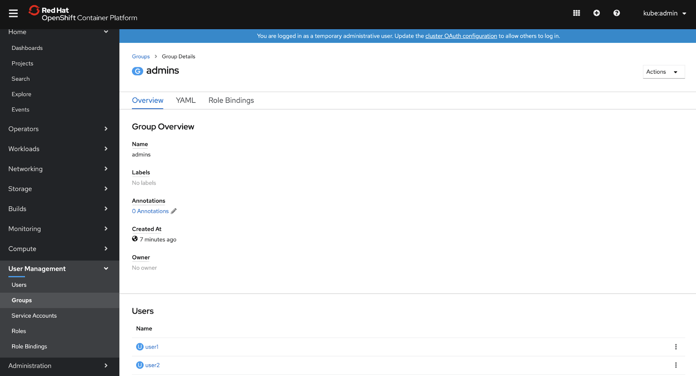
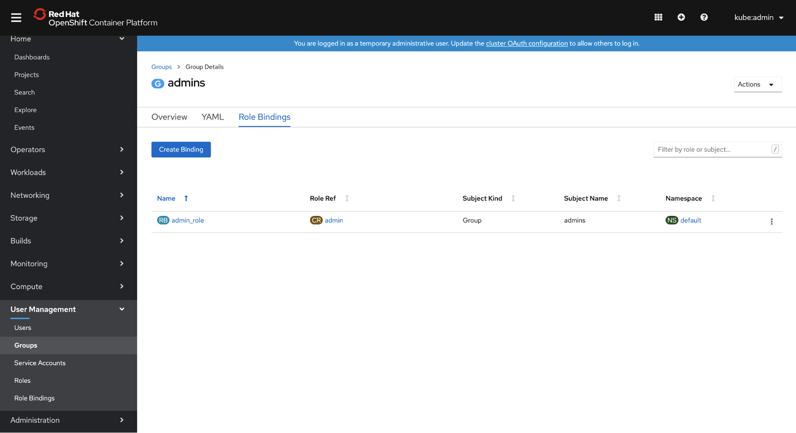

# Users and Groups pages in User Management section

Dedicated pages for **Users** and **Groups** are now available under a consolidated **User Management** navigation section along with the existing **Service Accounts**, **Roles**, and **Role Bindings**. These new pages allow an admin to view and modify the existing users and groups in the system and also allow impersonation of a user or group.

## Users Page

- The console now includes a list of users who have previously logged into the cluster, a place where admins can come to see which users have authenticated to the system using which Identity Provider.
- Admins can now impersonate users from this list to see the console exactly how a user with those permissions would, making it easy to test and troubleshoot RBAC settings. Previously this feature was available for the impersonation of role bindings to test a single role, however now being able to impersonate a user and exercise all of their roles at one time will ease more complex access-related tasks.

- Details about an individual user can also be viewed, giving an admin a quick understanding of that user with the ability to view and edit the comprising YAML.

- The Role Bindings tab for a user gives a summarized look at what roles that user has access to, with the ability to add additional role bindings right from that list.

## Groups Page

- The console also now includes a dedicated view of the groups on the cluster. Admins can see what groups exist and how many users are contained in each.

- Viewing the details of a group gives an overview, including a list of its current members with the option to view the details of a particular user.

- Role bindings for the group are also viewable, letting an admin know what roles users in that group are inheriting, with the option to add more.

