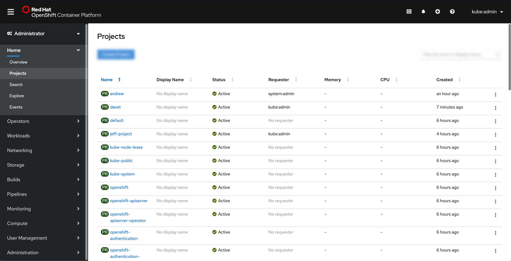
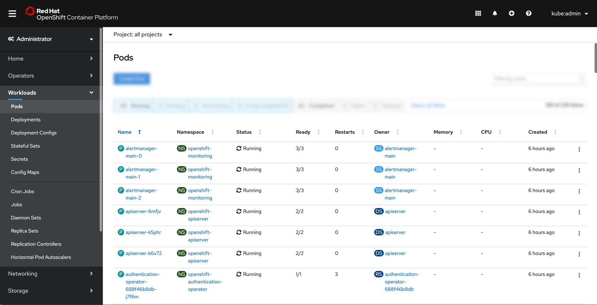
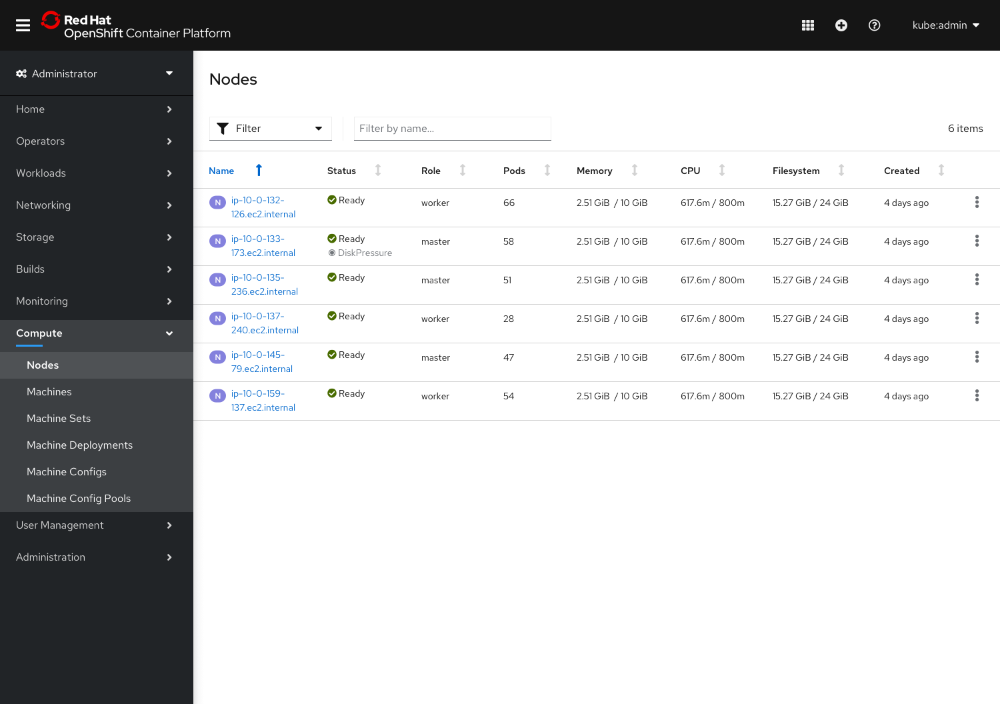
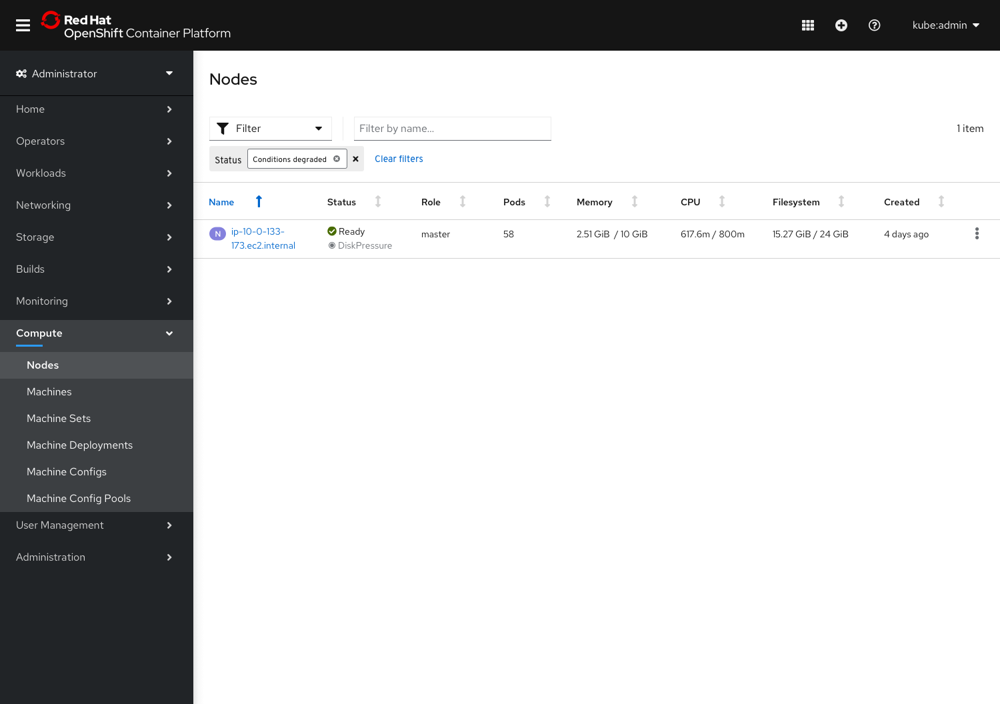

# List Updates

## Projects list

* The Projects list view will have 7 columns: Name, Display Name, Status, Requester, Memory, CPU, and Created.
* On decreasing screen sizes, columns will drop from right to left, with the exception of Status, which will always be visible.

## Pods List

* The Pods list view will have 9 columns: Name, Namespace, Status, Ready, Restarts, Owner, Memory, CPU, and Created.
* On decreasing screen sizes, the Created and Restarts columns will drop first, followed by Owner, Memory, and CPU. Next to drop will be the Ready column, followed by Status. Name and Namespace will always be visible.

## Nodes List

* The Nodes list view will have 8 columns: Name, Status, Role, Pods, Memory, CPU, Filesystem, and Created.
* The status column will also surface any degraded conditions below the general node status.
* The filter dropdown will give users the option to filter on Status or Role. See [toolbar documentation](https://openshift.github.io/openshift-origin-design/designs/administrator/future-openshift/toolbars/) for more information about the Nodes page toolbar.

* A new option to filter on "Conditions degraded" will be available.
