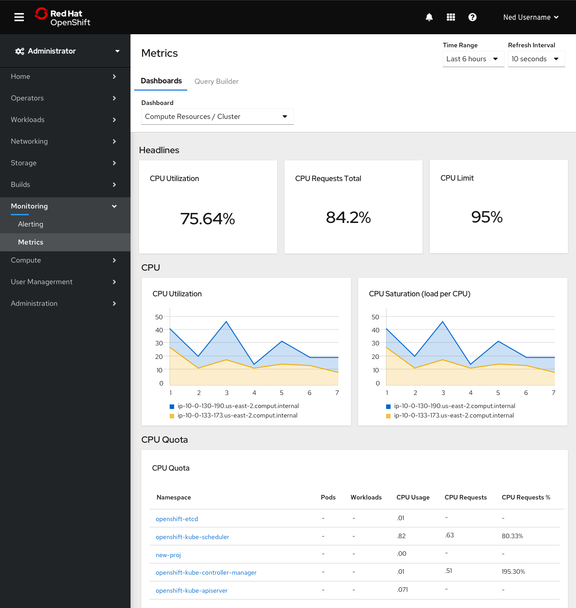
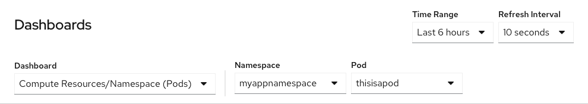
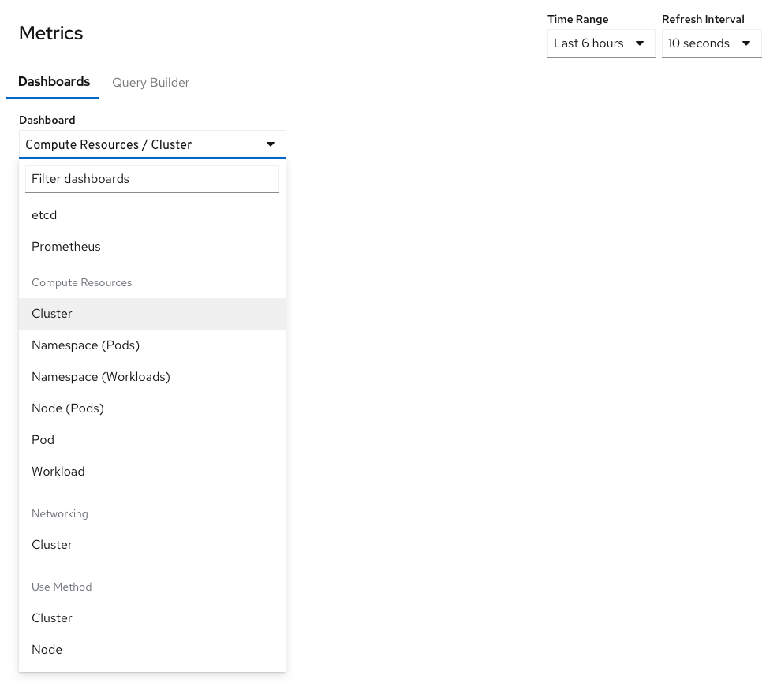
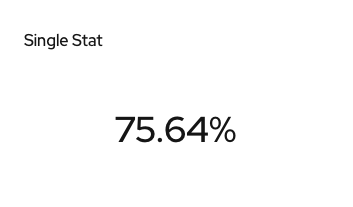
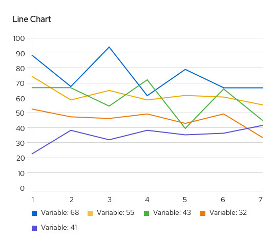
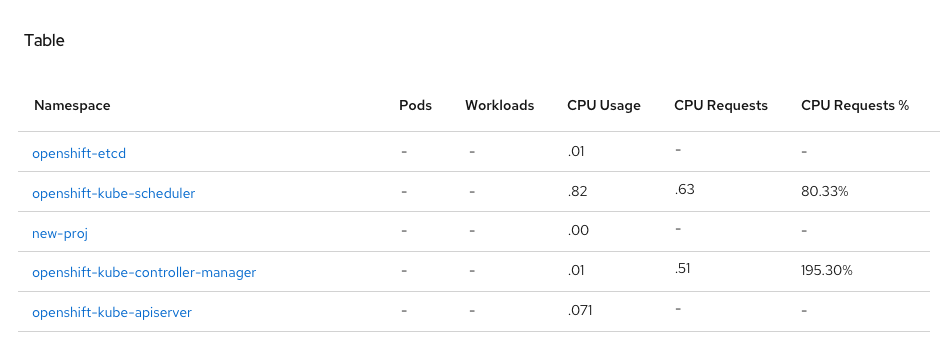

# "Metrics" Dashboards

Unlike other similar pages in the console, "Metrics" dashboards are composed entirely of stored metrics. Each card is a dynamically generated representation of the results of one or more PromQL queries.

## Navigation

- Time permitting, these dashboards will be found under the `Monitoring > Metrics` navigation item.
- Separate tabs for `Dashboards` and the `Query Builder` would enable people to quickly switch between two ways of viewing metrics.
- Alternatively, the dashboards may be found listed separately under `Monitoring > Dashboard`.

## Toolbar

- Time range and refresh interval selectors determine the scope of data presented on the current dashboard. If applicable, these selectors would also apply to the query builder page.
- The `Dashboard` dropdown determines which set of queries will be displayed in the page.
- Variable selectors appear and disappear as necessary to set the scope for the current dashboard type. Some types of dashboard have several variables that can be set, while others have none.

## Card types
- Initially three card types are available to display metrics data.
- Specific configuration options available for each chart type are limited and likely to change over time.

### Singlestat

- Displays a single value. Can be presented as a percentage or have a unit.

### Graph

- Displays one or many series resulting from a query.
- Area chart is used when data is stacked. Line chart styling used otherwise.

### Table

- Displays one or more queries in a flexible format
