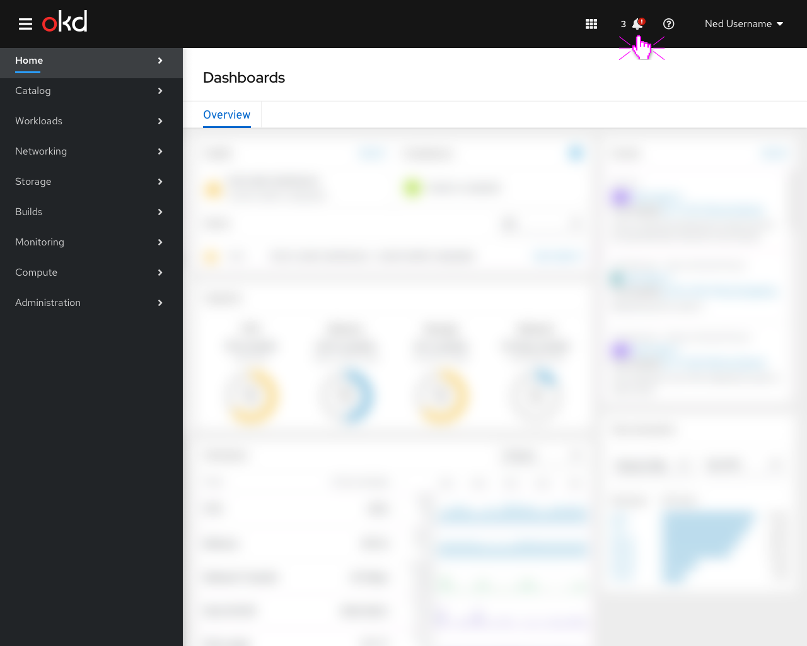
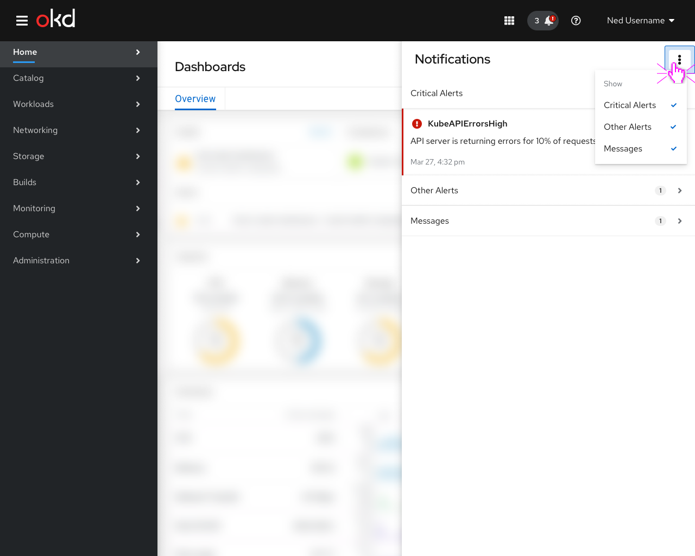
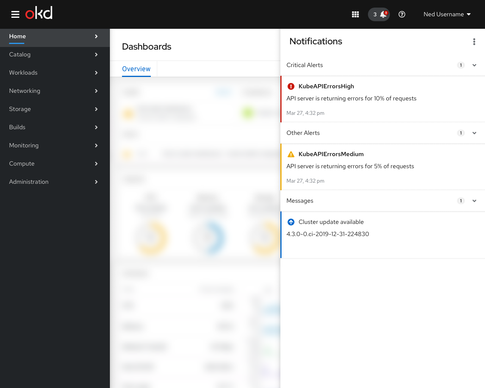
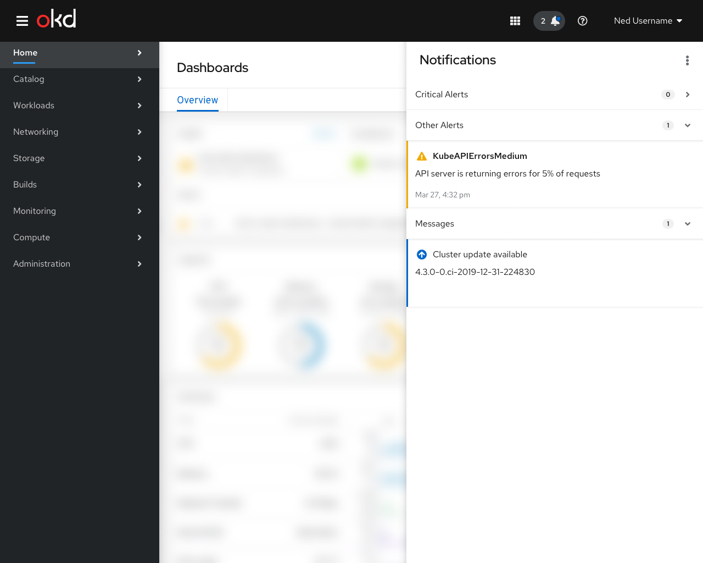
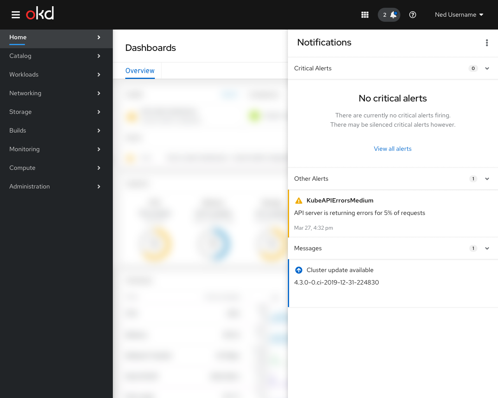
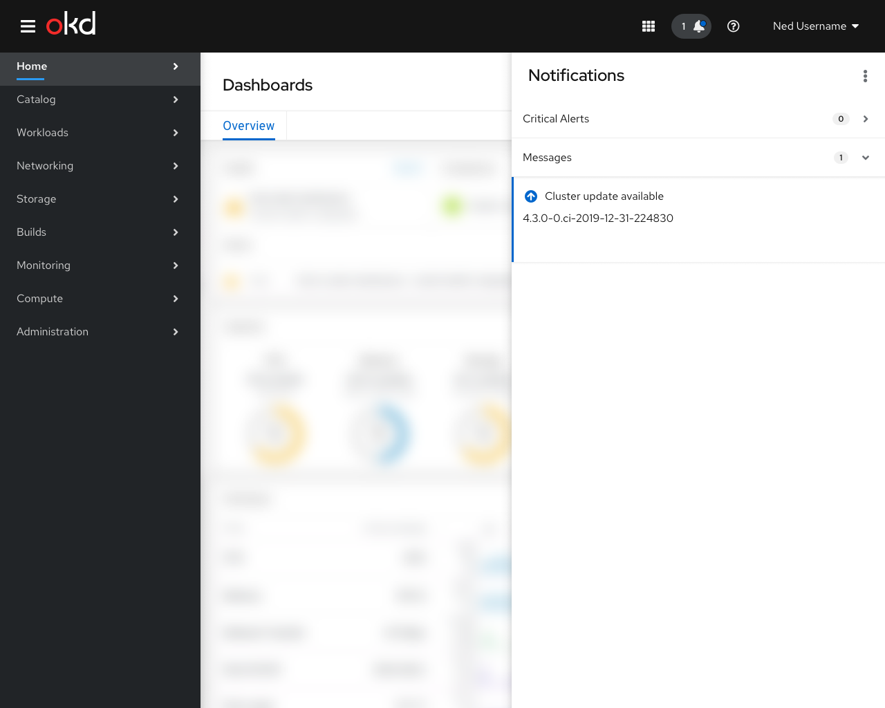
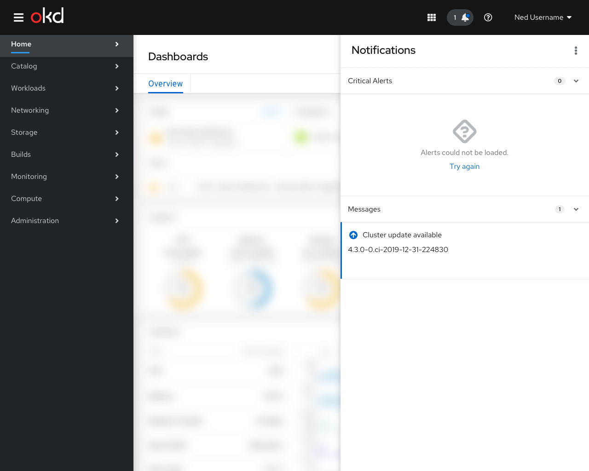

# Notification Drawer

## Masthead Icon

- When alerts are firing, a special signifier icon appears in the masthead for users with appropriate RBAC permissions. Clicking on the icon opens the notification drawer.

## Alerts

- By default, the drawer would contain all types of alerts, but users could choose to omit one or more notification types. These settings would be kept in local browser storage.
- Clicking on an alert takes the user to the details page for the alert.
- The `Critical Alerts` group should be expanded by default and all others should be collapsed.

## Messages

- Non-alert messages, such as updates for the cluster or for specific operators could also be listed here.
- Clicking on one of these cards would take the user to a page with information about the updates.

## Empty State

- When there are no critical alerts firing, the `Critical Alerts` group should still be present but should contain an empty state pattern.
- The `Other Alerts`, `Messages`, and any additional categories should be hidden when they are empty.

## First Time Setup

- Potentially, alerts with a specific annotation could have the annotation rendered as an action or link button. Otherwise, clicking on the alert itself would take the user to the details page for the alert.
- A special severity level for “getting started” or “first time setup” alerts could cause them to be rendered in a special way.

## Alert error

- In the case of a connection or other error, a message would be displayed with a `Try again` action to manually refresh.
