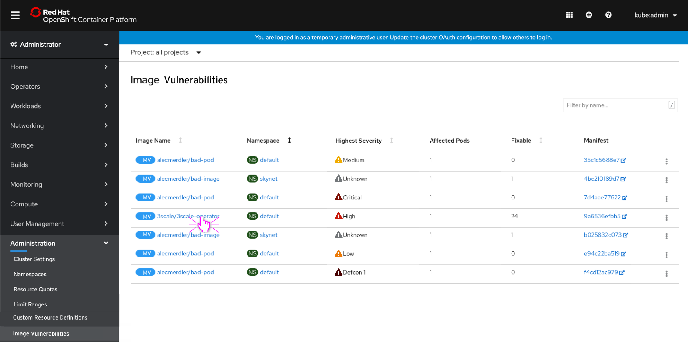
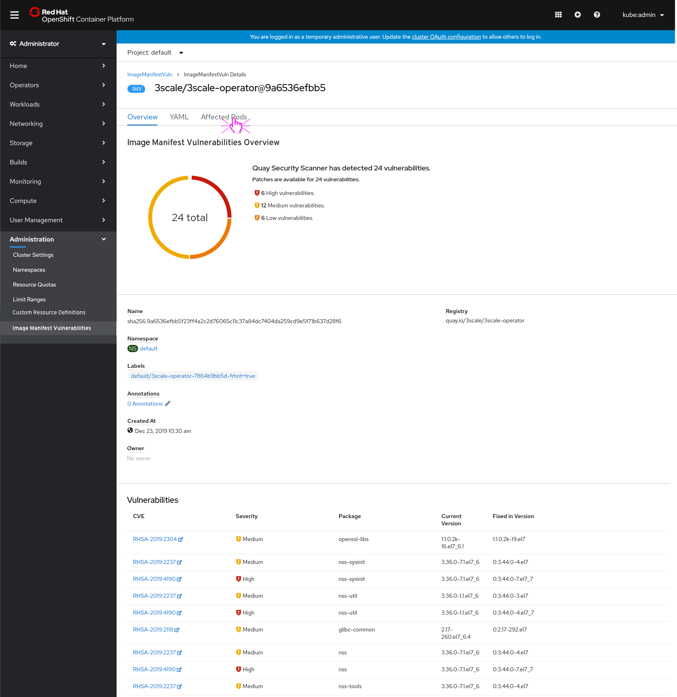
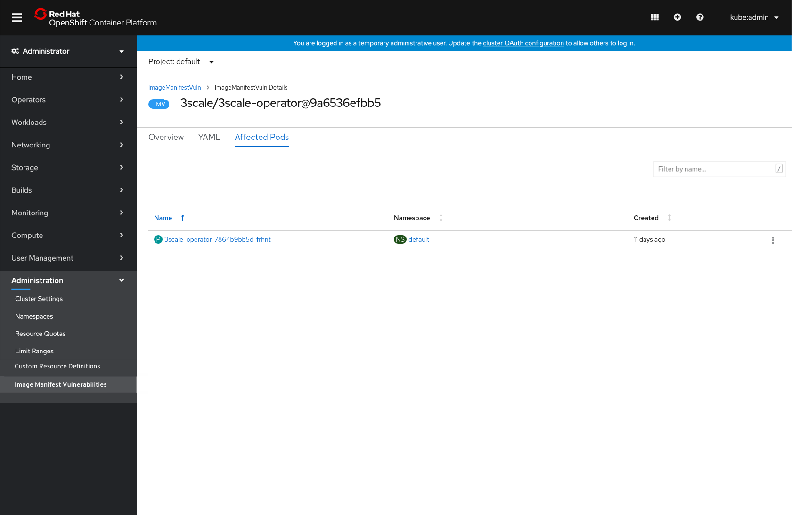
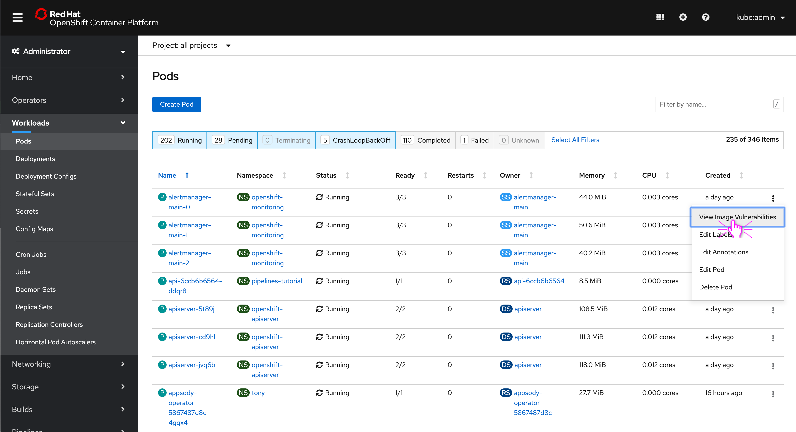

# Quay Image Manifest Vulnerabilities List

Users that have installed the Container Security Operator now have direct access to known container image vulnerabilities in their cluster via the new **Image Manifest Vulnerabilities** nav item in the Administration section. This nav item lists the vulnerabilities on the cluster and each can be viewed to see specific details and the pods that are affected by it. Users can also access this list filtered by pod from a pod's actions menu.

## Image Manifest Vulnerabilities List and Details

- A new nav item  **Image Manifest Vulnerabilities**  is added to the Administration section.
- An brief overview of the vulnerability is viewable in the list view with a link to the Quay instance the image is hosted on (for example, Quay.io.)

- Opening an Image Manifest Vulnerability shows additional details, including the list of Vulnerabilities and their severity.
- Each vulnerability also includes a link to view more information about it off cluster.

- The Image Manifest Vulnerability also includes a list of **Affected Pods** that conveys which workloads are affected by this vulnerability.

## Access from Pods

- Pods' action menus now include a **View Image Vulnerabilities** action that displays the vulnerabilities related to that pod.

- The user is taken to the **Image Manifest Vulnerabilities** list, with a filter applied to only show vulnerabilities that relate to that pod. The list may be empty if no vulnerabilities exist for that pod.