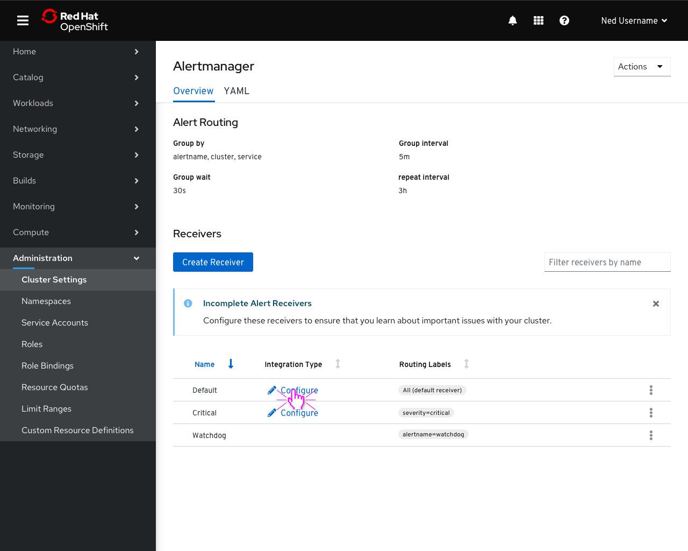
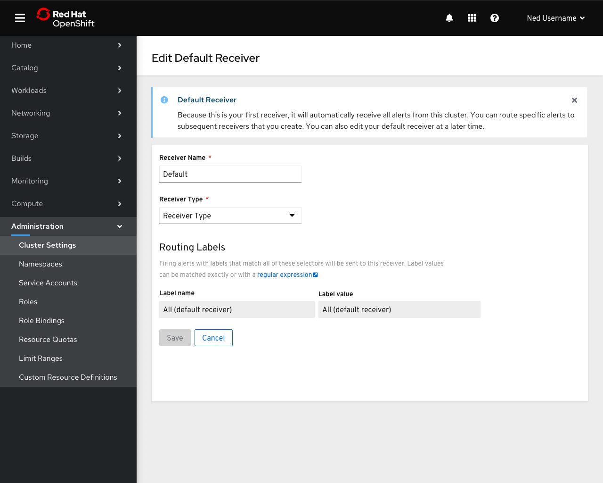
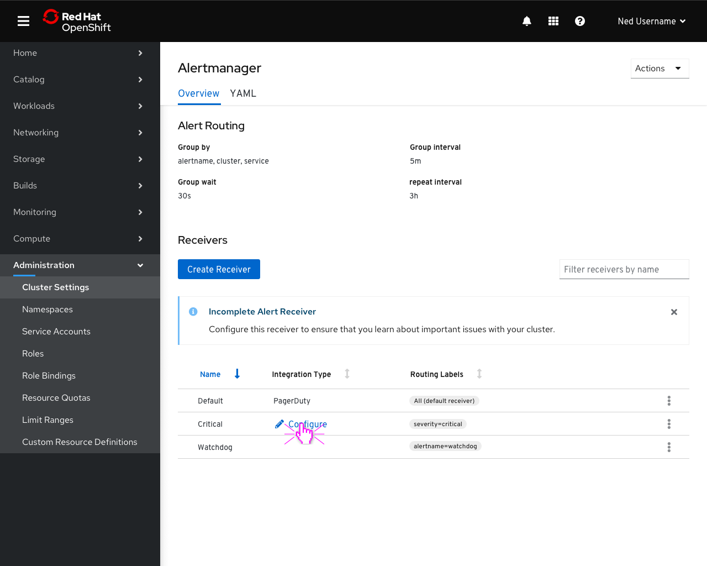
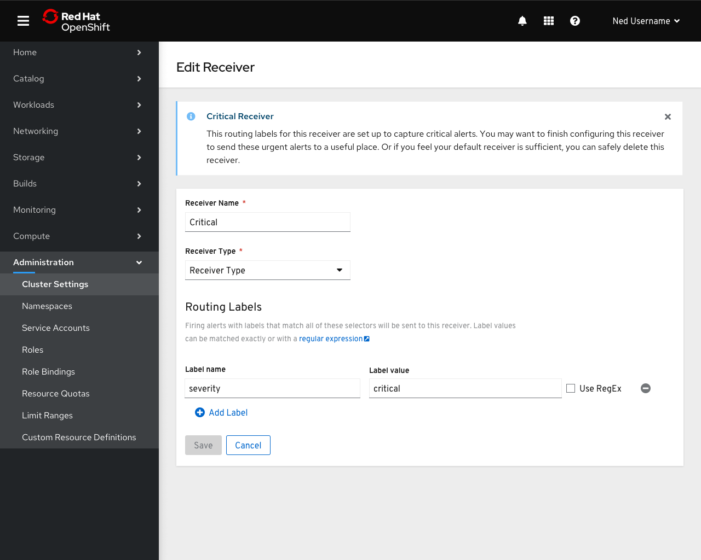
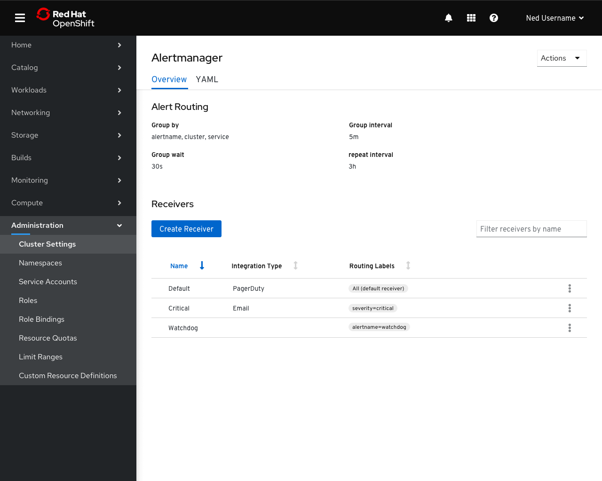

# Alertmanager Configuration

- The default alertmanager configuration will ship with 3 receivers, two of which need to be configured to correctly function.

- The default receiver will continue to display an informational alert when it is configured explaining its purpose.

- When only one receiver remains unconfigured, the text of the notification should change from plural to singular.

- When the Critical receiver is edited, an informational alert explains the purpose of the receiver.
- Once the receiver has been edited or deleted, this message no longer appears.

- Once all receivers except Watchdog are fully configured the notification is no longer necessary.

- If the Watchdog receiver is edited, an informational alert explains the purpose of the alert and receiver.
- Similar to the Critical alert message, if the Watchdog receiver is edited, this message will no longer appear.
