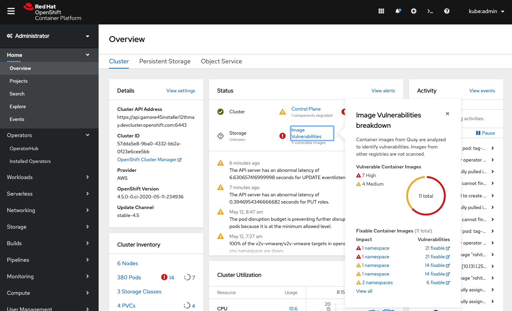
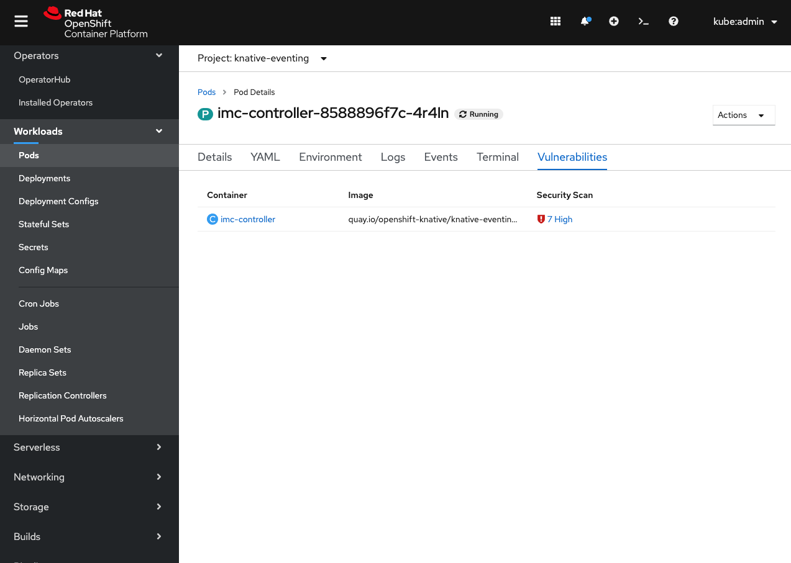

# Quay Container Security Operator Enhancements

Enhancements have been made to the Container Security Operator, with the **Image Vulnerabilities** status on the cluster dashboard now having clearer labeling and access to the **Image Vulnerabilities** list. Also Pods now include a **Vulnerabilities** tab which lists out the vulnerable containers on the pod.

## Image Vulnerabilities on Cluster Dashboard

- The **Quay Image Security** status has been renamed **Image Vulnerabilities** to better convey its purpose and relationship to the **Image Vulnerabilities** resources.
- The popover now displays its data in a per image way, so the user knows just how many images are vulnerable on the cluster.
- The **Fixable Container Images** section conveys how many namespaces are impacted by each image and how many of its vulnerabilities are fixable.
-  There is now a **View all** link to immediately take the user to the **Image Vulnerabilities** list.

## Image Vulnerabilities from Pods

- Pods now include a **Vulnerabilities** tab that lists the containers on that pod that are vulnerable. This has replaced the **View Image Vulnerabilities** action.
- Each container includes a count of how many vulnerabilities are present and the highest severity, which also functions as a link to the corresponding ImageManifestVuln resource.